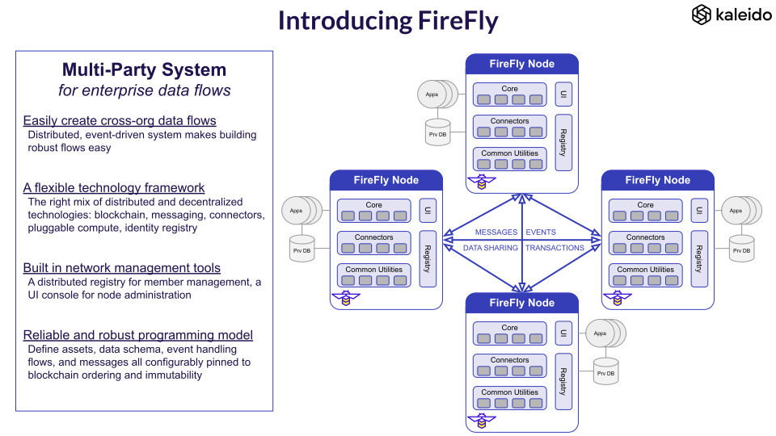

# FireFly

[](https://codecov.io/gh/hyperledger/firefly)
[](https://goreportcard.com/report/github.com/hyperledger/firefly)
[](https://hyperledger.github.io/firefly//)

FireFly is a multiparty system for enterprise data flows, powered by blockchain. It solves all of the layers of complexity that sit between the low level blockchain and high level business processes and user interfaces. FireFly enables developers to build blockchain apps for enterprise radically faster by allowing them to focus on business logic instead of infrastructure.

FireFly focusses on:

- Providing a great developer API and experience, with a CLI and UI as first class project components
- Pluggability for implementations of multi-party system infrastructure (blockchains, off-chain data exchange, identity, compute etc.)
- Making proven multi-party system patterns easy for new projects to adopt
- Providing developer friendly access to custom transactions+events in the underlying blockchain platforms
- Giving visibility and control on the private data exchange that occurs between businesses in a multi-party system
- Simplifying the journey of building multi-party business processes, by empowering non-blockchain developers to build great APIs+UX

You will see enterprise focussed code in FireFly solving hard "plumbing" problems like on-chain/off-chain event sequencing and aggregation, and enough smart contract code to make the patterns possible. You will then find patterns of integration with the individual communities that are already building the deep blockchain & multi-party compute tech, like Hyperledger Fabric, Hyperledger Besu, Quorum, Corda, IPFS, Hyperledger Avalon, OpenZeppelin, NodeRED etc.

> Watch this space for patterns on integrating Tokens into the model (fungible token value exchange, and NFTs), which is a big current focus of evolution in the gen2 FireFly architecture (building on the work done in gen1, also in this repo). The tokens working group is being lead by [Jim Zhang](https://github.com/jimthematrix)



## Documentation

https://hyperledger.github.io/firefly//

## FireFly repos

FireFly has a plugin based architecture design, with a microservice runtime footprint.
As such there are a number of repos, and the list will grow as the community evolves.

But not to worry, one of those repos is a CLI designed to get you running with all the components you need in minutes!

- CLI / Developer experience - https://github.com/hyperledger/firefly-cli
- UI Explorer - https://github.com/hyperledger/firefly-ui
- Sample applications - https://github.com/hyperledger/firefly-samples
- Core (this repo) - https://github.com/hyperledger/firefly
- HTTP Data Exchange - https://github.com/hyperledger/firefly-dataexchange-https
- Ethereum (Hyperledger Besu / Quorum) connector: https://github.com/hyperledger/firefly-ethconnect
- Corda connector: https://github.com/hyperledger/firefly-cordaconnect - contributed from Kaleido generation 1 - porting to generation 2
- Hyperledger Fabric connector - in design phase, including collaboration with https://github.com/hyperledger/fabric-smart-client

> Note only the projects that are primarily built to support FireFly are listed here, not all
> of the ecosystem of projects that integrate underneath the plugins. See [below](#firefly-code-hierarchy) for
> more information on the landscape of plugins and components.

## Getting Started

Use the FireFly CLI for fast bootstrap: https://github.com/hyperledger/firefly-cli

## Navigating this repo

There are **two core codebases** currently active in this repo:

### Generation 2: FireFly

Directories:

- [internal](./internal): The core Golang implementation code
- [pkg](./pkg): Interfaces intended for external project use
- [cmd](./cmd): The command line entry point
- [solidity_firefly](./solidity_firefly): Ethereum/Solidity smart contract code

[Full code layout here](#firefly-code-hierarchy)

This latest generation is re-engineered from the ground up to improve developer experience, runtime performance, and extensibility.

This means a simplified REST/WebSocket programming model for app development, and a wider range of infrastructure options for deployment.

It also means a focus on an architecture and code structure for a vibrant open source community.

A few highlights:

- Golang codebase
  - Strong coding standards, including unit test coverage, translation support, logging and more
  - Fast starting, low memory footprint, multi-threaded runtime
- OpenAPI 3.0 API specification (Swagger)
  - Generated from the API router code, to avoid divergence with the implementation
- Active/active HA architecture for the core runtime
  - Deferring to the core database for state high availability
  - Exploiting leader election where required
- Fully pluggable architecture
  - Everything from Database through to Blockchain, and Compute
  - Golang plugin infrastructure to decouple the core code from the implementation
  - Remote Agent model to decouple code languages, and HA designs
- Updated API resource model
  - `Asset`, `Data`, `Message`, `Event`, `Topic`, `Transaction`
- Added flexibility, with simplified the developer experience:
  - Versioning of data definitions
  - Introducing a first class `Context` construct link related events into a single sequence
  - Allow many pieces of data to be attached to a single message, and be automatically re-assembled on arrival
  - Clearer separation of concerns between the FireFly DB and the Application DB
  - Better search, filter and query support

### Generation 1: Kaleido Asset Trail (KAT)

Directories:

- [kat](./kat): The core TypeScript runtime
- [solidity_kat](./solidity_kat): Ethereum/Solidity smart contract code
- [cordapp_kat](./cordapp_kat): The Corda smart contract (CorDapp)

This was the original implementation of the multi-party systems API by Kaleido, and is already deployed in a number production projects.

The codebase distilled years of learning, into a set of patterns for performing blockchain orchestrated data exchange.

It depends on the following Kaleido services:

- Blockchain nodes
  - Ethereum with the Kaleido [Kaleido REST API Gateway](https://docs.kaleido.io/kaleido-services/ethconnect/)
  - Corda with the Kaleido built-in API for streaming KAT transactions
- [Kaleido Event Streams](https://docs.kaleido.io/kaleido-services/event-streams/)
- [Kaleido App2App Messaging](https://docs.kaleido.io/kaleido-services/app2app/)
- [Kaleido Document Exchange](https://docs.kaleido.io/kaleido-services/document-store/)

## FireFly code hierarchy

```
┌──────────┐  ┌───────────────┐
│ cmd      ├──┤ firefly   [Ff]│  - CLI entry point
└──────────┘  │               │  - Creates parent context
              │               │  - Signal handling
              └─────┬─────────┘
                    │
┌──────────┐  ┌─────┴─────────┐  - HTTP listener (Gorilla mux)
│ internal ├──┤ api       [As]│    * TLS (SSL), CORS configuration etc.
└──────────┘  │ server        │    * WS upgrade on same port
              │               │  - REST route definitions
              └─────┬─────────┘    * Simple routing logic only, all processing deferred to orchestrator
                    │
              ┌─────┴─────────┐  - REST route definition framework
              │ openapi   [Oa]│    * Standardizes Body, Path, Query, Filter semantics
              │ spec          |      - OpenAPI 3.0 (Swagger) generation
              └─────┬─────────┘    * Including Swagger. UI
                    │
              ┌─────┴─────────┐  - WebSocket server
              │           [Ws]│    * Developer friendly JSON based protocol business app development
              │ websockets    │    * Reliable sequenced delivery
              └─────┬─────────┘    * _Event interface [Ei] supports lower level integration with other compute frameworks/transports_
                    │
              ┌─────┴─────────┐  - Core data types
              │ fftypes   [Ft]│    * Used for API and Serialization
              │               │    * APIs can mask fields on input via router definition
              └─────┬─────────┘
                    │
              ┌─────┴─────────┐  - Core runtime server. Initializes and owns instances of:
              │           [Or]│    * Components: Implement features
  ┌───────┬───┤ orchestrator  │    * Plugins:    Pluggable infrastructure services
  │       │   │               │  - Exposes actions to router
  │       │   └───────────────┘    * Processing starts here for all API calls
  │       │
  │  Components: Components do the heavy lifting within the engine
  │       │
  │       │   ┌───────────────┐  - Maintains a view of the entire network
  │       ├───┤ network   [Nm]│    * Integrates with network permissioning [NP] plugin
  │       │   │ map           │    * Integrates with broadcast plugin
  │       │   └───────────────┘    * Handles hierarchy of member identity, node identity and signing identity
  │       │
  │       │   ┌───────────────┐  - Broadcast of data to all parties in the network
  │       ├───┤ broadcast [Bm]│    * Implements dispatcher for batch component
  │       │   │ manager       |    * Integrates with public storage interface [Ps] plugin
  │       │   └───────────────┘    * Integrates with blockchain interface [Bi] plugin
  │       │
  │       │   ┌───────────────┐  - Send private data to individual parties in the network
  │       ├───┤ private   [Pm]│    * Implements dispatcher for batch component
  │       │   │ messaging     |    * Integrates with the data exchange [Dx] plugin
  │       │   └──────┬────────┘    * Messages can be pinned and sequenced via the blockchain, or just sent
  │       │          │
  │       │   ┌──────┴────────┐  - Groups of parties, with isolated data and/or blockchains
  │       │   │ group     [Gm]│    * Integrates with data exchange [Dx] plugin
  │       │   │ manager       │    * Integrates with blockchain interface [Bi] plugin
  │       │   └───────────────┘
  │       │
  │       │   ┌───────────────┐  - Private data management and validation
  │       ├───┤ data      [Dm]│    * Implements dispatcher for batch component
  │       │   │ manager       │    * Integrates with data exchange [Dx] plugin
  │       │   └──────┬────────┘    * Integrates with blockchain interface [Bi] plugin
  │       │          │
  │       │   ┌──────┴────────┐  - JSON data shema management and validation (architecture extensible to XML and more)
  │       │   │ json      [Jv]│    * JSON Schema validation logic for outbound and inbound messages
  │       │   │ validator     │    * Schema propagatation
  │       │   └──────┬────────┘    * Integrates with broadcast plugin
  │       │          │
  │       │   ┌──────┴────────┐  - Binary data addressable via ID or Hash
  │       │   │ blobstore [Bs]│    * Integrates with data exchange [Dx] plugin
  │       │   │               │    * Hashes data, and maintains mapping to payload references in blob storage
  │       │   └───────────────┘    * Integrates with blockchain interface [Bi] plugin
  │       │
  │       │   ┌───────────────┐  - Private data management and validation
  │       ├───┤ event     [Em]│    * Implements dispatcher for batch component
  │       │   │ manager       │    * Integrates with data exchange [Dx] plugin
  │       │   └──────┬────────┘    * Integrates with blockchain interface [Bi] plugin
  │       │          │
  │       │   ┌──────┴────────┐  - Handles incoming external data
  │       │   │           [Ag]│    * Integrates with data exchange [Dx] plugin
  │       │   │ aggregator    │    * Integrates with public storage interface [Ps] plugin
  │       │   │               │    * Integrates with blockchain interface [Bi] plugin
  │       │   │               │  - Ensures valid events are dispatched only once all data is available
  │       │   └──────┬────────┘    * Context aware, to prevent block-the-world scenarios
  │       │          │
  │       │   ┌──────┴────────┐  - Subscription manager
  │       │   │           [Sm]│    * Creation and management of subscriptions
  │       │   │ subscription  │    * Creation and management of subscriptions
  │       │   │ manager       │    * Message to Event matching logic
  │       │   └──────┬────────┘
  │       │          │
  │       │   ┌──────┴────────┐  - Manages delivery of events to connected applications
  │       │   │ event     [Ed]│    * Integrates with data exchange [Dx] plugin
  │       │   │ dispatcher    │    * Integrates with blockchain interface [Bi] plugin
  │       │   └───────────────┘
  │       │
  │       │   ┌───────────────┐  - Token operations
  │       ├───┤ asset     [Am]│    * NFT coupling with contexts
  │       │   │ manager       │    * Transfer coupling with data describing payment reason
  │       │   │               │  - ...
  │       │   └───────────────┘
  │       │
  │       │   ┌───────────────┐
  │       ├───┤ sync /   [Sa] │  - Sync/Async Bridge
  │       │   │ async bridge  │    * Provides synchronous request/reply APIs
  │       │   │               │    * Translates to underlying event-driven API
  │       │   └───────────────┘
  │       │
  │       │   ┌───────────────┐  - Aggregates messages and data, with rolled up hashes for pinning
  │       ├───┤ batch     [Ba]│    * Pluggable dispatchers
  │       │   │ manager       │  - Database decoupled from main-line API processing
  │       │   │               │    * See architecture diagrams for more info on active/active sequencing
  │       │   └──────┬────────┘  - Manages creation of batch processor instances
  │       │          │
  │       │   ┌──────┴────────┐  - Short lived agent spun up to assemble batches on demand
  │       │   │ batch     [Bp]│    * Coupled to an author+type of messages
  │       │   │ processor     │  - Builds batches of 100s messages for efficient pinning
  │       │   │               │    * Aggregates messages and data, with rolled up hashes for pinning
  │       │   └───────────────┘  - Shuts down automatically after a configurable inactivity period
  │       ... more TBD
  │
Plugins: Each plugin comprises a Go shim, plus a remote agent microservice runtime (if required)
  │
  │           ┌───────────────┐  - Blockchain Interface
  ├───────────┤           [Bi]│    * Transaction submission - including signing key management
  │           │ blockchain    │    * Event listening
  │           │ interface     │    * Standardized operations, and custom on-chain coupling
  │           └─────┬─────────┘
  │                 │
  │                 ├─────────────────────┬───────────────────┐
  │           ┌─────┴─────────┐   ┌───────┴───────┐   ┌───────┴────────┐
  │           │ ethereum      │   │ corda         │   │ fabric         │
  │           └───────────────┘   └───────────────┘   └────────────────┘
  │
  │           ┌───────────────┐  - P2P Content Addresssed Filesystem
  ├───────────┤ public    [Pi]│    * Payload upload / download
  │           │ storage       │    * Payload reference management
  │           │ interface     │
  │           └─────┬─────────┘
  │                 │
  │                 ├───────── ... extensible to any shared storage sytem, accessible to all members
  │           ┌─────┴─────────┐
  │           │ ipfs          │
  │           └───────────────┘
  │
  │           ┌───────────────┐  - Private Data Exchange
  ├───────────┤ data      [Dx]│    * Blob storage
  │           │ exchange      │    * Private secure messaging
  │           └─────┬─────────┘    * Secure file transfer
  │                 │
  │                 ├─────────────────────┬────────── ... extensible to any private data exchange tech
  │           ┌─────┴─────────┐   ┌───────┴───────┐
  │           │ httpdirect    │   │ kaleido       │
  │           └───────────────┘   └───────────────┘
  │
  │           ┌───────────────┐  - Identity resolution and mapping
  ├───────────┤ identity  [Ii]│    * Resolves opaque identifiers used throughout FireFly
  │           │ interface     │    * Maps to and from blockchain signing identities
  │           └─────┬─────────┘    * Map API/user identities from authentication, to network/organizational identities
  │                 │
  │                 ├───────────── ... extensible to DIDs etc.
  │           ┌─────┴─────────┐
  │           │ onchain       │
  │           └───────────────┘
  │
  │           ┌───────────────┐  - API Authentication and Authorization Interface
  ├───────────┤ api auth  [Aa]│    * Authenticates security credentials (OpenID Connect id token JWTs etc.)
  │           │               │    * Extracts API/user identity (for identity interface to map)
  │           └─────┬─────────┘    * Enforcement point for fine grained API access control
  │                 │
  │                 ├─────────────────────┬────────── ... extensible other single sign-on technologies
  │           ┌─────┴─────────┐   ┌───────┴───────┐
  │           │ apikey        │   │ jwt           │
  │           └───────────────┘   └───────────────┘
  │
  │           ┌───────────────┐  - Database Interactions
  ├───────────┤ database  [Di]│    * Create, Read, Update, Delete (CRUD) actions
  │           │ interace      │    * Filtering and update definition interace
  │           └─────┬─────────┘    * Migrations and Indexes
  │                 │
  │                 ├───────── ... extensible to NoSQL (CouchDB / MongoDB etc.)
  │           ┌─────┴─────────┐
  │           │ sqlcommon     │
  │           └─────┬─────────┘
  │                 ├───────────────────────┬───────── ... extensible other SQL databases
  │           ┌─────┴─────────┐     ┌───────┴────────┐
  │           │ postgres      │     │ sqlite3        │
  │           └───────────────┘     └────────────────┘
  │
  │           ┌───────────────┐  - Connects the core event engine to external frameworks and applications
  ├───────────┤ event     [Ei]│    * Supports long-lived (durable) and ephemeral event subscriptions
  │           │ interface     │    * Batching, filtering, all handled in core prior to transport
  │           └─────┬─────────┘    * Interface supports connect-in (websocket) and connect-out (broker runtime style) plugins
  │                 │
  │                 ├───────── ... extensible to integrate off-chain compute framework (Hyperledger Avalon, TEE, ZKP, MPC etc.)
  │                 │          ... extensible to additional event delivery brokers/subsystems (Webhooks, Kafka, AMQP etc.)
  │           ┌─────┴─────────┐
  │           │ websockets    │
  │           └───────────────┘
  │  ... more TBD

  Additional utility framworks
              ┌───────────────┐  - REST API client
              │ rest      [Re]│    * Provides convenience and logging
              │ client        │    * Standardizes auth, config and retry logic
              └───────────────┘    * Built on Resty

              ┌───────────────┐  - WebSocket client
              │ wsclient  [Wc]│    * Provides convenience and logging
              │               │    * Standardizes auth, config and reconnect logic
              └───────────────┘    * Built on Gorilla WebSockets

              ┌───────────────┐  - Translation framework
              │ i18n      [In]│    * Every translations must be added to `en_translations.json` - with an `FF10101` key
              │               │    * Errors are wrapped, providing extra features from the `errors` package (stack etc.)
              └───────────────┘    * Description translations also supported, such as OpenAPI description

              ┌───────────────┐  - Logging framework
              │ log       [Lo]│    * Logging framework (logrus) integrated with context based tagging
              │               │    * Context is used throughout the code to pass API invocation context, and logging context
              └───────────────┘    * Example: Every API call has an ID that can be traced, as well as a timeout

              ┌───────────────┐  - Configuration
              │ config    [Co]│    * File and Environment Variable based logging framework (viper)
              │               │    * Primary config keys all defined centrally
              └───────────────┘    * Plugins integrate by returning their config structure for unmarshaling (JSON tags)

```

## API Query Syntax

REST collections provide filter, `skip`, `limit` and `sort` support.

- The field in the message is used as the query parameter
- When multiple query parameters are supplied these are combined with AND
- When the same query parameter is supplied multiple times, these are combined with OR

### Example

`GET` `/api/v1/messages?confirmed=>0&type=broadcast&topic=t1&topic=t2&context=@someprefix&sort=sequence&descending&skip=100&limit=50`

This states:

- Filter on `confirmed` greater than 0
- Filter on `type` exactly equal to `broadcast`
- Filter on `topic` exactly equal to `t1` _or_ `t2`
- Filter on `context` containing the case-sensitive string `someprefix`
- Sort on `sequence` in `descending` order
- Paginate with `limit` of `50` and `skip` of `100` (e.g. get page 3, with 50/page)

Table of filter operations, which must be the first character of the query string (after the `=` in the above URL path example)

| Operator | Description                       |
| -------- | --------------------------------- |
| (none)   | Equal                             |
| `!`      | Not equal                         |
| `<`      | Less than                         |
| `<=`     | Less than or equal                |
| `>`      | Greater than                      |
| `>=`     | Greater than or equal             |
| `@`      | Containing - case sensitive       |
| `!@`     | Not containing - case sensitive   |
| `^`      | Containing - case insensitive     |
| `!^`     | Not containing - case insensitive |
