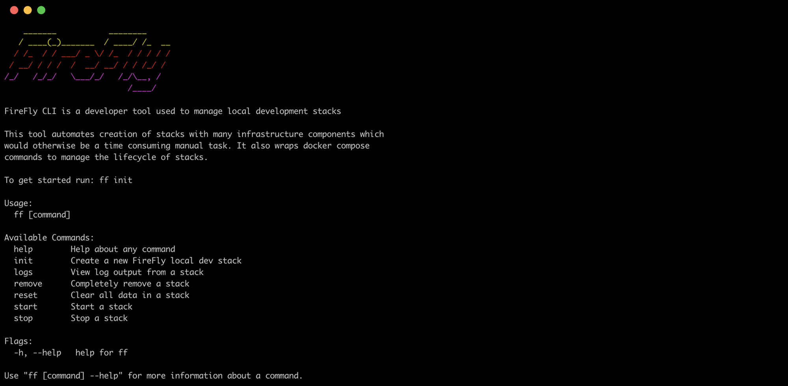
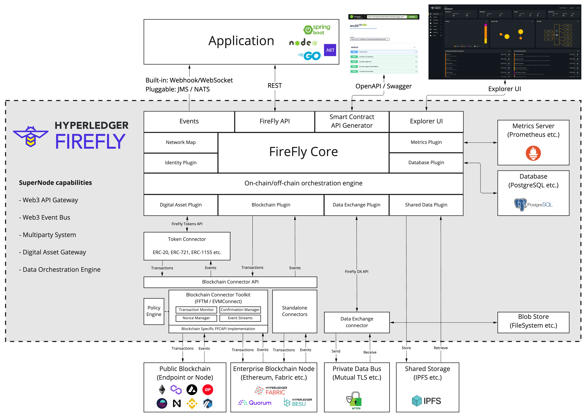

# Hyperledger FireFly

[](https://codecov.io/gh/hyperledger/firefly)
[](https://goreportcard.com/report/github.com/hyperledger/firefly)
[](https://hyperledger.github.io/firefly//)

[](https://www.bestpractices.dev/projects/7826)


Hyperledger FireFly is the first open source Supernode: a complete stack for enterprises to build and scale secure Web3 applications.

The FireFly API for digital assets, data flows, and blockchain transactions makes it radically faster to build production-ready apps on popular chains and protocols.

## Start using Hyperledger FireFly

The best place to learn about FireFly is in the [documentation](https://hyperledger.github.io/firefly).

There you will find our [Getting Started Guide](https://hyperledger.github.io/firefly/gettingstarted/),
which will get you a running FireFly network of Supernodes on your local machine in a few minutes.

Your development environment will come with:

FireFly CLI                   |  FireFly Explorer UI                | FireFly Sandbox  |
:----------------------------:|:-----------------------------------:|:----------------:|
 |  |  |

## Engage with the community

- [Join us on Discord](https://discord.gg/hyperledger)

## Technical architecture

Hyperledger FireFly has a pluggable microservices architecture. Everything is pluggable, from the Blockchain technology,
token ERC standards, and custom smart contracts, all the way to the event distribution layer and private database.

So if there aren't yet instructions for making FireFly a Supernode for your favorite blockchain technology -
don't worry. There is almost certainly a straightforward path to plugging it in that will save you from re-building
all the plumbing for your blockchain application from scratch.

[](https://raw.githubusercontent.com/kaleido-io/firefly/main/doc-site/docs/images/firefly_architecture_overview.jpg)

## Start contributing to Hyperledger FireFy

There are lots of places you can contribute, regardless of whether your skills are front-end, backend-end, or full-stack.

Check out our [Contributor Guide](https://hyperledger.github.io/firefly/contributors/), and **welcome!**.

## Other repos

You are currently in the "core" repository, which is written in Go and hosts the API Server and central orchestration
engine. Here you will find plugin interfaces to microservice connectors written in a variety of languages like
TypeScript and Java, as well as heavy-lifting runtime components.

Other repositories you might be interested in containing those microservice components, user experiences, CLIs and samples.

> Note that only open source repositories and plugins are listed below

### Blockchain connectivity

- Transaction Manager - https://github.com/hyperledger/firefly-transaction-manager
- RLP & ABI encoding, KeystoreV3 utilities and secp256k1 signer runtime -  https://github.com/hyperledger/firefly-signer
- FFCAPI reference connector for EVM Chains - https://github.com/hyperledger/firefly-evmconnect
  - Public EVM compatible chains: Learn more in the [documentation](https://hyperledger.github.io/firefly)
- Permissioned Ethereum connector - https://github.com/hyperledger/firefly-ethconnect
  - Private/permissioned: Hyperledger Besu / Quorum
- Hyperledger Fabric connector - https://github.com/hyperledger/firefly-fabconnect
- Tezos connector - https://github.com/hyperledger/firefly-tezosconnect
- Corda connector starter: https://github.com/hyperledger/firefly-cordaconnect
  - CorDapp specific customization is required

### Token standards

- Tokens ERC20/ERC721 - https://github.com/hyperledger/firefly-tokens-erc20-erc721
- Tokens ERC1155 - https://github.com/hyperledger/firefly-tokens-erc1155

### Private data bus connectivity

- HTTPS Data Exchange - https://github.com/hyperledger/firefly-dataexchange-https

### Developer ecosystem

- Command Line Interface (CLI) - https://github.com/hyperledger/firefly-cli
- Explorer UI - https://github.com/hyperledger/firefly-ui
- Node.js SDK - https://github.com/hyperledger/firefly-sdk-nodejs
- Sandbox / Exerciser - https://github.com/hyperledger/firefly-sandbox
- Samples - https://github.com/hyperledger/firefly-samples
- FireFly Performance CLI: https://github.com/hyperledger/firefly-perf-cli
- Helm Charts for Deploying to Kubernetes: https://github.com/hyperledger/firefly-helm-charts

## FireFly Core code hierarchy

```
┌──────────┐  ┌───────────────┐
│ cmd      ├──┤ firefly   [Ff]│  - CLI entry point
└──────────┘  │               │  - Creates parent context
              │               │  - Signal handling
              └─────┬─────────┘
                    │
┌──────────┐  ┌─────┴─────────┐  - HTTP listener (Gorilla mux)
│ internal ├──┤ api       [As]│    * TLS (SSL), CORS configuration etc.
└──────────┘  │ server        │    * WS upgrade on same port
              │               │  - REST route definitions
              └─────┬─────────┘    * Simple routing logic only, all processing deferred to orchestrator
                    │
              ┌─────┴─────────┐  - REST route definition framework
              │ openapi   [Oa]│    * Standardizes Body, Path, Query, Filter semantics
              │ spec          |      - OpenAPI 3.0 (Swagger) generation
              └─────┬─────────┘    * Including Swagger. UI
                    │
              ┌─────┴─────────┐  - WebSocket server
              │           [Ws]│    * Developer friendly JSON based protocol business app development
              │ websockets    │    * Reliable sequenced delivery
              └─────┬─────────┘    * _Event interface [Ei] supports lower level integration with other compute frameworks/transports_
                    │
              ┌─────┴─────────┐  - Extension point interface to listen for database change events
              │ admin     [Ae]│    * For building microservice extensions to the core that run externally
              │ events        |    * Used by the Transaction Manager component
              └─────┬─────────┘    * Filtering to specific object types
                    │
              ┌─────┴─────────┐  - Core data types
              │ fftypes   [Ft]│    * Used for API and Serialization
              │               │    * APIs can mask fields on input via router definition
              └─────┬─────────┘
                    │
              ┌─────┴─────────┐  - Core runtime server. Initializes and owns instances of:
              │           [Or]│    * Components: Implement features
  ┌───────┬───┤ orchestrator  │    * Plugins:    Pluggable infrastructure services
  │       │   │               │  - Exposes actions to router
  │       │   └───────────────┘    * Processing starts here for all API calls
  │       │
  │  Components: Components do the heavy lifting within the engine
  │       │
  │       │   ┌───────────────┐  - Integrates with Blockchain Smart Contract logic across blockchain technologies
  │       ├───┤ contract  [Cm]│    * Generates OpenAPI 3 / Swagger definitions for smart contracts, and propagates to network
  │       │   │ manager       │    * Manages listeners for native Blockchain events, and routes those to application events
  │       │   └───────────────┘    * Convert to/from native Blockchain interfaces (ABI etc.) and FireFly Interface [FFI] format
  │       │
  │       │   ┌───────────────┐  - Maintains a view of the entire network
  │       ├───┤ network   [Nm]│    * Integrates with network permissioning [NP] plugin
  │       │   │ map           │    * Integrates with broadcast plugin
  │       │   └───────────────┘    * Handles hierarchy of member identity, node identity and signing identity
  │       │
  │       │   ┌───────────────┐  - Broadcast of data to all parties in the network
  │       ├───┤ broadcast [Bm]│    * Implements dispatcher for batch component
  │       │   │ manager       |    * Integrates with shared storage interface [Ss] plugin
  │       │   └───────────────┘    * Integrates with blockchain interface [Bi] plugin
  │       │
  │       │   ┌───────────────┐  - Send private data to individual parties in the network
  │       ├───┤ private   [Pm]│    * Implements dispatcher for batch component
  │       │   │ messaging     |    * Integrates with the data exchange [Dx] plugin
  │       │   └──────┬────────┘    * Messages can be pinned and sequenced via the blockchain, or just sent
  │       │          │
  │       │   ┌──────┴────────┐  - Groups of parties, with isolated data and/or blockchains
  │       │   │ group     [Gm]│    * Integrates with data exchange [Dx] plugin
  │       │   │ manager       │    * Integrates with blockchain interface [Bi] plugin
  │       │   └───────────────┘
  │       │
  │       │   ┌───────────────┐  - Private data management and validation
  │       ├───┤ data      [Dm]│    * Implements dispatcher for batch component
  │       │   │ manager       │    * Integrates with data exchange [Dx] plugin
  │       │   └──────┬────────┘    * Integrates with blockchain interface [Bi] plugin
  │       │          │
  │       │   ┌──────┴────────┐  - JSON data schema management and validation (architecture extensible to XML and more)
  │       │   │ json      [Jv]│    * JSON Schema validation logic for outbound and inbound messages
  │       │   │ validator     │    * Schema propagation
  │       │   └──────┬────────┘    * Integrates with broadcast plugin
  │       │          │
  │       │   ┌──────┴────────┐  - Binary data addressable via ID or Hash
  │       │   │ blobstore [Bs]│    * Integrates with data exchange [Dx] plugin
  │       │   │               │    * Hashes data, and maintains mapping to payload references in blob storage
  │       │   └───────────────┘    * Integrates with blockchain interface [Bi] plugin
  │       │
  │       │   ┌───────────────┐  - Download from shared storage
  │       ├───┤ shared    [Sd]│    * Parallel asynchronous download
  │       │   │ download      │    * Resilient retry and crash recovery
  │       │   └───────────────┘    * Notification to event aggregator on completion
  │       │
  │       │   ┌───────────────┐
  │       ├───┤ identity [Im] │  - Central identity management service across components
  │       │   │ manager       │    * Resolves API input identity + key combos (short names, formatting etc.)
  │       │   │               │    * Resolves registered on-chain signing keys back to identities
  │       │   └───────────────┘    * Integrates with Blockchain Interface and pluggable Identity Interface (TBD)
  │       │
  │       │   ┌───────────────┐  - Keeps track of all operations performed against external components via plugins
  │       ├───┤ operation [Om]│    * Updates database with inputs/outputs
  │       │   │ manager       │    * Provides consistent retry semantics across plugins
  │       │   └───────────────┘
  │       │
  │       │   ┌───────────────┐  - Private data management and validation
  │       ├───┤ event     [Em]│    * Implements dispatcher for batch component
  │       │   │ manager       │    * Integrates with data exchange [Dx] plugin
  │       │   └──────┬────────┘    * Integrates with blockchain interface [Bi] plugin
  │       │          │
  │       │   ┌──────┴────────┐  - Handles incoming external data
  │       │   │           [Ag]│    * Integrates with data exchange [Dx] plugin
  │       │   │ aggregator    │    * Integrates with shared storage interface [Ss] plugin
  │       │   │               │    * Integrates with blockchain interface [Bi] plugin
  │       │   │               │  - Ensures valid events are dispatched only once all data is available
  │       │   └──────┬────────┘    * Context aware, to prevent block-the-world scenarios
  │       │          │
  │       │   ┌──────┴────────┐  - Subscription manager
  │       │   │           [Sm]│    * Creation and management of subscriptions
  │       │   │ subscription  │    * Creation and management of subscriptions
  │       │   │ manager       │    * Message to Event matching logic
  │       │   └──────┬────────┘
  │       │          │
  │       │   ┌──────┴────────┐  - Manages delivery of events to connected applications
  │       │   │ event     [Ed]│    * Integrates with data exchange [Dx] plugin
  │       │   │ dispatcher    │    * Integrates with blockchain interface [Bi] plugin
  │       │   └───────────────┘
  │       │
  │       │   ┌───────────────┐  - Token creation/transfer initiation, indexing and coordination
  │       ├───┤ asset     [Am]│    * Fungible tokens: Digitized value/settlement (coins)
  │       │   │ manager       │    * Non-fungible tokens: NFTs / globally uniqueness / digital twins
  │       │   └───────────────┘    * Full indexing of transaction history
  │       │   [REST/WebSockets]
  │       │   ┌─────┴─────────────┐   ┌──────────┐   ┌─ 
  │       │   │ ERC-20 / ERC-721  ├───┤ ERC-1155 ├───┤  Simple framework for building token connectors
  │       │   └───────────────────┘   └──────────┘   └─ 
  │       │
  │       │   ┌───────────────┐
  │       ├───┤ sync /   [Sa] │  - Sync/Async Bridge
  │       │   │ async bridge  │    * Provides synchronous request/reply APIs
  │       │   │               │    * Translates to underlying event-driven API
  │       │   └───────────────┘
  │       │
  │       │   ┌───────────────┐  - Aggregates messages and data, with rolled up hashes for pinning
  │       ├───┤ batch     [Ba]│    * Pluggable dispatchers
  │       │   │ manager       │  - Database decoupled from main-line API processing
  │       │   │               │    * See architecture diagrams for more info on active/active sequencing
  │       │   └──────┬────────┘  - Manages creation of batch processor instances
  │       │          │
  │       │   ┌──────┴────────┐  - Short lived agent spun up to assemble batches on demand
  │       │   │ batch     [Bp]│    * Coupled to an author+type of messages
  │       │   │ processor     │  - Builds batches of 100s messages for efficient pinning
  │       │   │               │    * Aggregates messages and data, with rolled up hashes for pinning
  │       │   └───────────────┘  - Shuts down automatically after a configurable inactivity period
  │       ... more TBD
  │
Plugins: Each plugin comprises a Go shim, plus a remote agent microservice runtime (if required)
  │
  │           ┌───────────────┐  - Blockchain Interface
  ├───────────┤           [Bi]│    * Transaction submission - including signing key management
  │           │ blockchain    │    * Event listening
  │           │ interface     │    * Standardized operations, and custom on-chain coupling
  │           └─────┬─────────┘
  │                 │
  │                 ├─────────────────────┬───────────────────┬-───────────────────┐
  │           ┌─────┴─────────┐   ┌───────┴───────┐   ┌───────┴────────┐   ┌───────┴────────┐
  │           │ ethereum      │   │ fabric        │   │ corda/cordapps │   │ tezos          │
  │           └─────┬─────────┘   └───────────────┘   └────────────────┘   └────────────────┘
  │           [REST/WebSockets]
  │           ┌─────┴────────────────────┐   ┌────────────────────────┐   ┌─ 
  │           │ transaction manager [Tm] ├───┤ Connector API [ffcapi] ├───┤  Simple framework for building blockchain connectors
  │           └──────────────────────────┘   └────────────────────────┘   └─ 
  │        
  │           ┌───────────────┐  - Token interface
  ├───────────┤ tokens    [Ti]│    * Standardizes core concepts: token pools, transfers, approvals
  │           │ interface     │    * Pluggable across token standards
  │           └───────────────┘    * Supports simple implementation of custom token standards via microservice connector
  │           [REST/WebSockets]
  │           ┌─────┴─────────────┐   ┌──────────┐   ┌─ 
  │           │ ERC-20 / ERC-721  ├───┤ ERC-1155 ├───┤  Simple framework for building token connectors
  │           └───────────────────┘   └──────────┘   └─ 
  │
  │           ┌───────────────┐  - P2P Content Addressed Filesystem
  ├───────────┤ shared    [Si]│    * Payload upload / download
  │           │ storage       │    * Payload reference management
  │           │ interface     │
  │           └─────┬─────────┘
  │                 │
  │                 ├───────── ... extensible to any shared storage system, accessible to all members
  │           ┌─────┴─────────┐
  │           │ ipfs          │
  │           └───────────────┘
  │
  │           ┌───────────────┐  - Private Data Exchange
  ├───────────┤ data      [Dx]│    * Blob storage
  │           │ exchange      │    * Private secure messaging
  │           └─────┬─────────┘    * Secure file transfer
  │                 │
  │                 ├─────────────────────┬────────── ... extensible to any private data exchange tech
  │           ┌─────┴─────────┐   ┌───────┴───────┐
  │           │ https / MTLS  │   │ Kaleido       │
  │           └───────────────┘   └───────────────┘
  │
  │           ┌───────────────┐  - API Authentication and Authorization Interface
  ├───────────┤ api auth  [Aa]│    * Authenticates security credentials (OpenID Connect id token JWTs etc.)
  │           │               │    * Extracts API/user identity (for identity interface to map)
  │           └─────┬─────────┘    * Enforcement point for fine grained API access control
  │                 │
  │                 ├─────────────────────┬────────── ... extensible other single sign-on technologies
  │           ┌─────┴─────────┐   ┌───────┴───────┐
  │           │ apikey        │   │ jwt           │
  │           └───────────────┘   └───────────────┘
  │
  │           ┌───────────────┐  - Database Interactions
  ├───────────┤ database  [Di]│    * Create, Read, Update, Delete (CRUD) actions
  │           │ interace      │    * Filtering and update definition interace
  │           └─────┬─────────┘    * Migrations and Indexes
  │                 │
  │                 ├───────── ... extensible to NoSQL (CouchDB / MongoDB etc.)
  │           ┌─────┴─────────┐
  │           │ sqlcommon     │
  │           └─────┬─────────┘
  │                 ├───────────────────────┬───────── ... extensible other SQL databases
  │           ┌─────┴─────────┐     ┌───────┴────────┐
  │           │ postgres      │     │ sqlite3        │
  │           └───────────────┘     └────────────────┘
  │
  │           ┌───────────────┐  - Connects the core event engine to external frameworks and applications
  ├───────────┤ event     [Ei]│    * Supports long-lived (durable) and ephemeral event subscriptions
  │           │ interface     │    * Batching, filtering, all handled in core prior to transport
  │           └─────┬─────────┘    * Interface supports connect-in (websocket) and connect-out (broker runtime style) plugins
  │                 │
  │                 ├───────────────────────┬──────────   ... extensible to additional event buses (Kafka, NATS, AMQP etc.)
  │           ┌─────┴─────────┐     ┌───────┴────────┐
  │           │ websockets    │     │ webhooks       │
  │           └───────────────┘     └────────────────┘
  │  ... more TBD

  Additional utility frameworks
              ┌───────────────┐  - REST API client
              │ rest      [Re]│    * Provides convenience and logging
              │ client        │    * Standardizes auth, config and retry logic
              └───────────────┘    * Built on Resty

              ┌───────────────┐  - WebSocket client
              │ wsclient  [Wc]│    * Provides convenience and logging
              │               │    * Standardizes auth, config and reconnect logic
              └───────────────┘    * Built on Gorilla WebSockets

              ┌───────────────┐  - Translation framework
              │ i18n      [In]│    * Every translations must be added to `en_translations.json` - with an `FF10101` key
              │               │    * Errors are wrapped, providing extra features from the `errors` package (stack etc.)
              └───────────────┘    * Description translations also supported, such as OpenAPI description

              ┌───────────────┐  - Logging framework
              │ log       [Lo]│    * Logging framework (logrus) integrated with context based tagging
              │               │    * Context is used throughout the code to pass API invocation context, and logging context
              └───────────────┘    * Example: Every API call has an ID that can be traced, as well as a timeout

              ┌───────────────┐  - Configuration
              │ config    [Co]│    * File and Environment Variable based logging framework (viper)
              │               │    * Primary config keys all defined centrally
              └───────────────┘    * Plugins integrate by returning their config structure for unmarshaling (JSON tags)

```

Testing action: https://broken/url