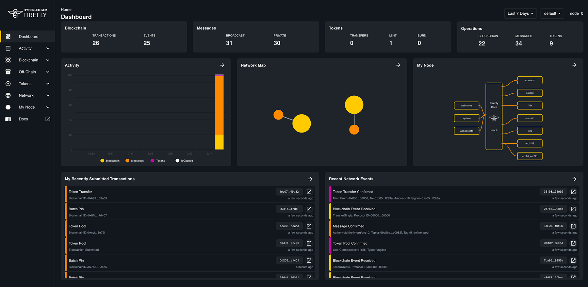
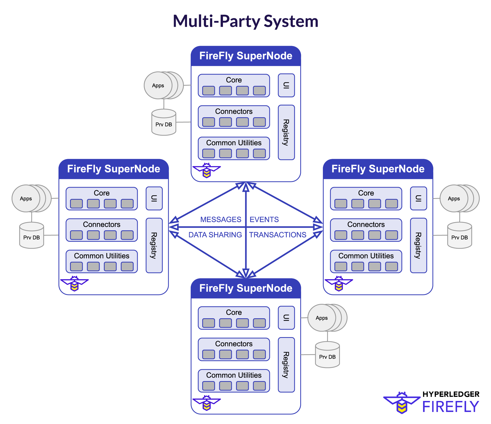
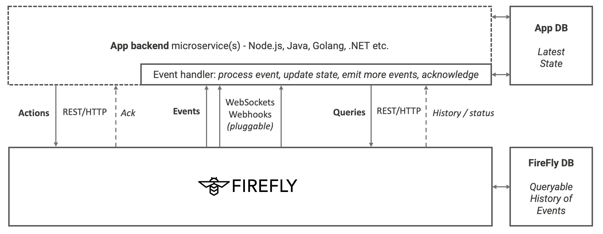

# Hyperledger FireFly

[](https://codecov.io/gh/hyperledger/firefly)
[](https://goreportcard.com/report/github.com/hyperledger/firefly)
[](https://hyperledger.github.io/firefly//)


Hyperledger FireFly is an API and data orchestration layer on top of core blockchain technologies.

It implements a [multi-party system](#multi-party-systems) for building enterprise decentralized applications.

- Transaction submission and event streaming
  - Radically simplified API access to your on-chain smart contracts
- Multi-protocol blockchain integration
  - [Hyperledger Fabric](https://www.hyperledger.org/use/fabric)
  - Enterprise Ethereum - [Hyperledger Besu](https://www.hyperledger.org/use/besu) & [Quorum](https://github.com/ConsenSys/quorum)
  - [Corda](https://www.corda.net/) *(work in progress)*
- Developer friendly event-driven REST & WebSocket APIs
  - For building multi-party business applications that solve real enterprise use cases
- Digital assets
  - Tokens and NFTs ready for use, with indexed transaction history, and easy extension/customization
- On-chain/off-chain orchestration
  - Enterprise data flows backed by blockchain, with secure off-chain transfer of private docs+data
  - Pluggable private data exchange / messaging (inc. [HTTPS + Mutual TLS](https://github.com/hyperledger/firefly-dataexchange-https))
- Identity, data format, and interface distribution
  - Broadcast data schema, proven identity, and on-chain logic integration APIs across the network
  - Pluggable data distribution network with batch optimization (inc. [IPFS](https://ipfs.io/))
  - *Pluggable DIDs for identity and multi-protocol on-chain interface definition are work in progress*
- Microservice architecture, optimized for docker deployment
  - Fully pluggable architecture, embracing multiple runtime technologies (Go, Node.js, Java etc.)
- Built by developers for developers
  - Ready to go in minutes, with a CLI, built-in UI explorer, OpenAPI spec, and samples
- Data operations at the boundary of your data center
  - Fast database cache + audit of all data flowing out of your enterprise, to the network

## Quick Start Guide

Follow the [get started](https://hyperledger.github.io/firefly/gettingstarted/gettingstarted.html) guide in the doc, and your
local developer environment will be up in minutes.

You'll have your own private multi-party system, comprising a blockchain (Ethereum/Fabric) with API/Event connectors, a Private Data Exchange, an IPFS data sharing network, and ERC-1155 Token/NFT implementations.

All with the Hyperledger FireFly Explorer UI of course, and a [samples to get you building fast](https://github.com/hyperledger/firefly-samples).



## API Reference

All the Hyperledger FireFly APIs are self-documenting via Swagger, and you can just open them up on `/api` on your running FireFly.

Or you can check out the [latest API here](https://hyperledger.github.io/firefly/swagger/swagger.html).

## Documentation

https://hyperledger.github.io/firefly

## Multi-party Systems

Hyperledger Firefly is an implementation of a multi-party system.



Multi-party systems have the potential to unlock the next wave of digitization in core transaction processing systems. They combine the best features of the existing secure data exchange models for API/WebService/Messaging integration of business data/processes today, with the new technologies of the blockchain revolution.

Working within existing regulatory environments, and existing IT and data security governance frameworks, multi-party systems provide a secure gateway for organizations to participate securely in blockchain backed business ecosystems.

They are the middleware tier for decentralized applications, which are fundamentally different to centralized/SaaS applications because they are hosted independently by each IT organization, and can be customized by each organization to their own IT landscape. These applications communicate through a mix of blockchain, and private data exchange, to execute multi-party transactions at scale - powered by revolutionary new programming constructs like digital assets.

The next wave of business applications that build in a decentralized way on multi-party systems, can orchestrate data and business process flows across organizational boundaries. The integrity of the end-to-end transactions can be established throughout its lifecycle, rather than requiring complex handoff and compensation logic each time a new party performs its step. Yet the autonomy of each business and IT team is maintained in a way that could not be by pooling data and business logic in a 3rd party centralized business application.

Blockchain and other advanced cryptography technologies like zero-knowledge proofs (ZKPs), and trusted execution environments (TEEs), are the core technologies that enable this new model of cross-organizational data flow.

In an enterprise context these raw technologies are necessary, but not sufficient. Organizations need a comprehensive toolset at the boundary of their *existing core systems of record* to govern the flow of data out of their own secure IT infrastructure.
- To store the private data staged in canonical formats ready for exchange with other parties
- For retrieval of the state of transaction and data flows in-flight in the system
- To provide an audit record and reporting system for what has been shared so far
- Providing event-driven integration APIs fit for purpose to integrate to the core systems of record

This all needs to be fast, secure and reliable.

[Learn more in the Hyperledger FireFly Documentation](https://hyperledger.github.io/firefly/)

## Event-driven programming model

The core programming model of FireFly is event-driven:
- FireFly delivers data and actions from your application instance, reliably to on-chain logic and privately to other parties in the network
- FireFly receives data and actions from on-chain, and other parties in the network, correlates them, and once complete and verified delivers them to your application for processing

For this reason FireFly has a pluggable database that keeps track of all those interactions.

This database is *not intended to replace* your application database (apart from in early PoC scenarios). Instead it complements it.

You process the events from the network as they happen, **including ones you submit** because they have to be ordered with other events in the network ([learn more](https://hyperledger.github.io/firefly/keyconcepts/multiparty_process_flow.html)).

Then you update the indexed business objects in your own database, as a result of the ordered state changes that come from the network. At any point you can go back and retrieve the set of events that caused that update to your "latest" state, whether that's on-chain transaction events, digital asset transfers (Tokens/NFTs), private data transfers, or a combination.



## FireFly Hardening & Performance Testing

To be confident Firefly can perform under normal conditions for an extended period of time, [Firefly Performance CLI](https://github.com/hyperledger/firefly-perf-cli) is used and currently in development.

### Performance Test Architecture


## Learn more about Hyperledger FireFly Architecture

- [YouTube Channel](https://www.youtube.com/playlist?list=PL0MZ85B_96CFVEdBNsHRoX_f15AJacZJD)
  - Check out the architecture series
- [Architecture reference documentation](https://hyperledger.github.io/firefly/architecture/node_component_architecture.html)
  - Still evolving, and open for feedback - let us know what you think [on Rocket Chat](https://chat.hyperledger.org/channel/firefly)
- [Tagged git issues](https://github.com/hyperledger/firefly/issues?q=is%3Aissue+is%3Aopen+label%3Aarchitecture)
  - Watch out for a new formalized Feature Improvement Request (FIR) process coming soon

## Hyperledger FireFly project status

A number projects are actively building on Hyperledger FireFly today, and the current feature set and API is sufficient to build many decentralized applications. Some of the microservice components have matured through a number of years (including production adoption), others are new, and some areas are still evolving quickly and subject to flux in the APIs and feature set.

Overall, the community is working hard towards a V1.0 release.

A good reference for the scope of the V1.0 release is included in issue #117. You might be interested in getting involved.

## Git repositories

There are multiple Git repos making up the Hyperledger FireFly project, and this
list is likely to grow as additional pluggable extensions come online in the community:

- Command Line Interface (CLI) - https://github.com/hyperledger/firefly-cli
- Core (this repo) - https://github.com/hyperledger/firefly
- Sample applications - https://github.com/hyperledger/firefly-samples
- HTTPS Data Exchange - https://github.com/hyperledger/firefly-dataexchange-https
- Hyperledger Fabric connector - https://github.com/hyperledger/firefly-fabconnect
- Ethereum (Hyperledger Besu / Quorum) connector - https://github.com/hyperledger/firefly-ethconnect
- Corda connector: https://github.com/hyperledger/firefly-cordaconnect - contributed from Kaleido generation 1 - porting to generation 2
- FireFly Explorer UI - https://github.com/hyperledger/firefly-ui

## Contributing

Interested in contributing to the community?

Check out our [Contributor Guide](https://hyperledger.github.io/firefly/contributors/contributors.html), and **welcome!**.

## Navigating this core repo

Directories:

- [internal](./internal): The core Golang implementation code
- [pkg](./pkg): Interfaces intended for external project use
- [cmd](./cmd): The command line entry point
- [smart_contracts](./smart_contracts): smart contract code for Firefly's onchain logic, with support for Ethereum and Hyperledger Fabric in their respective sub-directories

[Full code layout here](#firefly-code-hierarchy)

## FireFly Core code hierarchy

```
┌──────────┐  ┌───────────────┐
│ cmd      ├──┤ firefly   [Ff]│  - CLI entry point
└──────────┘  │               │  - Creates parent context
              │               │  - Signal handling
              └─────┬─────────┘
                    │
┌──────────┐  ┌─────┴─────────┐  - HTTP listener (Gorilla mux)
│ internal ├──┤ api       [As]│    * TLS (SSL), CORS configuration etc.
└──────────┘  │ server        │    * WS upgrade on same port
              │               │  - REST route definitions
              └─────┬─────────┘    * Simple routing logic only, all processing deferred to orchestrator
                    │
              ┌─────┴─────────┐  - REST route definition framework
              │ openapi   [Oa]│    * Standardizes Body, Path, Query, Filter semantics
              │ spec          |      - OpenAPI 3.0 (Swagger) generation
              └─────┬─────────┘    * Including Swagger. UI
                    │
              ┌─────┴─────────┐  - WebSocket server
              │           [Ws]│    * Developer friendly JSON based protocol business app development
              │ websockets    │    * Reliable sequenced delivery
              └─────┬─────────┘    * _Event interface [Ei] supports lower level integration with other compute frameworks/transports_
                    │
              ┌─────┴─────────┐  - Core data types
              │ fftypes   [Ft]│    * Used for API and Serialization
              │               │    * APIs can mask fields on input via router definition
              └─────┬─────────┘
                    │
              ┌─────┴─────────┐  - Core runtime server. Initializes and owns instances of:
              │           [Or]│    * Components: Implement features
  ┌───────┬───┤ orchestrator  │    * Plugins:    Pluggable infrastructure services
  │       │   │               │  - Exposes actions to router
  │       │   └───────────────┘    * Processing starts here for all API calls
  │       │
  │  Components: Components do the heavy lifting within the engine
  │       │
  │       │   ┌───────────────┐  - Maintains a view of the entire network
  │       ├───┤ network   [Nm]│    * Integrates with network permissioning [NP] plugin
  │       │   │ map           │    * Integrates with broadcast plugin
  │       │   └───────────────┘    * Handles hierarchy of member identity, node identity and signing identity
  │       │
  │       │   ┌───────────────┐  - Broadcast of data to all parties in the network
  │       ├───┤ broadcast [Bm]│    * Implements dispatcher for batch component
  │       │   │ manager       |    * Integrates with public storage interface [Ps] plugin
  │       │   └───────────────┘    * Integrates with blockchain interface [Bi] plugin
  │       │
  │       │   ┌───────────────┐  - Send private data to individual parties in the network
  │       ├───┤ private   [Pm]│    * Implements dispatcher for batch component
  │       │   │ messaging     |    * Integrates with the data exchange [Dx] plugin
  │       │   └──────┬────────┘    * Messages can be pinned and sequenced via the blockchain, or just sent
  │       │          │
  │       │   ┌──────┴────────┐  - Groups of parties, with isolated data and/or blockchains
  │       │   │ group     [Gm]│    * Integrates with data exchange [Dx] plugin
  │       │   │ manager       │    * Integrates with blockchain interface [Bi] plugin
  │       │   └───────────────┘
  │       │
  │       │   ┌───────────────┐  - Private data management and validation
  │       ├───┤ data      [Dm]│    * Implements dispatcher for batch component
  │       │   │ manager       │    * Integrates with data exchange [Dx] plugin
  │       │   └──────┬────────┘    * Integrates with blockchain interface [Bi] plugin
  │       │          │
  │       │   ┌──────┴────────┐  - JSON data shema management and validation (architecture extensible to XML and more)
  │       │   │ json      [Jv]│    * JSON Schema validation logic for outbound and inbound messages
  │       │   │ validator     │    * Schema propagatation
  │       │   └──────┬────────┘    * Integrates with broadcast plugin
  │       │          │
  │       │   ┌──────┴────────┐  - Binary data addressable via ID or Hash
  │       │   │ blobstore [Bs]│    * Integrates with data exchange [Dx] plugin
  │       │   │               │    * Hashes data, and maintains mapping to payload references in blob storage
  │       │   └───────────────┘    * Integrates with blockchain interface [Bi] plugin
  │       │
  │       │   ┌───────────────┐
  │       ├───┤ identity [Im] │  - Central identity management service across components
  │       │   │ manager       │    * Resolves API input identity + key combos (short names, formatting etc.)
  │       │   │               │    * Resolves registered on-chain signing keys back to identities
  │       │   └───────────────┘    * Integrates with Blockchain Interface and plugable Identity Interface (TBD)
  │       │
  │       │   ┌───────────────┐  - Private data management and validation
  │       ├───┤ event     [Em]│    * Implements dispatcher for batch component
  │       │   │ manager       │    * Integrates with data exchange [Dx] plugin
  │       │   └──────┬────────┘    * Integrates with blockchain interface [Bi] plugin
  │       │          │
  │       │   ┌──────┴────────┐  - Handles incoming external data
  │       │   │           [Ag]│    * Integrates with data exchange [Dx] plugin
  │       │   │ aggregator    │    * Integrates with public storage interface [Ps] plugin
  │       │   │               │    * Integrates with blockchain interface [Bi] plugin
  │       │   │               │  - Ensures valid events are dispatched only once all data is available
  │       │   └──────┬────────┘    * Context aware, to prevent block-the-world scenarios
  │       │          │
  │       │   ┌──────┴────────┐  - Subscription manager
  │       │   │           [Sm]│    * Creation and management of subscriptions
  │       │   │ subscription  │    * Creation and management of subscriptions
  │       │   │ manager       │    * Message to Event matching logic
  │       │   └──────┬────────┘
  │       │          │
  │       │   ┌──────┴────────┐  - Manages delivery of events to connected applications
  │       │   │ event     [Ed]│    * Integrates with data exchange [Dx] plugin
  │       │   │ dispatcher    │    * Integrates with blockchain interface [Bi] plugin
  │       │   └───────────────┘
  │       │
  │       │   ┌───────────────┐  - Token operations
  │       ├───┤ asset     [Am]│    * NFT coupling with contexts
  │       │   │ manager       │    * Transfer coupling with data describing payment reason
  │       │   │               │  - ...
  │       │   └───────────────┘
  │       │
  │       │   ┌───────────────┐
  │       ├───┤ sync /   [Sa] │  - Sync/Async Bridge
  │       │   │ async bridge  │    * Provides synchronous request/reply APIs
  │       │   │               │    * Translates to underlying event-driven API
  │       │   └───────────────┘
  │       │
  │       │   ┌───────────────┐  - Aggregates messages and data, with rolled up hashes for pinning
  │       ├───┤ batch     [Ba]│    * Pluggable dispatchers
  │       │   │ manager       │  - Database decoupled from main-line API processing
  │       │   │               │    * See architecture diagrams for more info on active/active sequencing
  │       │   └──────┬────────┘  - Manages creation of batch processor instances
  │       │          │
  │       │   ┌──────┴────────┐  - Short lived agent spun up to assemble batches on demand
  │       │   │ batch     [Bp]│    * Coupled to an author+type of messages
  │       │   │ processor     │  - Builds batches of 100s messages for efficient pinning
  │       │   │               │    * Aggregates messages and data, with rolled up hashes for pinning
  │       │   └───────────────┘  - Shuts down automatically after a configurable inactivity period
  │       ... more TBD
  │
Plugins: Each plugin comprises a Go shim, plus a remote agent microservice runtime (if required)
  │
  │           ┌───────────────┐  - Blockchain Interface
  ├───────────┤           [Bi]│    * Transaction submission - including signing key management
  │           │ blockchain    │    * Event listening
  │           │ interface     │    * Standardized operations, and custom on-chain coupling
  │           └─────┬─────────┘
  │                 │
  │                 ├─────────────────────┬───────────────────┐
  │           ┌─────┴─────────┐   ┌───────┴───────┐   ┌───────┴────────┐
  │           │ ethereum      │   │ corda         │   │ fabric         │
  │           └───────────────┘   └───────────────┘   └────────────────┘
  │
  │           ┌───────────────┐  - P2P Content Addresssed Filesystem
  ├───────────┤ public    [Pi]│    * Payload upload / download
  │           │ storage       │    * Payload reference management
  │           │ interface     │
  │           └─────┬─────────┘
  │                 │
  │                 ├───────── ... extensible to any shared storage sytem, accessible to all members
  │           ┌─────┴─────────┐
  │           │ ipfs          │
  │           └───────────────┘
  │
  │           ┌───────────────┐  - Private Data Exchange
  ├───────────┤ data      [Dx]│    * Blob storage
  │           │ exchange      │    * Private secure messaging
  │           └─────┬─────────┘    * Secure file transfer
  │                 │
  │                 ├─────────────────────┬────────── ... extensible to any private data exchange tech
  │           ┌─────┴─────────┐   ┌───────┴───────┐
  │           │ httpdirect    │   │ kaleido       │
  │           └───────────────┘   └───────────────┘
  │
  │           ┌───────────────┐  - Pluggable identity infrastructure
  ├───────────┤ identity  [Ii]│    * TBD
  │           │ interface     │    * See Identity Manager component above
  │           └───────────────┘    * See Issue
  │
  │           ┌───────────────┐  - API Authentication and Authorization Interface
  ├───────────┤ api auth  [Aa]│    * Authenticates security credentials (OpenID Connect id token JWTs etc.)
  │           │               │    * Extracts API/user identity (for identity interface to map)
  │           └─────┬─────────┘    * Enforcement point for fine grained API access control
  │                 │
  │                 ├─────────────────────┬────────── ... extensible other single sign-on technologies
  │           ┌─────┴─────────┐   ┌───────┴───────┐
  │           │ apikey        │   │ jwt           │
  │           └───────────────┘   └───────────────┘
  │
  │           ┌───────────────┐  - Database Interactions
  ├───────────┤ database  [Di]│    * Create, Read, Update, Delete (CRUD) actions
  │           │ interace      │    * Filtering and update definition interace
  │           └─────┬─────────┘    * Migrations and Indexes
  │                 │
  │                 ├───────── ... extensible to NoSQL (CouchDB / MongoDB etc.)
  │           ┌─────┴─────────┐
  │           │ sqlcommon     │
  │           └─────┬─────────┘
  │                 ├───────────────────────┬───────── ... extensible other SQL databases
  │           ┌─────┴─────────┐     ┌───────┴────────┐
  │           │ postgres      │     │ sqlite3        │
  │           └───────────────┘     └────────────────┘
  │
  │           ┌───────────────┐  - Connects the core event engine to external frameworks and applications
  ├───────────┤ event     [Ei]│    * Supports long-lived (durable) and ephemeral event subscriptions
  │           │ interface     │    * Batching, filtering, all handled in core prior to transport
  │           └─────┬─────────┘    * Interface supports connect-in (websocket) and connect-out (broker runtime style) plugins
  │                 │
  │                 ├───────── ... extensible to integrate off-chain compute framework (Hyperledger Avalon, TEE, ZKP, MPC etc.)
  │                 │          ... extensible to additional event delivery brokers/subsystems (Webhooks, Kafka, AMQP etc.)
  │           ┌─────┴─────────┐
  │           │ websockets    │
  │           └───────────────┘
  │  ... more TBD

  Additional utility framworks
              ┌───────────────┐  - REST API client
              │ rest      [Re]│    * Provides convenience and logging
              │ client        │    * Standardizes auth, config and retry logic
              └───────────────┘    * Built on Resty

              ┌───────────────┐  - WebSocket client
              │ wsclient  [Wc]│    * Provides convenience and logging
              │               │    * Standardizes auth, config and reconnect logic
              └───────────────┘    * Built on Gorilla WebSockets

              ┌───────────────┐  - Translation framework
              │ i18n      [In]│    * Every translations must be added to `en_translations.json` - with an `FF10101` key
              │               │    * Errors are wrapped, providing extra features from the `errors` package (stack etc.)
              └───────────────┘    * Description translations also supported, such as OpenAPI description

              ┌───────────────┐  - Logging framework
              │ log       [Lo]│    * Logging framework (logrus) integrated with context based tagging
              │               │    * Context is used throughout the code to pass API invocation context, and logging context
              └───────────────┘    * Example: Every API call has an ID that can be traced, as well as a timeout

              ┌───────────────┐  - Configuration
              │ config    [Co]│    * File and Environment Variable based logging framework (viper)
              │               │    * Primary config keys all defined centrally
              └───────────────┘    * Plugins integrate by returning their config structure for unmarshaling (JSON tags)

```
