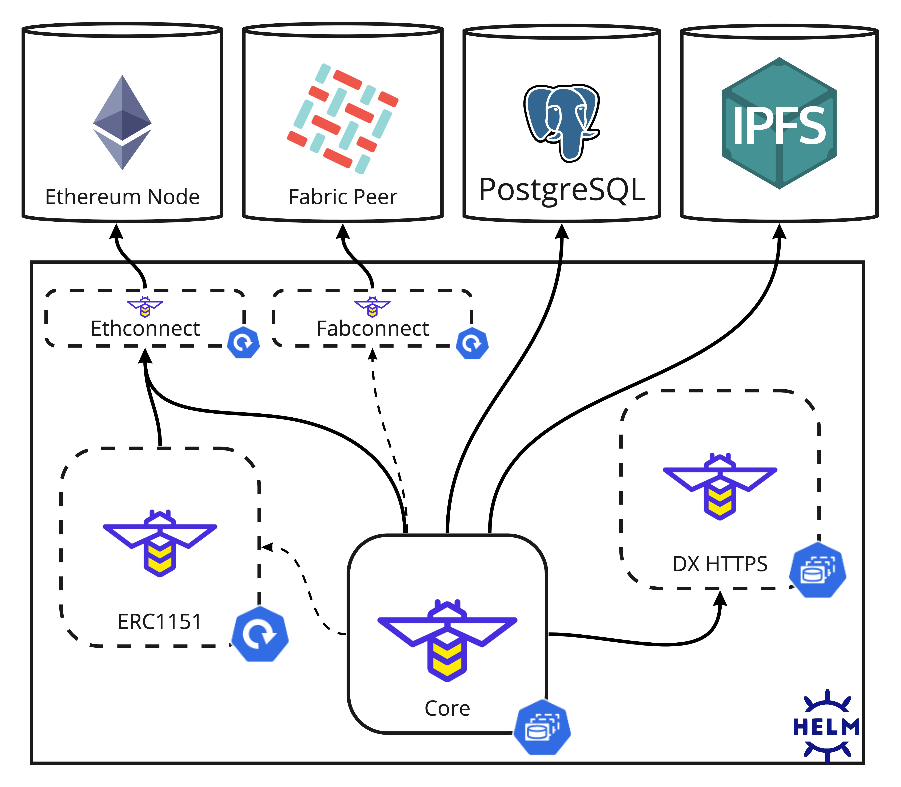

# FireFly

[Hyperledger FireFly](https://hyperledger.github.io/firefly/) is an implementation of a [multi-party system](https://github.com/hyperledger/firefly#multi-party-systems) that
simplifies data orchestration on top of blockchain and other peer-to-peer technologies.

This chart bootstraps a FireFly deployment on a [Kubernetes](https://kubernetes.io/) cluster using the [Helm](https://helm.sh/)
package manager. It can be used to deploy a FireFly node for an organization within a multi-party system.

### Table of Contents

* [Prerequisites](#prerequisites)
* [Get Repo Info](#get-repo-info)
* [Install Chart](#install-chart)
* [Uninstall Chart](#uninstall-chart)
* [Upgrading Chart](#upgrading-chart)
* [Using as a Dependency](#using-as-a-dependency)
* [Deployment Architecture](#deployment-architecture)
    * [Infrastructural Dependecies](#infrastructural-dependecies)
* [Configuration](#configuration)
    * [Configuration File Templating](#configuration-file-templating)
        * [Ethereum](#ethereum)
        * [Fabric](#fabric)
    * [Ingress Examples](#ingress-examples)
    * [SQL Database Migrations](#sql-database-migrations)
    * [Auto-Registration](#auto-registration)
    * [DataExchange HTTPS and cert-manager](#dataexchange-https-and-cert-manager)
    * [Tokens via ERC1155 Connector](#tokens-via-erc1155-connector)
    * [Prometheus Support](#prometheus-support)
* [Automated Deployments](#automated-deployments)
    * [GitOps](#gitops)
        * [Flux V2](#flux-v2)
        * [ArgoCD](#argocd)
    * [Terraform](#terraform)


## Prerequisites

* Kubernetes 1.18+
* Helm 3.7+
* PV provisioner support in the underlying infrastructure
* _Recommended:_ cert-manager 1.4+

## Get Repo Info

Helm's [experimental OCI registry support](https://helm.sh/docs/topics/registries/) is used for publishing and retrieving
the FireFly chart, as a result one must log into [GHCR](https://docs.github.com/en/packages/working-with-a-github-packages-registry/working-with-the-container-registry)
to download the chart:

```shell
export HELM_EXPERIMENTAL_OCI=1

helm registry login ghcr.io
```

> **NOTE**: it is recommended to use a [GitHub personal access token](https://docs.github.com/en/authentication/keeping-your-account-and-data-secure/creating-a-personal-access-token)
> when authenticating to the GHCR registry as opposed to using your GitHub password.

## Install Chart

```shell
helm install [RELEASE_NAME] --version 0.1.0 oci://ghcr.io/hyperledger/helm/firefly
```

_See [configuration](#Configuration) below._

_See [helm install](https://helm.sh/docs/helm/helm_install/) for command documentation._

## Uninstall Chart

```shell
helm uninstall [RELEASE_NAME]
```

_See [helm uninstall](https://helm.sh/docs/helm/helm_uninstall/) for command documentation._

## Upgrading Chart

```shell
helm upgrade [RELEASE_NAME] --install --version 0.1.1 oci://ghcr.io/hyperledger/helm/firefly
```

_See [helm upgrade](https://helm.sh/docs/helm/helm_upgrade/) for command documentation._

## Using as a Dependency

You can also use the FireFly chart within your own parent chart's `Chart.yaml`:

```yaml
dependencies:
  # ...
  - name: firefly
    repository: "oci://ghcr.io/hyperledger/helm/"
    version: 0.1.0
```

Then download the chart dependency into your parent chart:

```shell
helm dep up path/to/parent-chart
```

_See [helm dependency](https://helm.sh/docs/helm/helm_dependency/) for command documentation._


## Deployment Architecture

FireFly provides a REST API with an event-driven paradigm that makes building multi-party interactions via
decentralized applications simpler. In order to do so, FireFly leverages extensible connector plugins that enable
swapping out the underlying blockchain and off-chain infrastructure easily.

As a result, FireFly has several infrastructural dependencies:

* Blockchain connector (either Fabconnect -> Fabric, or Ethconnect -> Ethereum) for a _private_ blockchain
* A Fabric chaincode or Ethereum smart contract deployed to the underlying blockchain
* Private data exchange (HTTPS + mTLS)
* Database (PostgreSQL)
* Shared storage (IPFS)
* Optional tokens connector (ERC1155)



As depicted above, the chart only aims to provide a means for deploying FireFly core, and optionally both the
FireFly DataExchange HTTPS and FireFly Tokens ERC1155 microservices. All other infrastructural dependencies must be
pre-provisioned in order for FireFly to be fully functioning.

Below are some recommendations for provisioning the various pieces of infrastructural dependencies:

* **PostgreSQL**: for self-hosting consider the [`postgresql-ha` Chart](https://github.com/bitnami/charts/tree/master/bitnami/postgresql-ha)
  or a [Postgres operator](https://github.com/zalando/postgres-operator). Otherwise, consider cloud providers such as [AWS RDS](https://aws.amazon.com/rds/postgresql/).
* **Blockchain**: for self-hosting consider [Hyperledger Bevel](https://github.com/hyperledger/bevel). Otherwise, consider
  cloud providers such as [AWS Managed Blockchain](https://aws.amazon.com/managed-blockchain/) or [Kaleido](https://kaleido.io). _Please note, of these options only Kaleido
  provides the necessary blockchain connectors (Fabconnect or Ethconnect) out-of-the-box. For Bevel and AWS, you will have to deploy the connectors yourself._
* **IPFS**: for self-hosting options are limited, there is a [deprecated `stable/ipfs` chart](https://github.com/helm/charts/tree/master/stable/ipfs) which could be used to create private IPFS network. Otherwise
  consider cloud providers such as [Kaledio](https://docs.kaleido.io/kaleido-services/ipfs/).

## Configuration

The following describes how to use the chart's values to configure various aspects of the FireFly deployment.

### Configuration File Templating

FireFly itself has a robust YAML configuration file (usually named `firefly.core`) powered by [Viper](https://github.com/spf13/viper)
that allows one to define all  the necessary configuration for the FireFly server, and more importantly the underlying
connectors it will use.

The chart provides a top-level `config` value which then contains sub-values such as `postgresUrl`, `ethconnectUrl`,
`organizationName`, `adminEnabled`, etc. These sub-values are meant to provide an opinionated, safe way of templating
the `firefly.core` file. Based on which values are set, it will correctly configure the various connector plugins as well
as determine if additional ports will be exposed such as the admin, debug, and metrics ports.

The following values are required in order for FireFly to startup correctly:
* `config.organizationName`
* `config.organizationKey`
* `config.postgresUrl`
* `config.ipfsUrl`
* either:
    * `config.ethconnectUrl` and `config.fireflyContractAddress`
    * or, `config.fabconnectUrl` and `config.fabconnectSigner`

You can find documentation regarding each of these values, as well as all the other `config` values,
in the comments of the default [`values.yaml`](values.yaml). You can see how the values are used for
templating the `firefly.core` file by looking at the `firefly.coreConfig` helper function in [`_helpers.tpl`](templates/_helpers.tpl).

> **NOTE**: although `config.dataexchangeUrl` is available, by default `dataexchange.enabled` is `true` which will
> deploy a DataExchange HTTPS and automatically configure FireFly to use it.

If you would rather customize the templating of the `firefly.core` with your own values, you can use `config.templateOverride`:

```yaml
config:
  templateOverride: |
    org:
      name: {{ .Values.global.myOrgNameValue }}
    # etc. ...
```

See [`config.go`](../../../internal/config/config.go) for all available FireFly configuration options.

### Additional Environment Variables

If there are configurations you want to set via your own `ConfigMaps` or `Secrets`, it is recommended to do so
via environment variables which can be provided with the `core.extraEnv` list value. FireFly will automatically override
its config via environment variables prefixed with `FIREFLY_`. For example, if you want to set to the config value
`log.level` you would set the env var `FIREFLY_LOG_LEVEL`.

For a more detailed example using `core.extraEnv`, one could provide basic auth credentials for IPFS from a `Secret`
like so:

```yaml
core:
  extraEnv:
    - name: FIREFLY_PUBLICSTORAGE_IPFS_API_AUTH_USERNAME
      valueFrom:
        secretKeyRef:
          name: my-ipfs-basic-auth
          key: username
    - name: FIREFLY_PUBLICSTORAGE_IPFS_API_AUTH_PASSWORD
      valueFrom:
        secretKeyRef:
          name: my-ipfs-basic-auth
          key: password
```

### Ethereum

Configuring FireFly to use an [Ethereum](https://ethereum.org/en/) blockchain such as [Geth](https://geth.ethereum.org/),
[Quorum](https://github.com/ConsenSys/quorum), or [Hyperledger Besu](https://www.hyperledger.org/use/besu) requires first
having an instance of [FireFly Ethconnect](https://github.com/hyperledger/firefly-ethconnect) deployed and connected to
an Ethereum node in the underlying network.

Once you have an Ethconnect instance ready, FireFly then needs three pieces of configuration:

* `config.organizationKey`: the Ethereum address of the organization's wallet / key which will be used for signing transactions
* `config.ethconnectUrl`: the HTTP/S URL of the Ethconnect instance FireFly will use
* `config.fireflyContractAddress`: the Ethconnect URI representing the deployed FireFly smart contract i.e.
  `/instances/0x965b92929108df1c77c156ba73d00ca851dcd2e1`. See [Smart Contract Deployment](#smart-contract-deployment)
  for how to you can deploy the contract yourself.

These will enable the FireFly deployment to connect to the Ethereum blockchain and submit batch pin transactions via
its smart contract on behalf of the organization it's representing.

#### Smart Contract Deployment

Currently, the chart offers no way for one to manage the [FireFly smart contract](../../../smart_contracts/ethereum/solidity_firefly/contracts/Firefly.sol).
Instead, the chart assumes it is already pre-provisioned via Ethconnect by one of the organizations.

If you have the contract available as gateway contract on Ethconnect, you can then deploy it via the API:

```shell
curl -v \
 -X POST \
 -H 'Content-Type: application/json' \
 -d '{}' \
 "${ETHCONNECT_URL/gateways/${FF_CONTRACT_GATEWWAY}?ff-from=${ORG_WALLET_ADDRESS}&ff-sync=true"
```

The JSON returned by the API will have the Ethereum address of the smart contract in the `address` field.

> **NOTE**: the FireFly smart contract only needs to be deployed by one organization within the blockchain
> network. All organizations within a FireFly network must use the same smart contract instance in order for
> transactions to work properly.

If the contract is not available as a gateway contract on your Ethconnect instance, see the
Ethconnect docs for [deploying a contract](https://github.com/hyperledger/firefly-ethconnect#yaml-to-deploy-a-contract).

### Fabric

Configuring FireFly to use a [Hyperledger Fabric](https://www.hyperledger.org/use/fabric) blockchain requires first
having an instance of [FireFly Fabconnect](https://github.com/hyperledger/firefly-fabconnect) deployed and connected to
a Fabric peer in the underlying network.

#### Chaincode

#### Identity Management

### Ingress Examples


```yaml
core:
  ingress:
    enabled: true
    className: nginx
    annotations:
      # recommended for handling blob data transfers
      nginx.ingress.kubernetes.io/proxy-body-size: 128m
      # example cert-manager ClusterIssuer for Let's Encrypt
      cert-manager.io/cluster-issuer: letsencrypt-prod
    hosts:
      - host: firefly.acme.org
    tls:
      - secretName: firefly-tls
        hosts:
          - firefly.acme.org
```

### Database Migrations

```yaml
core:
  jobs:
    postgresMigrations:
      enabled: true
```

```yaml
config:
  postgresAutomigrate: true
```

### Auto-Registration

```yaml
core:
  jobs:
    registration:
      enabled: true
```

### DataExchange HTTPS and cert-manager

[cert-manager]() ...

mention https://github.com/jetstack/cert-manager/issues/3651

```yaml
dataexchange:
  certificate:
    enabled: true
    issuerRef:
      name: selfsigned-ca
      kind: ClusterIssuer
```

if your DataExchange HTTPS is communicating via `Ingresses`, you will need to enable TLS passthrough
in order for mTLS to work. For example, when using [nginx-ingress]() an annotation can be set on the
`Ingress`:

```yaml
  ingress:
    enabled: true
    annotations:
      nginx.ingress.kubernetes.io/ssl-passthrough: "true"
    class: nginx
    hosts:
      - host: firefly-dx.acme.org
```

> **NOTE**: the `tls` section of the `Ingress` does not need to be configured since mTLS is required. Instead,
> it assumes the provided `hosts` must match the `tls[0].hosts` and that the secret is either pre-made or
> sprovided by cert-manager.


### Tokens via ERC1155 Connector

Chart support for the [ERC1155 token connector](https://github.com/hyperledger/firefly-tokens-erc1155) is coming soon.
See [#218](https://github.com/hyperledger/firefly/issues/218) and [#272](https://github.com/hyperledger/firefly/issues/272)
for updates on its progress.

### Prometheus Support

FireFly comes with an [metrics endpoint](https://prometheus.io/docs/instrumenting/exposition_formats/#text-format-example)
exposed on a separate HTTP server for [Prometheus](https://prometheus.io/) scraping.

By default, the FireFly Prometheus metrics server is enabled. You can turn the server off, or configure its exposed port
and path using the following values:

```yaml
config:
  metricsEnabled: true
  metricsPath: /metrics

core:
  service:
    metricsPort: 5100
```

Additionally, if you are managing Prometheus via the [Prometheus Operator](https://github.com/prometheus-operator/prometheus-operator),
you can enable a [`ServiceMonitor`](https://github.com/prometheus-operator/prometheus-operator/blob/main/Documentation/user-guides/getting-started.md#related-resources)
for FireFly with:

```yaml
core:
  metrics:
    serviceMonitor:
      enabled: true
```

## Automated Deployments

Due to Helm's OCI registry support being experimental, below describes how to configure
common deployment automation tooling for consuming the FireFly chart.

### GitOps

#### Flux V2

[Flux V2](https://fluxcd.io/docs/) is a GitOps controller for Kubernetes which currently [does not support Helm OCI registries](https://github.com/fluxcd/source-controller/issues/124).
Instead, one can use a [`GitRepository`](https://fluxcd.io/docs/components/source/gitrepositories/) resource pointed at a specific release tag:

```yaml
apiVersion: source.toolkit.fluxcd.io/v1beta1
kind: GitRepository
metadata:
  name: firefly-helm
spec:
  interval: 10m
  url: "https://github.com/hyperledger/firefly"
  ref:
    tag: helm-v0.1.0
  ignore: |
    /*
    !/deploy/charts/firefly
```

then within a [`HelmRelease`](https://fluxcd.io/docs/components/helm/helmreleases/) resource you can refer to the chart via the `GitRepostiory`:

```yaml
apiVersion: helm.toolkit.fluxcd.io/v2beta1
kind: HelmRelease
metadata:
  name: firefly
spec:
  chart:
    spec:
      chart: /deploy/charts/firefly
      sourceRef:
        name: firefly-helm
        kind: GitRepository
  interval: 1m
  values: |
    # ...
```


#### ArgoCD

[ArgoCD](https://argo-cd.readthedocs.io/en/stable/)

via the [CLI](https://argo-cd.readthedocs.io/en/stable/user-guide/commands/argocd_repo_add/):
```shell
argocd repo add ghcr.io/hyperledger/helm --type helm --name hyperledger --enable-oci --username ${USERNAME} --password ${PAT}
```

https://argo-cd.readthedocs.io/en/stable/operator-manual/declarative-setup/#repositories

```yaml
apiVersion:
kind: Application
```

### Terraform

```shell
helm pull --version 0.1.0 oci://ghcr.io/hyperledger/helm/firefly
```