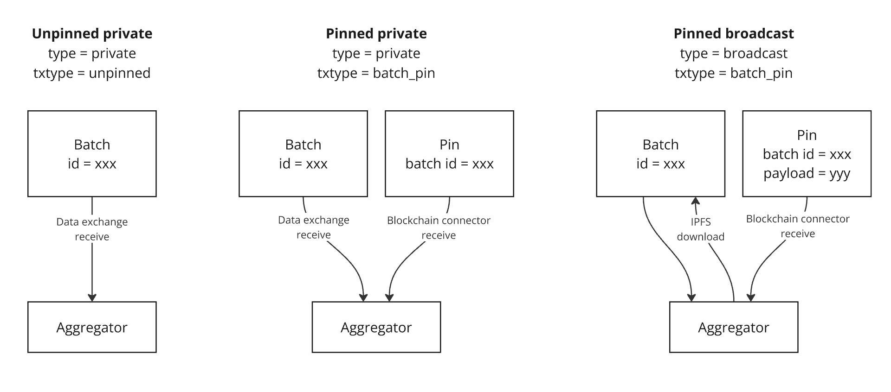

When using FireFly in multiparty mode to deliver broadcast or private messages, one potential problem is that of
undelivered messages. In general FireFly's message delivery service should be extremely reliable, but understanding
when something has gone wrong (and how to recover) can be important for maintaining system health.

## Background

This guide assumes some familiarity with how
[multiparty event sequencing](../architecture/multiparty_event_sequencing.md) works.
In general, FireFly messages come in three varieties:

1. **Unpinned private messages:** private messages delivered directly via data exchange
2. **Pinned private messages:** private messages delivered via data exchange, with a hash of the message recorded on the blockchain ledger
3. **Pinned broadcast messages:** messages stored in IPFS, with a hash and reference to the message shared on the blockchain ledger

Note that all messages are batched for efficiency, but in cases of low throughput, you may frequently see batches
containing exactly one message.

"Pinned" messages are those that use the blockchain ledger for reliable timestamping and ordering. These messages have
two pieces which must be received before the message can be processed: the **batch** is the actual contents of
the message(s), and the **pin** is the lightweight blockchain transaction that records the existence and ordering of
that batch. We frequently refer to this combination as a **batch-pin**.

## Symptoms

When some part of the multiparty messaging infrastructure requires troubleshooting, common symptoms include:

- a message was sent, but is not present on some other node where it should have been received
- a message is stuck indefinitely in "sent" or "pending" state

## Troubleshooting steps

When troubleshooting one of the symptoms above, the main goal is to identify the specific piece of the infrastructure that is
experiencing an issue. This can lead you to diagnose specific issues such as misconfiguration, network problems, database
integrity problems, or potential code bugs.

In all cases, the **batch ID** is the most critical piece of data for determining the nature of the issue. This ID will be the
same on all nodes involved in the messaging flow. The following two steps can be easily performed to check for the existence
of the expected items:

- query `/batches/<batch-id>` on each node that should have the message
- query `/pins?batch=<batch-id>` on each node that should have the message (for pinned messages only)

Then choose one of these scenarios to focus in on an area of interest:

#### 1) Is the batch missing on a node that should have received it?

For private messages, this indicates a potential problem with **data exchange**. Check the sending node to see if the
operations succeeded when sending the batch via data exchange, and check that the data exchange runtime is healthy.
If an operation failed on the sending node, you may need to retry it with `/operations/<op-id>/retry`.

For broadcast messages, this indicates a potential problem with **IPFS**. Check the sending node to see if the
operations succeeded when uploading the batch to IPFS, and the receiving node to see if the operations succeeded when
downloading the batch from IPFS. If an operation failed, you may need to retry it with `/operations/<op-id>/retry`.

#### 2) Is the batch present, but the pin is missing?

This indicates a potential problem with the **blockchain connector**. Check if the underlying blockchain node is
healthy and mining blocks. Check the sending node to see if the operation succeeded when pinning the batch via the
blockchain. Check the blockchain connector logs (such as evmconnect or fabconnect) to see if it is
successfully processing events from the blockchain, or if it is encountering any errors before forwarding those events
on to FireFly.

#### 3) Are the batch and pin both present, but the messages from the batch are still stuck in "sent" or "pending"?

Check the pin details to see if it contains a field `"dispatched": true`. If this field is false or missing, it means
that the pin was received but couldn't be matched successfully with the off-chain batch contents. Check the FireFly
logs and search for the batch ID - likely this issue is in FireFly and it will have logged some problem while
aggregating the batch-pin.

## Opening an issue

It's possible that the above steps may lead to an obvious solution (such as recovering a crashed service or retrying a
failed operation). If they do not, you can open an issue. The more detail you can include from the troubleshooting above
(including the type of message, the nodes involved, and the details on the batch and pin found when examining each node),
the more likely it is that someone can help to suggest additional troubleshooting. Full logs from FireFly, and (as
deemed relevant from the troubleshooting above) full logs from the data exchange or blockchain connector runtimes, will
also make it easier to offer additional insight.
