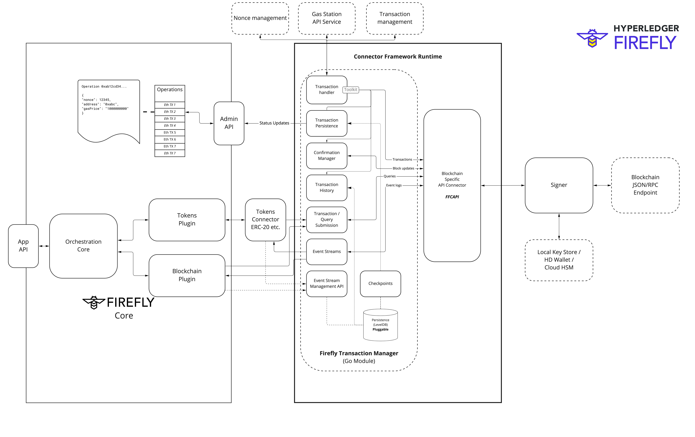

# Multiparty Event Sequencing
{: .no_toc }

## Table of contents
{: .no_toc .text-delta }

1. TOC
{:toc}

---

<iframe width="736" height="414" src="https://www.youtube.com/embed/Bwx7MWjP1z0?start=259" title="YouTube video player" frameborder="0" allow="accelerometer; autoplay; clipboard-write; encrypted-media; gyroscope; picture-in-picture" allowfullscreen></iframe>

## Blockchain Connector Framework

Hyperledger FireFly has a [multi-tier pluggable architecture](../overview/key_components/connectors.md) for supporting blockchains of
all shapes and sizes. This includes a remote API that allows a microservice connector to
be built from scratch in any programming language.

It also includes the **Connector Toolkit**, which is a pluggable SDK in Golang that provides
a set of re-usable modules that can be used across blockchain implementations.

> This is the preferred way to build a new blockchain connector, if you are comfortable
> with coding in Golang and there are language bindings available for the raw RPC interface
> of your blockchain.

## Connector Toolkit Architecture

The core component of the FireFly Connector Framework for Blockchains is a Go module
called [FireFly Transaction Manager](https://github.com/hyperledger/firefly-transaction-manager) (FFTM).

FFTM is responsible for:

- Submission of transactions to blockchains of all types
  - Nonce management - idempotent submission of transactions, and assignment of nonces 
  - Protocol connectivity decoupled with additional lightweight API connector
  - Easy to add additional protocols that conform to normal patterns of TX submission / events

- Monitoring and updating blockchain operations
  - Receipts
  - Confirmations

- Gas calculation and rescue of stalled transactions
  - Extensible policy engine
  - Gas station API integration

- Event streaming
  - Protocol agnostic event polling/streaming support
  - Reliable checkpoint restart
  - At least once delivery API

## Assumptions / Requirements

The framework is currently constrained to blockchains that adhere to certain basic principals:

1. Has transactions
  - That are signed
  - That can optionally have gas semantics (limits and prices, expressed in a blockchain specific way)
2. Has events (or "logs")
  - That are emitted as a deterministic outcome of transactions
3. Has blocks
  - Containing zero or more transactions, with their associated events
  - With a sequential numeric order
  - With a hash
  - With a parent hash
4. Has finality for transactions & events that can be expressed as a level of confidence over time
  - Confirmations: A number of sequential blocks in the canonical chain that contain the transaction

## Nonce management

The nonces for transactions is assigned as early as possible in the flow:
- Before the REST API for submission of the transaction occurs
- After the FFCAPI blockchain connector verifies the transaction can be encoded successfully to the chain
- With protection against multiple parallel API requests for the same signing address
- With stateful persistence meaning the connector knows about all nonces it previously allocated, to avoids duplicates

This "at source" allocation of nonces provides the strictest assurance of order of transactions possible,
because the order is locked in with the coordination of the business logic of the application submitting the transaction.

As well as protecting against loss of transactions, this protects against duplication of transactions - even in crash
recovery scenarios with a sufficiently reliable persistence layer.

### Avoid multiple nonce management systems against the same signing key

FFTM is optimized for cases where all transactions for a given signing address flow through the
same FireFly connector. If you have signing and nonce allocation happening elsewhere, not going through the
FireFly blockchain connector, then it is possible that the same nonce will be allocated in two places.

> Be careful that the signing keys for transactions you stream through the Nonce Management of the FireFly
> blockchain connector are not used elsewhere.

If you must have multiple systems performing nonce management against the same keys you use with FireFly nonce management,
you can set the `transactions.nonceStateTimeout` to `0` (or a low threshold like `100ms`) to cause the nonce management
to query the pending transaction pool of the node every time a nonce is allocated.

This reduces the window for concurrent nonce allocation to be small (basically the same as if you had
multiple simple web/mobile wallets used against the same key), but it does not eliminate it completely it.

### Why "at source" nonce management was chosen vs. "at target"

The "at source" approach to ordering used in FFTM could be compared with the "at target" allocation of nonces used in
[EthConnect](https://github.com/hyperledger/firefly-ethconnect)).

The "at target" approach optimizes for throughput and ability to send new transactions to the chain,
with an at-least-once delivery assurance to the applications.

An "at target" algorithm as used in EthConnect could resume transaction delivery automatically without operator intervention
from almost all scenarios, including where nonces have been double allocated.

However, "at target" comes with two compromises that mean FFTM chose the "at source" approach was chosen for FFTM:

- Individual transactions might fail in certain scenarios, and subsequent transactions will still be streamed to the chain.
  While desirable for automation and throughput, this reduces the ordering guarantee for high value transactions.

- In crash recovery scenarios the assurance is at-least-once delivery for "at target" ordering (rather than "exactly once"),
  although the window can be made very small through various optimizations included in the EthConnect codebase.

## Policy Manager

The policy manager is a pluggable component that allows rich policy to be applied to the
gas pricing, signing, submission and re-submission of transactions to the blockchain.

It is executed at regular intervals against transactions in-flight, and is responsible for
evaluating what actions are required to cause those transactions to be executed successfully.

The policy manager can store custom state in the state store of the FFTM code, which is also
reported in status within the FireFly API/Explorer on the operation.

A reference implementation is provided that:
- Submits transactions via the underlying FFCAPI
- Estimates gas price in one of three modes:
  - Fixed: It is specified via configuration
  - Connector: The FFCAPI is used to estimate the gas price (e.g. `eth_gasPrice` for EVM JSON/RPC)
  - Gas Oracle: A REST API is called the the result mapped via a Go template
- Re-submits transactions after a configurable stale time

The reference implementation is available [here](https://github.com/hyperledger/firefly-transaction-manager/blob/main/pkg/policyengines/simple/simple_policy_engine.go)

## Event Streams

One of the largest pieces of heavy lifting code in the FFTM codebase, is the event stream
support. This provides a WebSocket (and Webhook) interface that FireFly Core and the Tokens
Connectors connect to in order to receive ordered streams of events from the blockchain.

The interface down to the blockchain layer is via go channels, and there are lifecycle
interactions over the FFCAPI to the blockchain specific code to add and remove listeners
for different types of blockchain events.

Some high architectural principals that informed the code:

- Event Stream
  - A delivery stream of events that have been confirmed
  - Only events that have reached finality are delivered to an event stream
  - FireFly creates a single event stream _per namespace_ from core
  - Each token connector creates a single event stream
  - If one event stream is blocked, it must not block other streams in the FFTM based runtime
- Listener (/Subscription)
  - A blockchain specific specification for a set of events to listen to
  - Specifies an initial block to listen from, and will replay all events from that block
  - Can have multiple blockchain specific filters, to match multiple events
  - The order of delivery _within_ a listener matches the blockchain across all filters
  > - Note that the EVMConnect implementation of FFCAPI attempts to make this true across all listeners
  >   on an event stream. However, this is impossible when a new listener has been added,
  >   and that listener is catching up from an old block.
- Compatibility
  - Has breaking changes from the API of EthConnect
  - A component that has been upgraded to support EVMConnect,
    can maintain backwards compatibility with EthConnect
- Batching & Checkpoints
  - Delivery on event streams is via batches, with a single confirmation for each batch
  - At-least-once delivery of batches
  - Checkpoints are written after each batch
- Chain head stability
  - A configurable section of the head of the chain is considered unstable
  - If no events have been delivered for a listener, checkpoints are still moved forwards
  - These empty checkpoints will never be written in the unstable head of the chain
- Confirmation manager
  - Plugged in between detection of the events, and assembling into batches
  - Determines the final order based on order of confirmation on the blockchain

