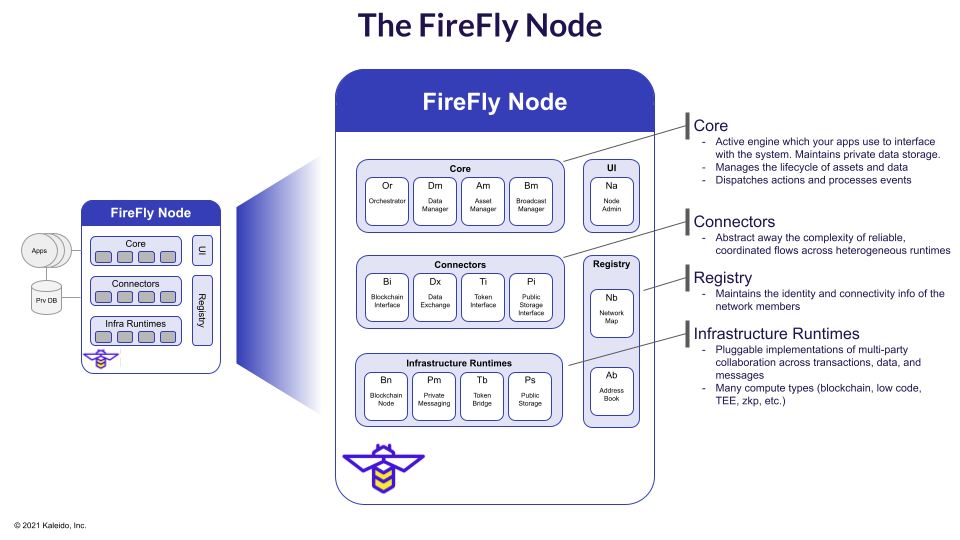

# Node Component Architecture
{: .no_toc }

## Table of contents
{: .no_toc .text-delta }

1. TOC
{:toc}

---

<iframe width="736" height="414" src="https://www.youtube.com/embed/KbXcP7wAB-0" title="YouTube video player" frameborder="0" allow="accelerometer; autoplay; clipboard-write; encrypted-media; gyroscope; picture-in-picture" allowfullscreen></iframe>

## What is a FireFly Node?

The core architecture of a FireFly node can be broken down into the following three areas:

- The various runtimes encapsulating the node.
- The core runtime responsibilities and pluggable elements.
- The actual code running inside the node.

## Runtimes

What fundamentally _is_ a node - left side of the above diagram.

- It is a collection of multiple runtimes with a single unified HTTPS/Websocket API (exposed by the Core).
- It has a private database, containing your private data, and data received from others in the network.
- It has connectivity out to other parties in the network, through runtimes (Blockchain, Shared Filesystems, Messaging etc.).

## Responsibilities & Pluggable Elements

What are the core runtime responsibilities, and pluggable elements - right side of the above diagram.

- The core elements of function that FireFly performs, and which runtime is responsible.
  - This means some insight into core itself, and the jobs it performs, but not full code structure.
  - More importantly, what the split of responsibilities is between `Connectors` and `Infrastructure Runtimes`.
    - `Connectors` are the bridging runtimes, that know how to talk to a particular runtime.
      - They run separately to the core (like a microservice architecture of an app).
      - They can be written in any language (not just Go) - Java, TypeScript, Rust, Python, .NET etc.
      - They can use any network transport (not just HTTPS/Websockets) - GRPC, AMQP, UDP etc.
      - They connect to the core with a Golang shim - see separate _Plugin Architecture_ discussion.
        > - In some special cases (like the Database) the Golang shim does not need a connector runtime.
    - `Infrastructure Runtimes` are the core runtimes for multi-party system activities.
      - Blockchain nodes - Ethereum (Hyperledger Besu, Quorum, Geth), Hyperledger Fabric, Corda etc.
      - Public strorage - IPFS etc.
      - Database - PostreSQL, CouchDB etc.

## Code Structure

What is the code structure _inside_ the core.

- The [README.md](https://github.com/hyperledger/firefly#readme) is the reference for this.
- Developers contributing to FireFly, on the core, or building new plugins, need this level of detail.
  > - A reconciliation is underway to ensure the medium-level view correlates well with this code structure.
