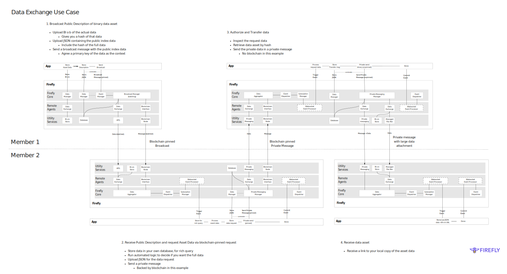

# Example Transaction Flow (Ping Pong)
{: .no_toc }

## Table of contents
{: .no_toc .text-delta }

1. TOC
{:toc}

---

## Overview 

This demonstrates the problem that at its core FireFly is there to solve. The internal plumbing complexity of just a very simple set of Enterprise blockchain / multi-party system interactions.

- Party A: Establish existence of a digital asset.
  - Nothing more than some binary data (an image, a document, a specification etc.).
- Party A: Broadcast some information about that asset to everyone, using blockchain to record, sequence and propagate.
  - So people can find it, or part of a more sophisticated workflow.
- Party B: Request the actual data - with evidence of that request tied to the blockchain.
  - Including some *private* data that's sent to the Party A, reliably off-chain.
- Party A: Authorize the request, and send the data *privately* to Party B.
  - In this example there's no blockchain involved in this step.

This is the kind of thing that enterprise projects have been solving ground-up since the dawn of enterprise blockchain, and the level of engineering required that is completely detached from business value, is very high.

The "tramlines" view shows how FireFly's pluggable model makes the job of the developer really simple:
- A few simple API calls from a modern web app.
- Event triggered execution of application logic.

This is deliberately a simple flow, and all kinds of additional layers might well layer on (and fit within the FireFly model):
- NFTs to track ownership etc. related to the digital asset.
- Tokenized rewards/payments integrated with the authorization of the transfer of data.
- Proof of deterministic execution of the logic to perform the authorization (on-chain, TEEs, ZKPs).
- Human workflow, that is of course completely non-deterministic.
- Multiple additional process steps, deterministic or not.
- Inclusion of multiple additional parties (maybe it's a request-for-tender, submit-tender flow for example).
- etc. 

## Broadcast Public Description of Binary Data Asset (Member 1)

- Upload BLOB of the actual data
  - Returns a hash of the payload
- Upload JSON containing the public index data 
  - Includes the hash of the full payload
- Send a broadcast message with the public index data
  - Agree upon a primary key of the data as the "context"

## Receive Public Description & Request Asset Data (Member 2)

- Store data in your own off-chain database for rich, efficient query
- Run automated logic to decide if you want to request the full data
- Upload JSON for data request
- Send a private message
  - Backed by blockchain in this flow

## Authorize & Transfer Data (Member 1)

- Inpsect the request data
- Retrieve data asset by hash
- Send the private data in a private message
  - No blockchain in this flow

## Receive Data Asset (Member 2)

- Receive a link to your local copy of the asset data
