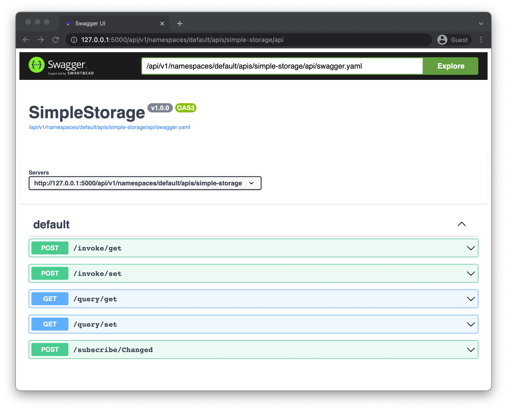
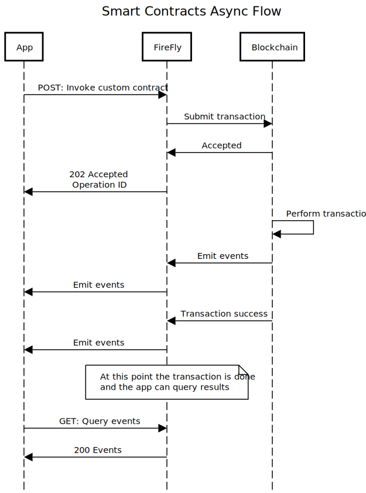

# Work with custom smart contracts
{: .no_toc }

FireFly includes robust support for custom smart contracts with an easy to use API to work with them. FireFly's unified API creates a consistent application experience regardless of the specific underlying blockchain implementation. It also provides developer-friendly features like automatic OpenAPI Specification generation for smart contracts, plus a Swagger UI built-in.

## Table of contents
{: .no_toc .text-delta }

1. TOC
{:toc}

---

> **NOTE:** This guide assumes that you are running a local FireFly stack with at least 2 members and an Ethereum blockchain created by the FireFly CLI

## Example smart contract

For this tutorial, we will be using a well known, but slightly modified smart contract called `SimpleStorage`, and be working with this contract on an Ethereum blockchain. As the name implies, it's a very simple contract which stores an unsigned 256 bit integer, emits and event when the value is updated, and allows you to retrieve the current value.

Here is the source for this contract:

```solidity
// SPDX-License-Identifier: Apache-2.0
pragma solidity ^0.8.10;

// Declares a new contract
contract SimpleStorage {
    // Storage. Persists in between transactions
    uint256 x;

    // Allows the unsigned integer stored to be changed
    function set(uint256 newValue) public {
        x = newValue;
        emit Changed(msg.sender, newValue);
    }
    
    // Returns the currently stored unsigned integer
    function get() public view returns (uint256) {
        return x;
    }

    event Changed(address indexed from, uint256 value);
}
```

## Contract deployment

For the this guide, we will assume that the SimpleStorage contract is deployed at the Ethereum address of: `0xa5ea5d0a6b2eaf194716f0cc73981939dca26da1`

**Deployment of smart contracts is not currently within the scope of responsibility for FireFly.** You can use your standard blockchain specific tools to deploy your contract to whichever blockchain you are using. For Ethereum blockchains you can use [Truffle](https://trufflesuite.com/) or [Hardhat](https://hardhat.org/).

If you're using Truffle, you'll need to set your `truffle-config.js` file to point to the locally running blockchain node. Make sure your `networks` section looks like this:

```javascript
networks: {
    development: {
        host: "127.0.0.1",
        port: 5100,
        network_id: "*"
    }
}
```

## The FireFly Interface Format

FireFly defines a common, blockchain agnostic way to describe smart contracts. This is referred to as a **Contract Interface**, and it is written in the FireFly Interface (FFI) format. It is a simple JSON document that has a name, a namespace, a version, a list of methods, and a list of events.

For more details, you can also have a look at the [Reference page for the FireFly Interface Format](../reference/firefly_interface_format).

If you have an Ethereum ABI for an existing smart contract, there is an HTTP endpoint on the FireFly API that will take the ABI as input and automatically generate the FireFly Interface for you.

### Request

Here we will take the JSON ABI generated by `truffle` or `solc` and `POST` that to FireFly to have it automatically generate the FireFly Interface for us. 

`POST` `http://localhost:5000/api/v1/namespaces/default/contracts/interfaces/generate`

```json
{
    "input": [
        {
            "anonymous": false,
            "inputs": [
                {
                    "indexed": true,
                    "internalType": "address",
                    "name": "from",
                    "type": "address"
                },
                {
                    "indexed": false,
                    "internalType": "uint256",
                    "name": "value",
                    "type": "uint256"
                }
            ],
            "name": "Changed",
            "type": "event"
        },
        {
            "inputs": [],
            "name": "get",
            "outputs": [
                {
                    "internalType": "uint256",
                    "name": "",
                    "type": "uint256"
                }
            ],
            "stateMutability": "view",
            "type": "function"
        },
        {
            "inputs": [
                {
                    "internalType": "uint256",
                    "name": "newValue",
                    "type": "uint256"
                }
            ],
            "name": "set",
            "outputs": [],
            "stateMutability": "nonpayable",
            "type": "function"
        }
    ]
}
```

### Response

FireFly generates and returns the the full FireFly Interface for the SimpleStorage contract in the response body:

```json
{
    "namespace": "default",
    "name": "",
    "description": "",
    "version": "",
    "methods": [
        {
            "name": "get",
            "pathname": "",
            "description": "",
            "params": [],
            "returns": [
                {
                    "name": "",
                    "schema": {
                        "type": "integer",
                        "details": {
                            "type": "uint256",
                            "internalType": "uint256"
                        }
                    }
                }
            ]
        },
        {
            "name": "set",
            "pathname": "",
            "description": "",
            "params": [
                {
                    "name": "newValue",
                    "schema": {
                        "type": "integer",
                        "details": {
                            "type": "uint256",
                            "internalType": "uint256"
                        }
                    }
                }
            ],
            "returns": []
        }
    ],
    "events": [
        {
            "name": "Changed",
            "description": "",
            "params": [
                {
                    "name": "from",
                    "schema": {
                        "type": "string",
                        "details": {
                            "type": "address",
                            "internalType": "address",
                            "indexed": true
                        }
                    }
                },
                {
                    "name": "value",
                    "schema": {
                        "type": "integer",
                        "details": {
                            "type": "uint256",
                            "internalType": "uint256"
                        }
                    }
                }
            ]
        }
    ]
}
```

## Broadcast the contract interface

Now that we have a FireFly Interface representation of our smart contract, we want to broadcast that to the entire network. This broadcast will actually be pinned to the blockchain, so we can always refer to this specific name and version, and everyone in the network will know exactly which contract interface we are talking about.

> **NOTE**: Contract interfaces are scoped to a namespace. Within a namespace each contract interface must have a unique name and version combination. The same name and version combination can exist in *different* namespaces simultaneously.

We will take the output from the previous HTTP response above, **fill in the name and version** and then `POST` that to the `/contracts/interfaces` API endpoint.

### Request

`POST` `http://localhost:5000/api/v1/namespaces/default/contracts/interfaces`

```json
{
    "namespace": "default",
    "name": "SimpleStorage",
    "version": "v1.0.0",
    "description": "",
    "methods": [
        {
            "name": "get",
            "pathname": "",
            "description": "",
            "params": [],
            "returns": [
                {
                    "name": "",
                    "schema": {
                        "type": "integer",
                        "details": {
                            "type": "uint256",
                            "internalType": "uint256"
                        }
                    }
                }
            ]
        },
        {
            "name": "set",
            "pathname": "",
            "description": "",
            "params": [
                {
                    "name": "newValue",
                    "schema": {
                        "type": "integer",
                        "details": {
                            "type": "uint256",
                            "internalType": "uint256"
                        }
                    }
                }
            ],
            "returns": []
        }
    ],
    "events": [
        {
            "name": "Changed",
            "description": "",
            "params": [
                {
                    "name": "from",
                    "schema": {
                        "type": "string",
                        "details": {
                            "type": "address",
                            "internalType": "address",
                            "indexed": true
                        }
                    }
                },
                {
                    "name": "value",
                    "schema": {
                        "type": "integer",
                        "details": {
                            "type": "uint256",
                            "internalType": "uint256"
                        }
                    }
                }
            ]
        }
    ]
}
```

### Response

```json
{
    "id": "8bdd27a5-67c1-4960-8d1e-7aa31b9084d3",
    "message": "3cd0dde2-1e39-4c9e-a4a1-569e87cca93a",
    "namespace": "default",
    "name": "SimpleStorage",
    "description": "",
    "version": "v1.0.0",
    "methods": [
        {
            "id": "56467890-5713-4463-84b8-4537fcb63d8b",
            "contract": "8bdd27a5-67c1-4960-8d1e-7aa31b9084d3",
            "name": "get",
            "namespace": "default",
            "pathname": "get",
            "description": "",
            "params": [],
            "returns": [
                {
                    "name": "",
                    "schema": {
                        "type": "integer",
                        "details": {
                            "type": "uint256",
                            "internalType": "uint256"
                        }
                    }
                }
            ]
        },
        {
            "id": "6b254d1d-5f5f-491e-bbd2-201e96892e1a",
            "contract": "8bdd27a5-67c1-4960-8d1e-7aa31b9084d3",
            "name": "set",
            "namespace": "default",
            "pathname": "set",
            "description": "",
            "params": [
                {
                    "name": "newValue",
                    "schema": {
                        "type": "integer",
                        "details": {
                            "type": "uint256",
                            "internalType": "uint256"
                        }
                    }
                }
            ],
            "returns": []
        }
    ],
    "events": [
        {
            "id": "aa1fe67b-b2ac-41af-a7e7-7ad54a30a78d",
            "contract": "8bdd27a5-67c1-4960-8d1e-7aa31b9084d3",
            "namespace": "default",
            "pathname": "Changed",
            "name": "Changed",
            "description": "",
            "params": [
                {
                    "name": "from",
                    "schema": {
                        "type": "string",
                        "details": {
                            "type": "address",
                            "internalType": "address",
                            "indexed": true
                        }
                    }
                },
                {
                    "name": "value",
                    "schema": {
                        "type": "integer",
                        "details": {
                            "type": "uint256",
                            "internalType": "uint256"
                        }
                    }
                }
            ]
        }
    ]
}
```

## Create an HTTP API for the contract

Now comes the fun part where we see some of the power, developer-friendly features of FireFly. The next thing we're going to to is tell FireFly to build an HTTP API for this smart contract, complete with an OpenAPI Specification and Swagger UI. As part of this, we'll also tell FireFly where the contract is on the blockchain. Like the interface broadcast above, this will also generate a broadcast which will be pinned to the blockchain so all the members of the network will be aware of and able to interact with this API.

We need to copy the `id` field we got in the response from the previous step to the `interface.id` field in the request body below. We will also pick a name `simple-storage` here that will be part of the URL for our HTTP API. So be sure to pick a name that is URL friendly. Lastly, in the `location.address` field, we're telling FireFly where an instance of the contract is deployed on-chain.

>**NOTE**: The `location` field is optional here, but if it is omitted, it will be required in every request to invoke or query the contract. This can be useful if you have multiple instances of the same contract deployed to different addresses.

### Request 

`POST` `http://localhost:5000/api/v1/namespaces/default/apis`

```json
{
    "name": "simple-storage",
    "interface": {
        "id": "8bdd27a5-67c1-4960-8d1e-7aa31b9084d3"
    },
    "location": {
        "address": "0xa5ea5d0a6b2eaf194716f0cc73981939dca26da1"
    }
}
```

### Response

```json
{
    "id": "9a681ec6-1dee-42a0-b91b-61d23a814b0f",
    "namespace": "default",
    "interface": {
        "id": "8bdd27a5-67c1-4960-8d1e-7aa31b9084d3"
    },
    "location": {
        "address": "0xa5ea5d0a6b2eaf194716f0cc73981939dca26da1"
    },
    "name": "simple-storage",
    "message": "d90d0386-8874-43fb-b7d3-485c22f35f47",
    "urls": {
        "openapi": "http://127.0.0.1:5000/api/v1/namespaces/default/apis/simple-storage/api/swagger.json",
        "ui": "http://127.0.0.1:5000/api/v1/namespaces/default/apis/simple-storage/api"
    }
}
```

## View OpenAPI spec for the contract

You'll notice in the response body that there are a couple of URLs near the bottom. If you navigate to the one labeled `ui` in your browser, you should see the Swagger UI for your smart contract.



## Smart contracts async programming in FireFly

Before we start using our smart contract, it's worth taking a moment to understand the programming model when working with smart contracts in FireFly. Like the rest of FireFly, smart contracts are implemented with an asynchronous programming model. The key concepts here are:

- Transactions are submitted to FireFly and will immediately be assigned an ID. This is the **Operation ID**.
- The transaction itself happens asynchronously from the HTTP request that initiated it
- Events emitted by the smart contract will be stored in FireFly's event database, and emitted on its event bus to an application if one has subscribed to those events



## Invoke the smart contract

Now that we've got everything set up, it's time to use our smart contract! We're going to make a `POST` request to the `invoke/set` endpoint to set the integer value on-chain. Let's set it to the value of `3` right now.

### Request

`POST` `http://localhost:5000/api/v1/namespaces/default/apis/simple-storage/invoke/set`
```json
{
    "input": {
        "newValue": 3
    }
}
```

### Response

```json
{
    "id": "41c67c63-52cf-47ce-8a59-895fe2ffdc86"
}
```

You'll notice that we just get an ID back here, and that's expected due to the asynchronous programming model of working with smart contracts in FireFly. To see what the value is now, we can query the smart contract. In a little bit, we'll also subscribe to the events emitted by this contract so we can know when the value is updated in realtime.

## Query the current value

To make a read-only request to the blockchain to check the current value of the stored integer, we can make a `POST` to the `query/get` endpoint.

### Request

`POST` `http://localhost:5000/api/v1/namespaces/default/apis/simple-storage/query/get`
```json
{}
```

### Response

```json
{
    "output": "3"
}
```

## Receive custom smart contract events

Now that we've seen how to submit transactions and preform read-only queries to the blockchain, let's look at subscribing to events so we know when things are happening in realtime.

If you look at the source code for the smart contract we're working with above, you'll notice that it emits an event when the stored value of the integer is set. In order to receive these events, we need to set up a WebSocket client to listen for them. You can use any WebSocket client you like, from a browser plugin to a command line app like `websocat`.

Connect your WebSocket client to `ws://localhost:5000/ws?namespace=default&ephemeral&autoack&filter.events=blockchain_event`

This URL has a few parameters included in it that will:

- Restrict messages received to those on the `default` namespace
- Not block if no WebSocket clients are connected - the `ephemeral` option
- Automatically acknowledge any incoming events
- Only show events of type `blockchain_event`

## Subscribe to events from our contract

You'll notice that when you connect your WebSocket client, you don't receive any events, even if you continue to invoke your contract after your connected. This is because we haven't yet told FireFly to *subscribe* to those events being emitted from our contract. To do that, we can make a `POST` request to the `/subscribe/Changed` endpoint on our generated API.

### Request

`POST` `http://localhost:5000/api/v1/namespaces/default/apis/simple-storage/subscribe/Changed`
```json
{}
```

### Response

```json
{
    "id": "1bfa3b0f-3d90-403e-94a4-af978d8c5b14",
    "interface": {
        "id": "8bdd27a5-67c1-4960-8d1e-7aa31b9084d3"
    },
    "namespace": "default",
    "name": "sb-66209ffc-d355-4ac0-7151-bc82490ca9df",
    "protocolId": "sb-66209ffc-d355-4ac0-7151-bc82490ca9df",
    "location": {
        "address": "0xa5ea5d0a6b2eaf194716f0cc73981939dca26da1"
    },
    "created": "2022-02-17T22:02:36.34549538Z",
    "event": {
        "name": "Changed",
        "description": "",
        "params": [
            {
                "name": "from",
                "schema": {
                    "type": "string",
                    "details": {
                        "type": "address",
                        "internalType": "address",
                        "indexed": true
                    }
                }
            },
            {
                "name": "value",
                "schema": {
                    "type": "integer",
                    "details": {
                        "type": "uint256",
                        "internalType": "uint256"
                    }
                }
            }
        ]
    }
}
```

### WebSocket event

After creating the subscription, you should see an event arrive on the connected WebSocket client that looks something like this:

```json
{
    "id": "49e24cb2-47cb-4f6f-80c8-f12791cdbe8b",
    "sequence": 26,
    "type": "blockchain_event",
    "namespace": "default",
    "reference": "b5d05bed-8c4a-4e2c-a6ec-a8a4ed42bb57",
    "created": "2022-02-17T22:02:37.381407964Z",
    "subscription": {
        "id": "f366992e-0f7d-4d42-bfd0-e3aa8e948147",
        "namespace": "default",
        "name": "f366992e-0f7d-4d42-bfd0-e3aa8e948147"
    }
}
```

## Retrieve the output of a blockchain event

Once we have received a blockchain event, we can go look up the output of that event to see the interesting things about it, like what value the stored integer was actually set to. To do that, we use the `reference` ID from the WebSocket event, and query the `blockchainevents` endpoint.

### Request
`GET` `http://localhost:5000/api/v1/namespaces/default/blockchainevents/5d7e27f5-29e3-4ec7-853d-101ac487fd9e`

### Response
```json
{
    "id": "b5d05bed-8c4a-4e2c-a6ec-a8a4ed42bb57",
    "sequence": 12,
    "source": "ethereum",
    "namespace": "default",
    "name": "Changed",
    "subscription": "1bfa3b0f-3d90-403e-94a4-af978d8c5b14",
    "protocolId": "000000000015/000000/000001",
    "output": {
        "from": "0x65e2c670f791047f7e622c863651eafe96fb4fa2",
        "value": "3"
    },
    "info": {
        "address": "0xA5ea5D0a6B2EAf194716F0cc73981939dCa26Da1",
        "blockNumber": "15",
        "logIndex": "1",
        "signature": "Changed(address,uint256)",
        "subId": "sb-66209ffc-d355-4ac0-7151-bc82490ca9df",
        "timestamp": "1645134495",
        "transactionHash": "0x3e2f167149747f4d7b65dd28f992667c378b40daca8229a2492dc91581d17b1a",
        "transactionIndex": "0x0"
    },
    "timestamp": "2022-02-17T21:48:15Z",
    "tx": {
        "type": ""
    }
}
```

Here we can see the `output.value` is `3` just like we submitted in our original request to invoke the contract.

## Appendix I: Work with a custom contract without creating a named API

FireFly aims to offer a developer-friendly and flexible approach to using custom smart contracts. The guide above has detailed the most robust and feature-rich way to use custom contracts with FireFly, but there are several alternative API usage patterns to do so.

It is possible to broadcast a contract interface and use a smart contract that implements that interface without also broadcasting a named API as above. There are several key differences (which may or may not be desirable) compared to the method outlined in the full guide above:

- OpenAPI Spec and Swagger UI are not available
- Each HTTP request to invoke/query the contract will need to include the contract location
- The contract location will *not* have been broadcasted to all other members of the network
- The URL to invoke/query the contract will be different (described below)

### Request

`POST` `http://localhost:5000/api/v1/namespaces/default/contracts/interfaces/8bdd27a5-67c1-4960-8d1e-7aa31b9084d3/invoke/set`
```json
{
    "location": {
        "address": "0xa5ea5d0a6b2eaf194716f0cc73981939dca26da1"
    },
    "input": {
        "newValue": 7
    }
}
```

### Response

```json
{
    "id": "f310fa4a-73d8-4777-9f9d-dfa5012a052f"
}
```

All of the same invoke, query, and subscribe endpoints are available on the contract interface itself.

## Appendix II: Work directly with contracts with inline requests

The final way of working with custom smart contracts with FireFly is to just put everything FireFly needs all in one request, each time a contract is invoked or queried. This is the most lightweight, but least feature-rich way of using a custom contract.

To do this, we will need to put both the contract location, and a subset of a FireFly Interface that describes the method we want to invoke in the request body, in addition to the function input.

### Request

`POST` `http://localhost:5000/api/v1/namespaces/default/contracts/invoke`
```json
{
    "location": {
        "address": "0xa5ea5d0a6b2eaf194716f0cc73981939dca26da1"
    },
    "method": {
        "name": "set",
        "params": [
            {
                "name": "x",
                "schema": {
                    "type": "integer",
                    "details": {
                        "type": "uint256"
                    }
                }
            }
        ],
        "returns": []
    },
    "input": {
        "x": 42
    }
}
```

### Response

```json
{
    "id": "386d3e23-e4bc-4a9b-bc1f-452f0a8c9ae5"
}
```