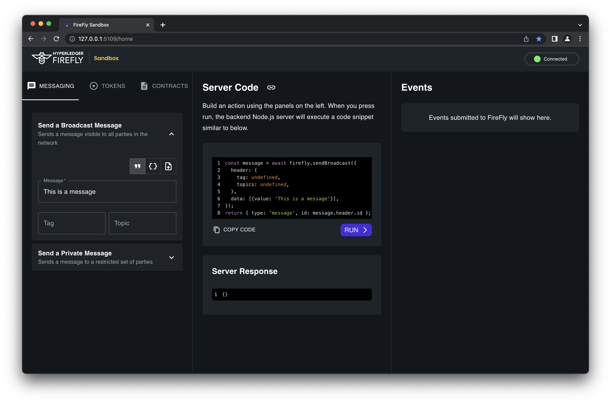
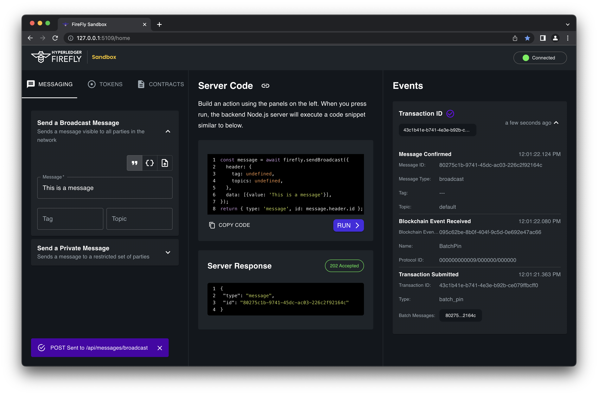

# Use the Sandbox
{: .no_toc }

## Table of contents
{: .no_toc .text-delta }

1. TOC
{:toc}

---

## Previous steps: Start your environment
If you haven't started a FireFly stack already, please go back to the previous step and read the guide on how to [Start your environment](./setup_env.md).

[← ② Start your environment](setup_env.md){: .btn .btn-purple .mb-5}

Now that you have a full network of three Supernodes running on your machine, let's look at the first two components that you will interact with: the FireFly Sandbox and the FireFly Explorer.

## Video walkthrough

<iframe width="736" height="414" src="https://www.youtube.com/embed/mmY7Vhwu-yk?start=2787" title="YouTube video player" frameborder="0" allow="accelerometer; autoplay; clipboard-write; encrypted-media; gyroscope; picture-in-picture" allowfullscreen></iframe>
This video is a walkthrough of the FireFly Sandbox and FireFly Explorer from the FireFly 1.0 launch webinar. At this point you should be able to follow along and try all these same things on your own machine.

<!-- ## What is the FireFly Sandbox?



The FireFly Sandbox sits logically outside the Supernode, and it acts like an "end-user" application written to use FireFly's API. In your setup, you have one Sandbox per member, each talking to their own FireFly API. The purpose of the Sandbox is to provide a quick and easy way to try out all of the fundamental building blocks that FireFly provides. It also shows developers, through example code snippets, how they would implement the same functionality in their own app's backend.

> 🗒 Technical details: The FireFly Sandbox is an example "full-stack" web app. It has a backend written in TypeScript / Node.js, and a frontend in TypeScript / React. When you click a button in your browser, the frontend makes a request to the backend, which then uses the [FireFly Node.js SDK](https://www.npmjs.com/package/@hyperledger/firefly-sdk) to make requests to FireFly's API.

## What is the FireFly Explorer?

The FireFly explorer is a part of FireFly Core itself. It is a view into the system that allows operators to monitor the current state of the system and investigate specific transactions, messages, and events. It is also a great way for developers to see the results of running their code against FireFly's API.

 -->

## Open the FireFly Sandbox for the first member

When you set up your FireFly stack in the previous section, it should have printed some URLs like the following. Open the link in a browser for the `Sandbox UI for member '0'. It should be: [http://127.0.0.1:5109](http://127.0.0.1:5109)

```
ff start demo
this will take a few seconds longer since this is the first time you're running this stack...
done

Web UI for member '0': http://127.0.0.1:5000/ui
Sandbox UI for member '0': http://127.0.0.1:5109

Web UI for member '1': http://127.0.0.1:5001/ui
Sandbox UI for member '1': http://127.0.0.1:5209

Web UI for member '2': http://127.0.0.1:5002/ui
Sandbox UI for member '2': http://127.0.0.1:5309


To see logs for your stack run:

ff logs demo
```


## Sandbox Layout


The Sandbox is split up into three columns:

### Left column: Prepare your request
On the left-hand side of the page, you can fill out simple form fields to construct messages and more. Some tabs have more types of requests on them in sections that can be expanded or collapsed. Across the top of this column there are three tabs that switch between the three main sets of functionality in the Sandbox. The next three sections of this guide will walk you through each one of these.

The first tab we will explore is the **MESSAGING** tab. This is where we can send broadcasts and private messages.

### Middle column: Preview server code and see response
As you type in the form on the left side of the page, you may notice that the source code in the top middle of the page updates automatically. If you were building a backend app, this is an example of code that your app could use to call the FireFly SDK. The middle column also contains a `RUN` button to actually send the request.

### Right column: Events received on the WebSocket
On the right-hand side of the page you can see a stream of events being received on a WebSocket connection that the backend has open to FireFly. For example, as you make requests to send messages, you can see when the messages are asynchronously confirmed.

## Messages

The Messages tab is where we can send broadcast and private messages to other members and nodes in the FireFly network. Messages can be a string, any arbitrary JSON object, or a binary file. For more details, please see the tutorial on [Broadcasting data](../tutorials/broadcast_data.md) and [Privately sending data](../tutorials/private_send.md).

### Things to try out

- Send a broadcast message and view the data payload in every member's FireFly Explorer
- Send a private message to one member, and verify that the data payload is not visible in the third member's FireFly Explorer
- Send an image file and download it from another member's FireFly Explorer



## Tokens

The Tokens tab is where you can create token pools, and mint, burn, or transfer tokens. This works with both fungible and non-fungible tokens (NFTs). For more details, please see the [Tokens tutorials](../tutorials/tokens).

### Things to try out

- Create a fungible token pool and mint some tokens and view your balance in the FireFly Explorer
- Transfer some amount of those tokens to another member and view the transfer transaction in the FireFly Explorer
- Burn some amount of tokens and view the transaction and updated balances in the FireFly Explorer
- Create a non-fungible token pool and mint some NFTs
- Transfer an NFT to another member and verify the account balances in the FireFly Explorer


## Contracts

The Contracts section of the Sandbox lets you interact with custom smart contracts, right from your web browser! The Sandbox also provides some helpful tips on deploying your smart contract to the blockchain. For more details, please see the tutorial on [Working with custom smart contracts](../tutorials/custom_contracts/index.md).


### Things to try out

- Create a contract interface and API, then view the Swagger UI for your new API
- Create an event listener
- Use the Swagger UI to call a smart contract function that emits an event. Verify that the event is received in the Sandbox and shows up in the FireFly Explorer.

## Go forth and build!
At this point you should have a pretty good understanding of some of the major features of Hyperledger FireFly. Now, using what you've learned, you can go and build your own Web3 app! Don't forget to [join the Hyperledger Discord server](https://discord.gg/Fy7MJuqw86) and come chat with us in the #firefly channel.