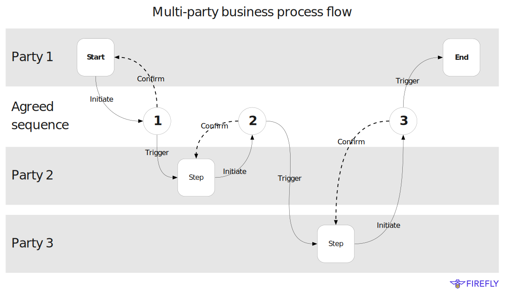

# Multi-party process flow

---

The ability to globally sequence events _across parties_ is a game changing capability of multi-party
systems. FireFly is designed to allow developers to harnesses that power in the application layer, to build
sophisticated multi-party APIs and user experiences.

- Build multi-party business processes where there is one agreed outcome:
  - Agree the trigger, inputs, outputs of each step in the process
  - Agree any common "rules of the road" must be adhered to
- Look back at your shared history, when deciding to commit to the next step:
  - Fast rich-query cache, backed by a private database
  - Initiate the next step through automated or manual decision making
  - Only consider a step final once it's multi-party sequence has been confirmed
- Gain big efficiencies in how multi-party business processes work:
  - Once locked in, a step is consider final - attested to by the party
  - If two parties submit conflicting actions, one wins, and one loses
  - Avoids complex compensation logic in the business orchestration layer
  - Provides one clear source of truth to quickly resolve multi-party disputes
- Program multi-party apps using the tools you know:
  - REST APIs for triggering the next step in a process, and querying history
  - WebSockets and Webhooks for events (pluggable to other event transports)
  - Remember - each party runs their own copy of the app, with their own private data
- Allow each party to integrate into their existing core systems:
  - Realtime or batch
  - Human workflows
  - Proprietary business logic that is unique to one party
- Avoid sensitive data written to the blockchain:
  - Works in bi-lateral and multi-lateral scenarios
  - Designed to limit leaking other "metadata" about the transaction as well
  - Share partial history with different participants in a
- No requirement to write custom on-chain smart contract logic:
  - Can be combined with rich custom on-chain logic as well

## Innovate fast

Building a successful multi-party system is often about business experimentation, and business results.
Proving the efficiency gains, and new business models, made possible by working together in a new way
under a new system of trust.

Things that can get in the way of that innovation, can include concerns over data privacy, technology
maturity, and constraints on autonomy of an individual party in the system. An easy to explain position
on how new technology components are used, where data lives, and how business process independence
is maintained can really help parties make the leap of faith necessary to take the step towards a new
model.

Keys to success often include building great user experiences that help digitize clunky decades old
manual processes. Also easy to integrate with APIs, what embrace the existing core systems of record
that are establish within each party.

## Consider the on-chain toolbox too

In the _deterministic compute_ section we talked about the value that deterministic execution
of multi-party logic can have. Either through on-chain execution, or advanced privacy preserving
techniques.

It's important to state that almost every process can be enhanced with more sophisticated 
on-chain constructs like tokens. Maybe it's to build a token economy that enhances the value
parties get from the system, or encourages healthy participation (and discourages leaching value).
Or maybe it's to track exactly which party owns a document, asset, or action within a process using NFTs. 

There are also cases where the foundation constructs are insufficient to implement the level of
automation or efficiency you need in your multi-party process. Here making the investment in building
bespoke on-chain logic, or apply advanced cryptographic techniques, is the linchpin to a successful
multi-party ecosystem.

