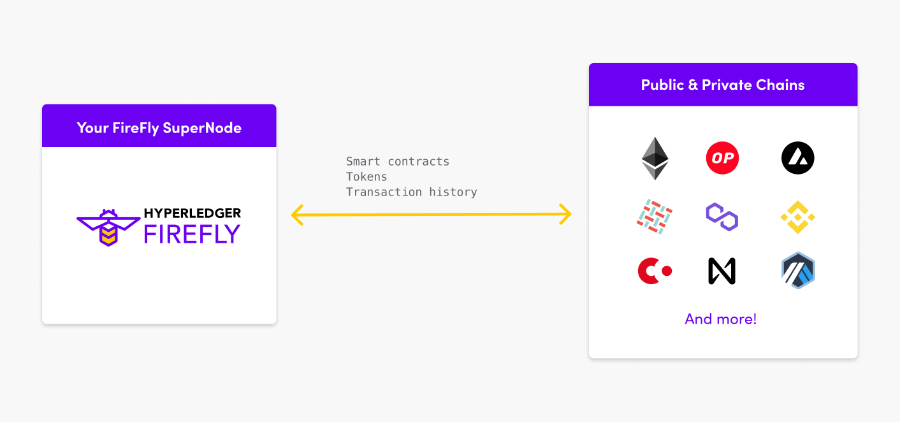

# Web3 Gateway Features
{: .no_toc }

## Table of contents
{: .no_toc .text-delta }

1. TOC
{:toc}

---

Web3 Gateway features allow your FireFly Supernode to connect to any blockchain ecosystem, public or private. When a chain is connected, the FireFly Supernode may invoke custom smart contracts, interact with tokens, and monitor transactions. A single FireFly Supernode is able to have multiple namespaces, or isolated environments, where each namespace is a connection to a different chain.

## Transfer tokenized value

The [Digital Asset Features](./key_components/digital_assets.md) allow you to connect to
token economies, in multiple blockchains, using the same infrastructure and signing keys.

The complexities of how each token works, and how each blockchain works, are abstracted
away from you by the Hyperledger FireFly [Connector Framework](./key_components/connectors.md).

All of the layers of plumbing required to execute a transaction exactly once on a 
blockchain, and tracking it through to completion, are part of the stack. Deploy and 
configure them once in your Web3 gateway, and use them for multiple use cases in your 
enterprise.

## Invoke any other type of smart contract

The [API Generation](./key_components/apps.md) features of Hyperledger FireFly, allow
you to generate a convenient and reliable REST API for any smart contract logic.

Then you just invoke that contract like you would any other API, with all the features
you would expect like an OpenAPI 3.0 specification for the API, and UI explorer.

The same reliable transaction submission framework is used as for token transfers,
and you can use Hyperledger FireFly as a high volume staging post for those transactions.

- Handles peaks in workload, drip-feeding transactions onto the chain
- Handles large batch submissions, tracking 
- Manages nonce assignment at high volume
- Idempotent APIs assuring that business transactions are submitted exactly once

> For EVM based chains, these features were significantly enhanced in the new EVMConnect
> connector introduced in v1.1 of FireFly (superseding [EthConnect](https://github.com/hyperledger/firefly-ethconnect)).

## Index data from the blockchain

Blockchain nodes are not designed for efficient querying of historical information. Instead
their core function is to provide an ordered ledger of actions+events, along with a consistent
world state at any point in time.

This means that almost all user experiences and business APIs need a separate
data store, that provides an fast indexed view of the history and current state of the chain.

As an example, you've probably looked at a _Block Explorer_ for a public blockchain on the web.
Well, you weren't looking directly at the blockchain node. You were querying an off-chain indexed
database, of all the blocks and transactions on that chain. An _indexer_ behind the scenes
was listening to the blockchain and synchronizing the off-chain state.

Hyperledger FireFly has a built-in indexer for tokens, that maps every token
mint/burn/transfer/approve operation that happens on the the blockchain into the database for
fast query. You just specify which tokens you're interested in, and FireFly takes care of
the rest.

Additionally, FireFly does the heavy lifting part of indexing for all other types of smart contract
event that might occur. It scrapes the blockchain for the events, formats them into easy to
consume JSON, and reliably delivers them to your application.

So your application just needs a small bit of code to take those payloads, and insert them
into the database with the right database indexes you need to query your data by.

## Reliably trigger events in your applications

One of the most important universal rules about Web3 applications, is that they are event-driven.

No one party in the system can chose to change the state, instead they must submit transactions
that get ordered against everyone else's transactions, and only once confirmed through the
consensus algorithm are they actioned.

This means the integration into your application and core systems needs to be event-driven too.

The same features that support reliable indexing of the blockchain data, allow reliable triggering
of application code, business workflows, and core system integrations.

> Learn more about the [FireFly Event Bus](../reference/events.html)

## Manage decentralized data (NFTs etc.)

Your blockchain transactions are likely to refer to data that is stored off-chain.

One common example is non-fungible-token (NFT) metadata, images and documents. These are not
a good fit for storing directly in any blockchain ledger, so complimentary decentralized
technologies like the InterPlanetary File System (IPFS) are used to make the data widely
available and resilient outside of the blockchain itself.

As a publisher or consumer of such metadata from decentralized storage, you need to be confident
you have your own copy safe. So just like with the blockchain data, Hyperledger FireFly can
act as a staging post for this data.

Structured JSON data can be stored, uploaded and downloaded from the FireFly database.

Large image/document/video payloads are handled by the pluggable Data Exchange microservice,
which allows you to attach local or cloud storage to manage your copy of the data.

FireFly then provides a standardized API to allow publishing of this data. So configuring
a reliable gateway to the decentralized storage tier can be done once, and then accessed
from your applications via a single Web3 Gateway.

## Maintain a private address book

You need to manage your signing keys, and know the signing keys of others you are
transacting with. A blockchain address like `0x0742e81393ee79C768e84cF57F1bF314F0f31ECe`
is not very helpful for this.

So Hyperledger FireFly provides a pluggable identity system, built on the foundation of
the Decentralized IDentifier (DID). When in Web3 Gateway Mode these identities are not
shared or published, and simply provide you a local address book.

You can associate profile information with the identities, for example correlating them
to the identifiers in your own core systems - such as an Identity and Access Management (IAM)
system, or Know Your Customer (KYC) database.

> Learn more about [Hyperledger FireFly Identities](../reference/identities.html)
