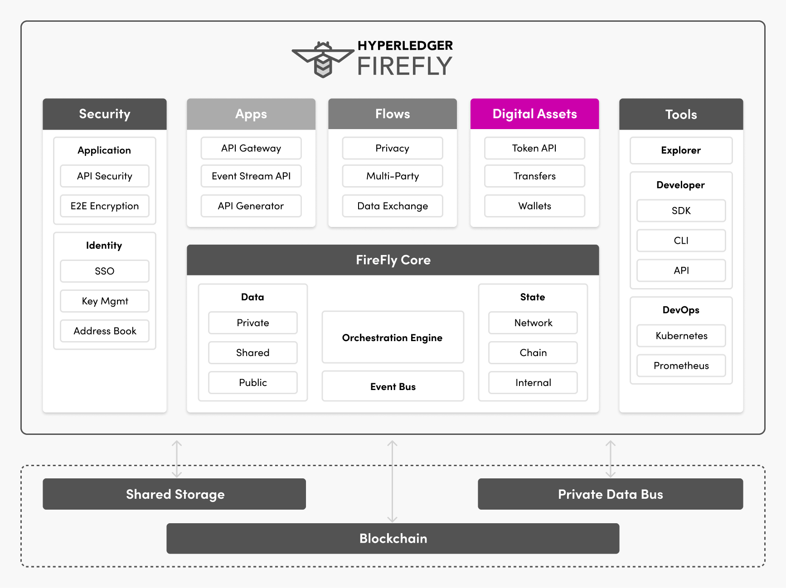

# Digital Assets
{: .no_toc }

---

## Digital asset features

The modelling, transfer and management of digital assets is the core programming
foundation of blockchain.

Yet out of the box, raw blockchains designed to efficiently manage these assets
in large ecosystems, do not come with all the building blocks needed by applications.

### Token API

Token standards have been evolving in the industry through standards
like ERC-20/ERC-721, and the Web3 signing wallets that support these.

Hyperledger FireFly bring this same standardization to the application tier.
Providing APIs that work across token standards, and blockchain implementations,
providing consistent and interoperable support.

This means one application or set of back-end systems, can integrate with multiple
blockchains, and different token implementations.

Pluggability here is key, so that the rules of governance of each digital
asset ecosystem can be exposed and enforced. Whether tokens are fungible,
non-fungible, or some hybrid in between.

> Learn more about token standards for fungible tokens, and non-fungible
> tokens (NFTs) in [this set of tutorials](../../tutorials/tokens/)

### Transfer history / audit trail

For efficiency blockchains do not provide a direct ability to
query historical transaction information.

Depending on the blockchain technology, even the current balance of your
wallet can be complex to calculate - particularly for blockchain
technologies based on an Unspent Transaction Output (UTXO) model.

So off-chain indexing of transaction history is an absolute must-have
for any digital asset solution.

Hyperledger FireFly provides:

- Automatic indexing of tokens, whether existing or newly deployed
- Off-chain indexing of fungible and non-fungible asset transfers & balances
- Off-chain indexing of approvals
- Integration with digital identity
- Full extensibility across both token standards and blockchain technologies

### Wallets

Wallet and signing-key management is a critical requirement for any
blockchain solution, particularly those involving the transfer
of digital assets between wallets.

Hyperledger FireFly provides you the ability to:

- Integrate multiple different signing/custody solutions in a proven way
- Manage the mapping of off-chain identities to on-chain signing identities
- Provide a plug-point for policy-based decision making on high value transactions
- Manage connections to multiple different blockchain solutions
