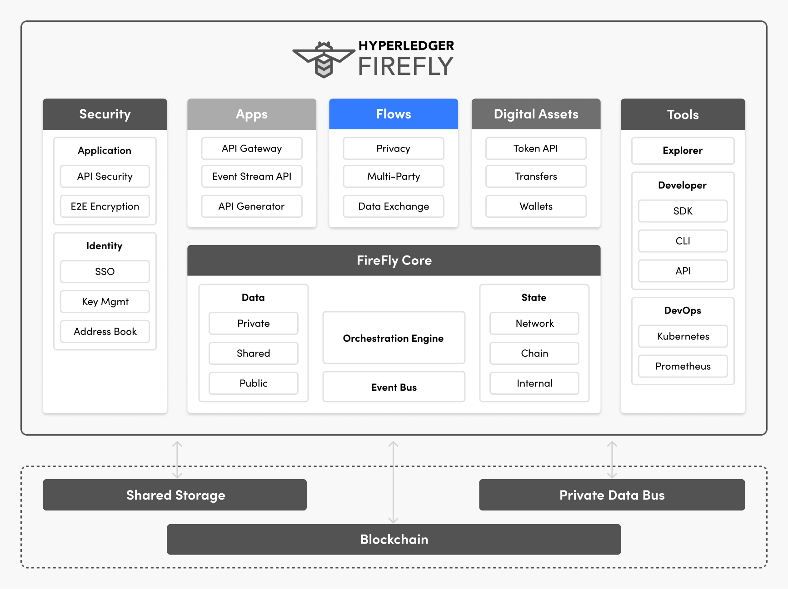

# Flows
{: .no_toc }

---

## Data flow

The reality of most Web3 scenarios is that only a small part of the overall use-case
can be represented _inside_ the blockchain or distributed ledger technology.

Some additional data flow is always required. This does not diminish the value of
executing the kernel of the logic within the blockchain itself.

Hyperledger FireFly embraces this reality, and allows an organization to keep track
of the relationship between the off-chain data flow, and the on-chain transactions.

Let's look at a few common examples:

### Digital Asset Transfers

Examples of common data flows performed off-chain, include Know Your Customer (KYC)
and Anti Money Laundering (AML) checks that need to be performed and validated
before participating in transactions.

There might also be document management and business transaction flows required to
verify the conditions are correct to digitally settle a transaction.
Have the goods been delivered? Are the contracts in place?

In regulated enterprise scenarios it is common to see a 10-to-1 difference in the number
of steps performed off-chain to complete a business transaction, vs. the number
of steps performed on-chain.

These off-chain data flows might be coordinated with on-chain smart contracts
that lock assets in _digital escrow_ until the off-chain steps are completed by each party,
and protect each party while the steps are being completed.

> A common form of digital escrow is a Hashed Timelock Contract (HTLC).

### Non-fungible Tokens (NFTs) and hash-pinning

The data associated with an NFT might be as simple as a JSON document pointing at an interesting
piece of artwork, or as complex a set of high resolution scans / authenticity documents
representing a _digital twin_ of a real world object.

Here the concept of a _hash pinning_ is used - allowing anyone who has a copy of the original data
to recreate the hash that is stored in the on-chain record.

With even the simplest NFT the business data is not stored on-chain, so simple data flow is
always required to publish/download the off-chain data.

The data might be published publicly for anyone to download, or it might be sensitive and require
a detailed permissioning flow to obtain it from a current holder of that data.

### Dynamic NFTs and Business Transaction Flow

In an enterprise context, an NFT might have a dynamic ever-evolving trail of business transaction
data associated with it. Different parties might have different views of that business data, based
on their participation in the business transactions associated with it.

Here the NFT becomes a like a _foreign key_ integrated across the core systems of a set of enterprises
working together in a set of business transactions.

The data itself needs to be downloaded, retained, processed and rendered.
Probably integrated to systems, acted upon, and used in multiple exchanges between companies
on different blockchains, or off-chain.

The business process is accelerated through this **Enterprise NFT** on the blockchain - as all parties
have _matched_ or _bound_ their own private data store to that NFT. This means they are confident
to be executing a business transaction against the same person or thing in the world.

### Data and Transaction Flow patterns

Hyperledger FireFly provides the raw tools for building data and transaction flow patterns, such
as storing, hashing and transferring data. It provides the event bus to trigger off-chain
applications and integration to participate in the flows.

It also provides the higher level flow capabilities that are needed for multiple parties to
build sophisticated transaction flows together, massively simplifying the application logic required:

- Coordinating the transfer of data off-chain with a blockchain sequencing transaction
- Batching for high throughput transfer via the blockchain and distributed storage technologies
- Managing privacy groups between parties involved in a business transaction
- Masking the relationship between blockchain transactions, for sensitive data

> Learn more in [Multiparty Process Flows](../multiparty/multiparty_flow.html)

