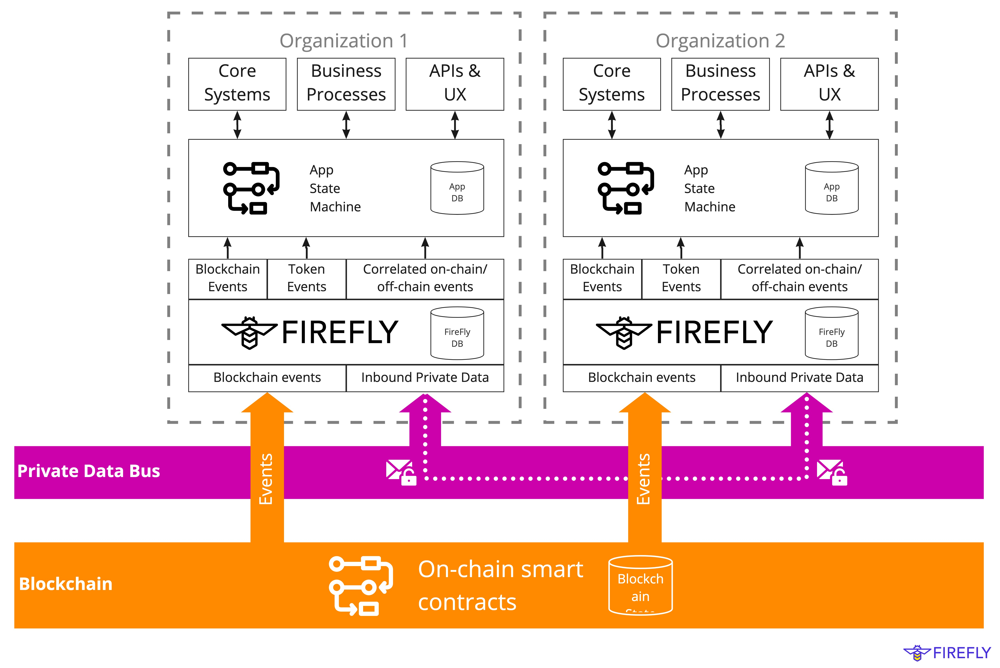

# Orchestration Engine

{: .no_toc }

---

## FireFly Core

At the core of Hyperledger FireFly is an event-driven engine that routes, indexed, aggregates, and sequences data
to and from the blockchain, and other connectors.

## Data Layer

Your own private view of the each network you connect:

- Indexes of all tokens and NFTs that you transact with
- A consistent view across multiple blockchains
- High performance rich query of transaction and data audit trail
- Private data you have received from other parties
- Local copies of data you have download from IPFS or other shared storage tech

## Event Bus

Whether a few dozen companies in a private blockchain consortium, or millions of
users connected to a public blockchain network - one thing is always true:

_Decentralized applications are event-driven._

In an enterprise context, you need to think not only about how those events
are being handled and made consistent _within_ the blockchain layer,
but also how those events are being processed and integrated to your core systems.

FireFly provides you with the reliable streams of events you need, as well
as the interfaces to subscribe to those events and integrate them into your
core systems.

- Token transfer events, across multiple blockchains, and varied asset types
- Custom smart contract events
- Correlated on-chain and off-chain data events

> Learn more about the event bus and event-driven programming in this
> [reference document](http://localhost:4000/firefly/reference/events.html)