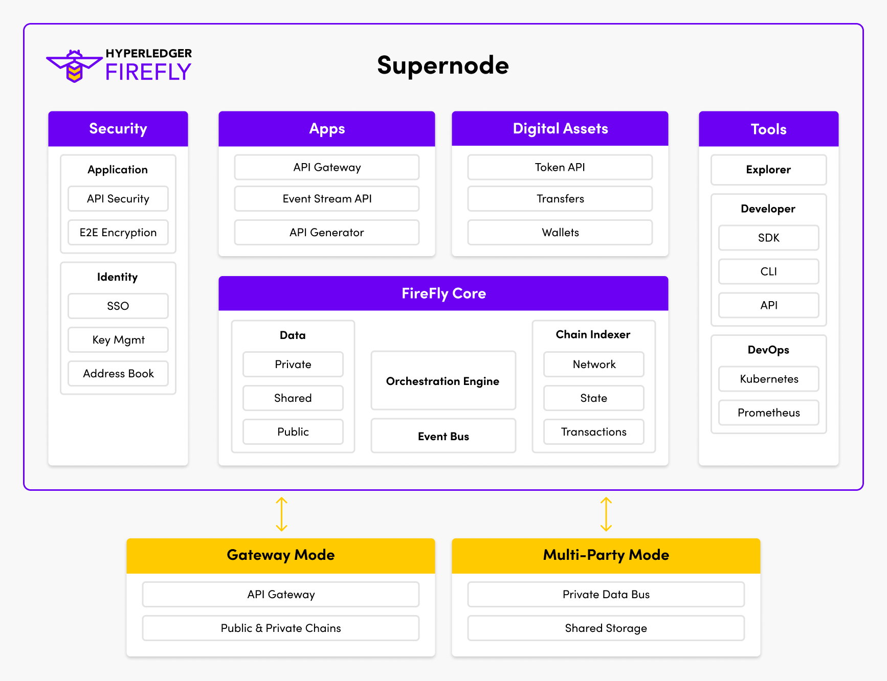

# Key Features
{: .no_toc }

---

Hyperledger FireFly provides a rich suite of features for building new applications, and connecting
existing Web3 ecosystems to your business. In this section we introduce each core pillar of functionality.

