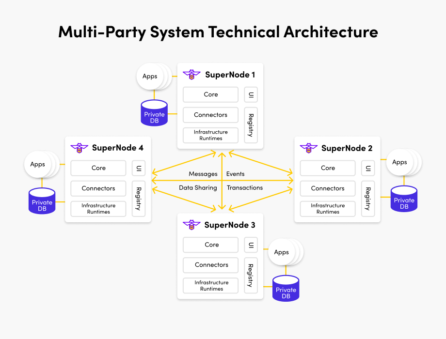

# Enterprise multi-party systems

{: .no_toc }

## Table of contents

{: .no_toc .text-delta }

1. TOC
{:toc}

---

## Introduction

Multiparty mode has all the features in Gateway mode with the added benefit of multi-party process flows.

A multi-party system is a class of application empowered by the technology revolution
of blockchain digital ledger technology (DLT), and emerging cryptographic proof technologies
like zero-knowledge proofs (ZKPs) and trusted execution environments (TEEs).

By combining these technologies with existing best practice technologies for
data security in regulated industries, multi-party systems allow businesses to
collaborate in ways previously impossible.

Through agreement on a common source of truth, such as the completion of a step in a
business process to proceed, or the existence and ownership of a unique asset, businesses
can cut out huge inefficiencies in existing multi-party processes.

New business and transaction models can be achieved, unlocking value in assets and data
that were previously siloed within a single organization. Governance and incentive
models can be created to enable secure collaboration in new ways, without compromising
the integrity of an individual organization.

The technology is most powerful in ecosystems of "coopetition", where privacy and security
requirements are high. Multi-party systems establish new models of trust, with easy to
prove outcomes that minimize the need for third party arbitration, and costly investigation
into disputes.

## Points of difference

Integration with existing systems of record is critical to unlock the potential
of these new ecosystems. So multi-party systems embrace the existing investments of
each party, rather than seeking to unify or replace them.

Multi-party systems are different from centralized third-party systems, because each
party retains sovereignty over:

- Their application instance
- Their private data
- Their business processes
- Their proprietary business logic
- Their internal business processes and IT controls

## Use Case Example

There are many multiparty use cases. An example for healthcare is detailed below.

Patient care requires multiple entities to work together including healthcare providers, insurance companies, and medical systems. Sharing data between these parties is inefficient and prone to errors and patient information must be kept secure and up to date. Blockchain's shared ledger makes it possible to automate data sharing while ensuring accuracy and privacy.

In a Multi-party FireFly system, entities are able to share data privately as detailed in the "Data Exchange" section. For example, imagine a scenario where there is one healthcare provider and two insurance companies operating in a multi-party system. Insurance company A may send private data to the healthcare provider that insurance company B is not privy to. While insurance company B may not know the contents of data transferred, it may verify that a transfer of data did occur. This validation is all thats needed to maintain an up to date state of the blockchain.

In a larger healthcare ecosystem with many members, a similar concept may emerge with multiple variations of members.

<!-- ADD DIAGRAMS FOR THIS EXAMPLE. -->
