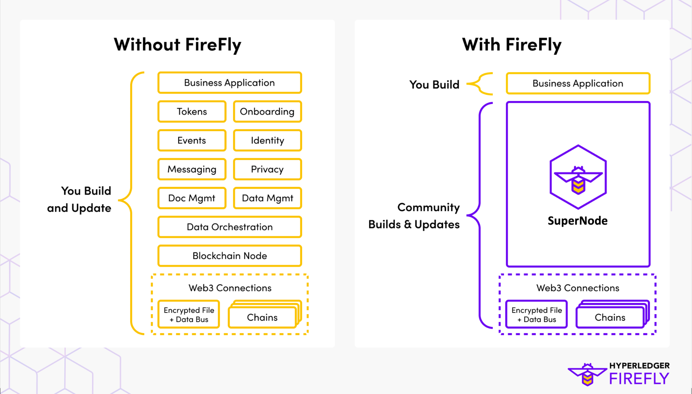
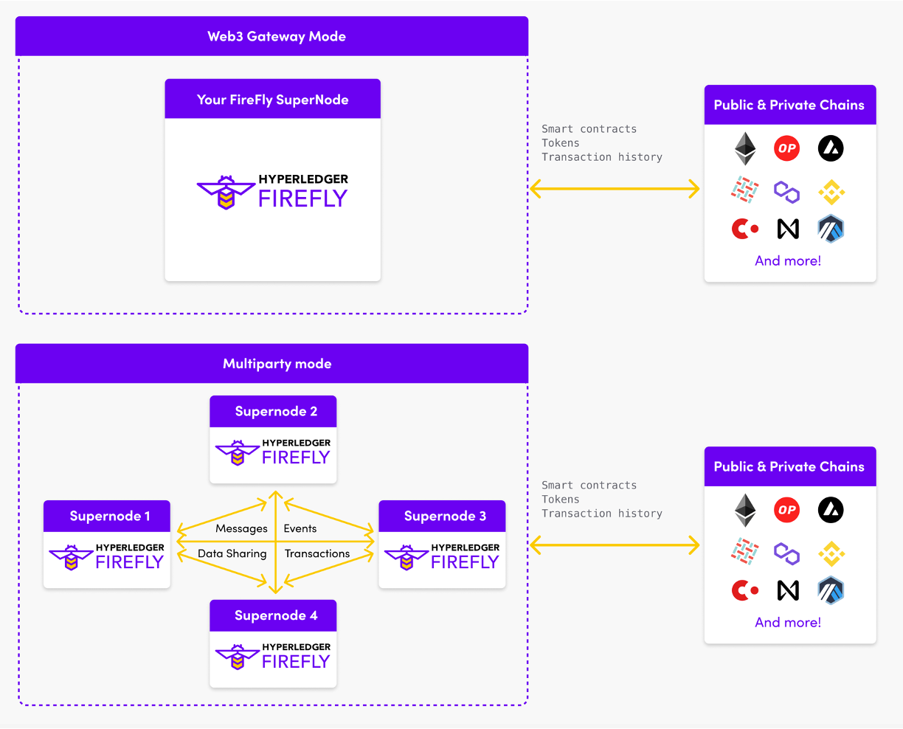

# Introduction to SuperNodes
{: .no_toc }

## Table of contents
{: .no_toc .text-delta }

1. TOC
{:toc}

---

## What is a Supernode

A FireFly Supernode is designed to be an organization's connection to Web 3 and to all the blockchain ecosystems that they participate in - multiple blockchains, multiple token economis, or multiple business networks. What makes a SuperNode "super" compared to a regular node is that it includes a blockchain developers toolkit under the hood. This includes a security layer, orchestration engine, token connectors, API identity management, and much more.

Over the last decade of enterprise blockchain projects, architects, and developers have realized
that they need much more than a blockchain node for their projects to be successful.

The development stack needed for an enterprise grade Web3 application is just as sophisticated as the stack required for the Web 2.0 applications that came before.

A raw blockchain node is simply not enough.

## Your project with or without a Supernode

So your choice as a development team for a blockchain project becomes whether you build
and update all of the "plumbing" / "middleware" components needed underneath your business
logic yourself, or whether you look for pre-built solutions.

The Hyperledger FireFly approach is to allow the community to collaborate on the development and hardening of
these components, across industries and projects. Then fit them into an open source, enterprise grade,
pluggable development and runtime stack... the _Supernode_.

The application developers then code against these APIs, and can be confident that the business logic that works
on their local laptop against a sandbox, is being written in a way that scales to an enterprise
decentralized application and can be deployed against one or more public/private blockchains in production.

Thus allowing development teams to focus on differentiation where it matters - at the solution layer.

## Web3 Gateway and Multiparty Mode

There are two main modes that a Supernode can operate in which are Web3 Gateway and Multiparty mode.

Web3 Gateway mode may be used to simplify the processes of invoking smart contracts, interacting with digital assets, and exchanging value in existing blockchain ecosystems. Existing ecosystems may be public chains (i.e. Ethereum, Polygon, etc.) or private chains that have been created.

Multiparty mode is used with multi-party systems. The key difference compared to Gateway mode is that not only can your Supernode interact with a blockchain, but it can also share data, send messages, and transact with other members in the multi-party system. A multi-party system is a blockchain where a decentralized application is running across a set of participants. Every member in the ecosystem runs their own FireFly Supernode with a copy of the same application stack on top.

To learn more about each mode, check out the [Web3 Gateway Mode](./firefly_modes/gateway_mode.html) and [Multiparty Mode](./firefly_modes/multiparty_mode.html) sections.

