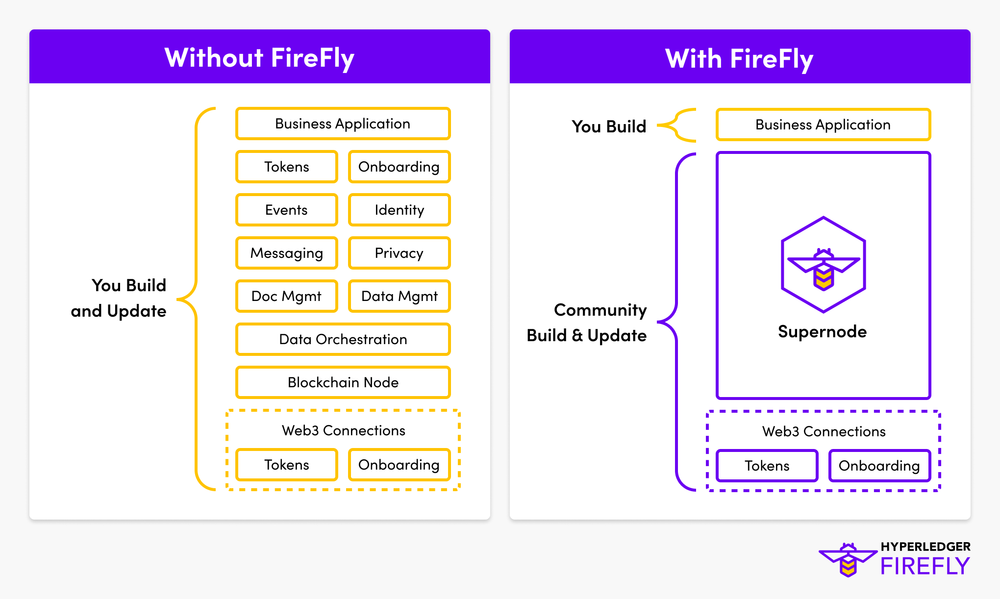

# Introduction to Hyperledger FireFly
{: .no_toc }

## Table of contents
{: .no_toc .text-delta }

1. TOC
{:toc}

---

## Your Gateway to Web3 Technologies

Hyperledger FireFly is an organization's gateway to Web3, including all the blockchain ecosystems that they participate in.

Multiple blockchains, multiple token economies, and multiple business networks.

FireFly is not another blockchain implementation, rather it is a pluggable API Orchestration and Data layer,
integrating into all of the different types of decentralized technologies that exist in Web3:

- Public Blockchains, Layer 2 scaling solutions, Side chains, and App chains
- Permissioned Blockchains and Distributed Ledger Technologies (DLTs)
- Decentralized storage solutions
- Token ecosystems and standards
- Smart Contracts, DeFi solutions and DAOs
- Private off-chain encrypted communication rails
- Advanced cryptography solutions
- Identity frameworks

## An Open Source Supernode for Web3 Apps

Hyperledger FireFly is a toolkit for building and connecting new full-stack decentralized applications (dapps),
as well as integrating your existing core systems to the world of Web3.

It has a runtime engine, and it provides a data layer that synchronizes state from the blockchain and other Web3 technologies.
It exposes an API and Event Bus to your business logic, that is reliable, developer friendly and ready for enterprise use.

We call this a _Supernode_ - it sits between the application and the underlying infrastructure nodes,
providing layers of additional function.

The concept of a Supernode has evolved over the last decade of enterprise blockchain projects, as developers realized
that they need much more than a blockchain node for their projects to be successful.

Without a technology like Hyperledger FireFly, the application layer becomes extremely complex and fragile.
Tens of thousands of lines of complex low-level "plumbing" / "middleware" code is required to integrate the
web3 infrastructure into the application. This code provides zero unique business value to the solution, but can
consume a huge proportion of the engineering budget and maintenance cost if built bespoke within a solution.

