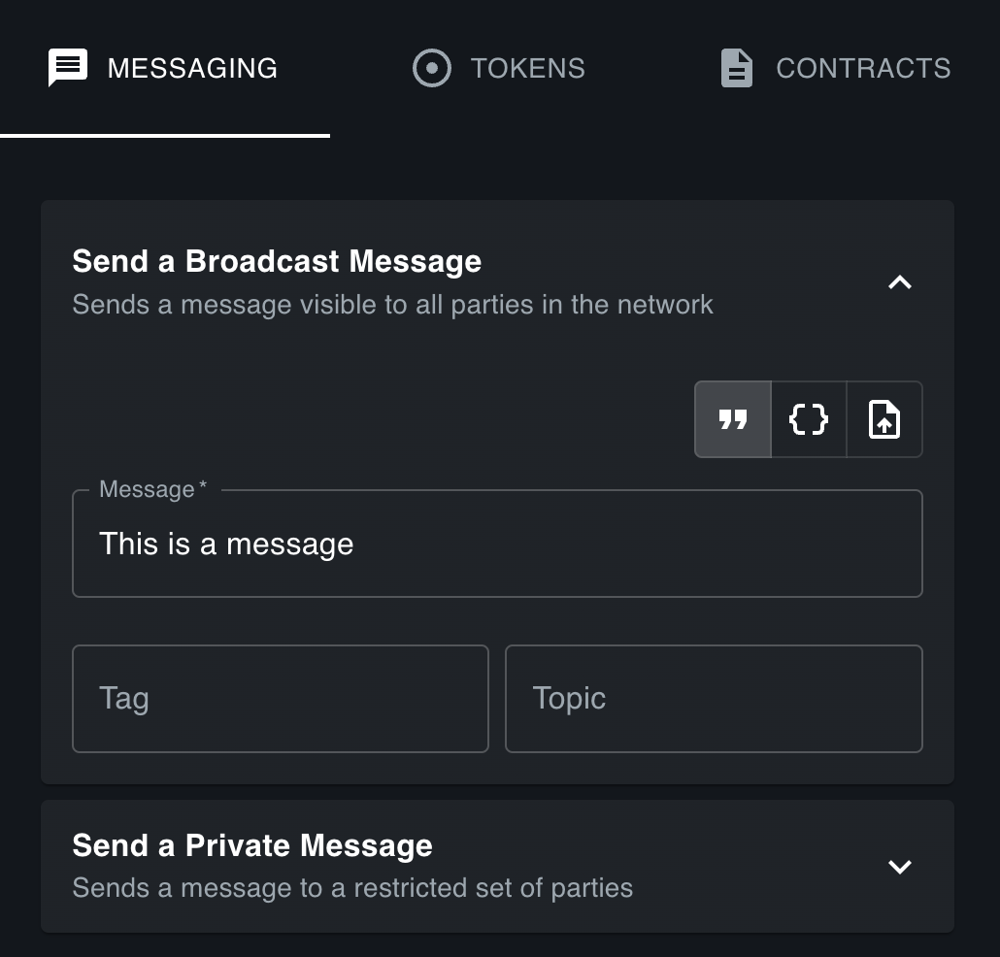
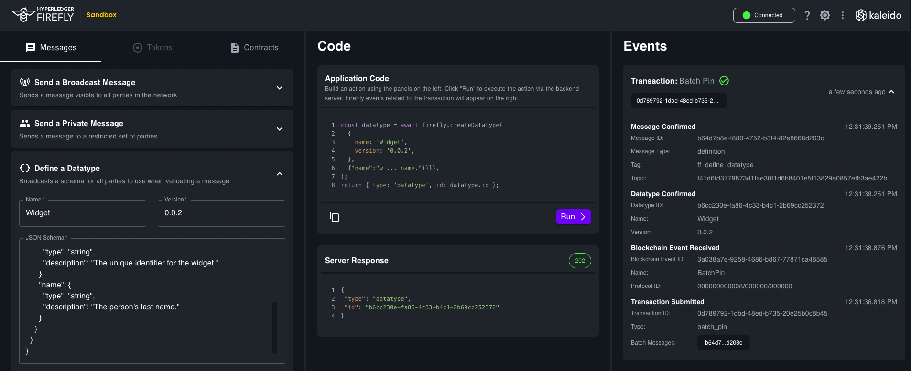
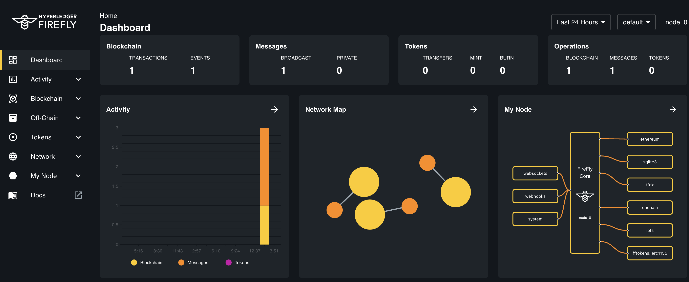

# Broadcast data
{: .no_toc }

## Table of contents
{: .no_toc .text-delta }

1. TOC
{:toc}

---

## Quick reference

- Sends a `message` visible to all parties in the network
  - The message describes who sent it, and exactly what data was sent
- A `message` has one or more attached pieces of business `data`
  - Can be sent in-line, uploaded in advanced, or received from other parties
  - Can include smaller JSON payloads suitable for database storage
    - These can be verified against a `datatype`
  - Can include references to large (multi megabyte/gigabyte) Blob data
- Sequenced via the blockchain
  - The blockchain does not contain any data, just a hash pin
- Batched for efficiency
  - One `batch` can pin hundreds of `message` broadcasts
  - The whole batch is written to the shared storage

## Additional info

- Key Concepts: [Broadcast / shared data](../overview/multiparty/broadcast.html)
- Swagger Reference: <a href="../swagger/swagger.html#/Default%20Namespace/postNewMessageBroadcast" data-proofer-ignore>POST /api/v1/namespaces/{ns}/messages/broadcast</a>

## Example 1: Inline string data

`POST` `/api/v1/namespaces/default/messages/broadcast`

```json
{
  "data": [
    {
      "value": "a string"
    }
  ]
}
```

## Example message response

```json
{
  "header": {
    "id": "607e22ad-04fa-434a-a073-54f528ca14fb", // uniquely identifies this broadcast message
    "type": "broadcast", // set automatically
    "txtype": "batch_pin", // message will be batched, and sequenced via the blockchain
    "author": "0x0a65365587a65ce44938eab5a765fe8bc6532bdf", // set automatically in this example to the node org
    "created": "2021-07-01T18:06:24.5817016Z", // set automatically
    "namespace": "default", // the 'default' namespace was set in the URL
    "topics": [
      "default" // the default topic that the message is published on, if no topic is set
    ],
    // datahash is calculated from the data array below
    "datahash": "5a7bbc074441fa3231d9c8fc942d68ef9b9b646dd234bb48c57826dc723b26fd"
  },
  "hash": "81acf8c8f7982dbc49258535561461601cbe769752fecec0f8ce0358664979e6", // hash of the header
  "state": "ready", // this message is stored locally but not yet confirmed
  "data": [
    // one item of data was stored
    {
      "id": "8d8635e2-7c90-4963-99cc-794c98a68b1d", // can be used to query the data in the future
      "hash": "c95d6352f524a770a787c16509237baf7eb59967699fb9a6d825270e7ec0eacf" // sha256 hash of `"a string"`
    }
  ]
}
```

## Example 2: Inline object data to a topic (no datatype verification)

It is very good practice to set a `tag` and `topic` in each of your messages:

- `tag` should tell the apps receiving the broadcast (including the local app), what
  to do when it receives the message. Its the reason for the broadcast - an
  application specific type for the message.
- `topic` should be something like a well known identifier that relates to the
  information you are publishing. It is used as an ordering context, so all
  broadcasts on a given topic are assured to be processed in order.

`POST` `/api/v1/namespaces/default/messages/broadcast`

```json
{
  "header": {
    "tag": "new_widget_created",
    "topics": ["widget_id_12345"]
  },
  "data": [
    {
      "value": {
        "id": "widget_id_12345",
        "name": "superwidget"
      }
    }
  ]
}
```
## Notes on why setting a topic is important

The FireFly aggregator uses the `topic` (obfuscated on chain) to determine if a
message is the next message in an in-flight sequence for any groups the node is
involved in. If it is, then that message must receive all off-chain private data
and be confirmed before any subsequent messages can be confirmed on the same sequence.

So if you use the same topic in every message, then a single failed send on one
topic blocks delivery of all messages between those parties, until the missing
data arrives.

Instead it is best practice to set the topic on your messages to a value
that identifies an ordered stream of business processing. Some examples:

- A long-running business process instance identifier assigned at initiation
- A real-world business transaction identifier used off-chain
- The agreed identifier of an asset you are attaching a stream of evidence to
- An NFT identifier that is assigned to an asset (digital twin scenarios)
- An agreed primary key for a data resource being reconciled between multiple parties

The `topic` field is an array, because there are cases (such as merging two identifiers)
where you need a message to be deterministically ordered across multiple sequences.
However, this is an advanced use case and you are likely to set a single topic
on the vast majority of your messages.

## Example 3: Upload a blob with metadata and broadcast

Here we make two API calls.

1) Create the `data` object explicitly, using a multi-party form upload

  - You can also just post JSON to this endpoint

2) Broadcast a message referring to that data

  - The Blob attachment gets published to shared storage
    - This happens the first time a broadcast happens on a data attachment
  - A pin goes to the blockchain
  - The metadata goes into a batch with the message

### Multipart form post of a file

Example curl command (Linux/Mac) to grab an image from the internet,
and pipe it into a multi-part form post to FireFly.

> _Note we use `autometa` to cause FireFly to automatically add
> the `filename`, and `size`, to the JSON part of the `data` object for us._

```sh
curl -sLo - https://github.com/hyperledger/firefly/raw/main/docs/firefly_logo.png \
 | curl --form autometa=true --form file=@- \
   http://localhost:5000/api/v1/namespaces/default/data
```

### Example data response from Blob upload

Status: `200 OK` - your data is uploaded to your local FireFly node

At this point the data has not be shared with anyone else in the network

```json
{
  // A uniquely generated ID, we can refer to when sending this data to other parties
  "id": "97eb750f-0d0b-4c1d-9e37-1e92d1a22bb8",
  "validator": "json", // the "value" part is JSON
  "namespace": "default", // from the URL
  // The hash is a combination of the hash of the "value" metadata, and the
  // hash of the blob
  "hash": "997af6a9a19f06cc8a46872617b8bf974b106f744b2e407e94cc6959aa8cf0b8",
  "created": "2021-07-01T20:20:35.5462306Z",
  "value": {
    "filename": "-", // dash is how curl represents the filename for stdin
    "size": 31185 // the size of the blob data
  },
  "blob": {
    // A hash reference to the blob
    "hash": "86e6b39b04b605dd1b03f70932976775962509d29ae1ad2628e684faabe48136"
    // Note at this point there is no public reference. The only place
    // this data has been uploaded to is our own private data exchange.
    // It's ready to be published to everyone (broadcast), or privately
    // transferred (send) to other parties in the network. But that hasn't
    // happened yet.
  }
}
```

### Broadcast the uploaded data

Just include a reference to the `id` returned from the upload.

`POST` `/api/v1/namespaces/default/messages/broadcast`

```json
{
  "data": [
    {
      "id": "97eb750f-0d0b-4c1d-9e37-1e92d1a22bb8"
    }
  ]
}
```

## Broadcasting Messages using the Sandbox
All of the functionality discussed above can be done through the [FireFly Sandbox](../gettingstarted/sandbox.md).

To get started, open up the Web UI and Sanbox UI for at least one of your members. The URLs for these were printed in your terminal when you started your FireFly stack.

In the sandbox, enter your message into the message field as seen in the screenshot below.



Notice how the `data` field in the center panel updates in real time.

Click the blue `Run` button. This should return a `202` response immediately in the Server Response section and will populate the right hand panel with transaction information after a few seconds.



Go back to the FireFly UI (the URL for this would have been shown in the terminal when you started the stack) and you'll see your successful blockchain transaction


