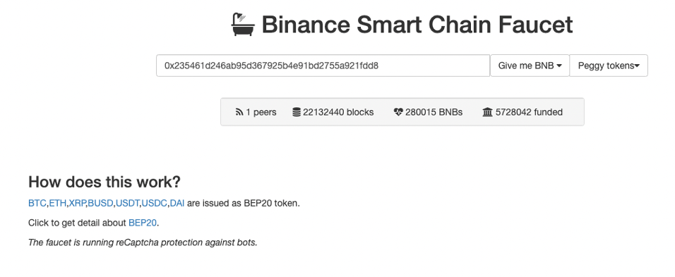
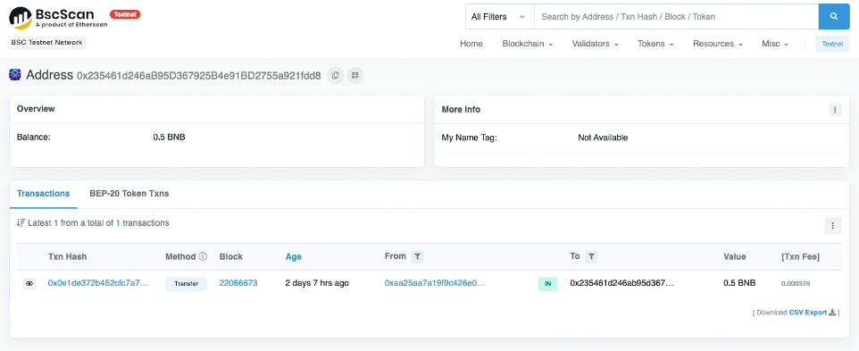

# 
{: .no_toc }

## Table of contents
{: .no_toc .text-delta }

1. TOC
{:toc}

---

Starting with FireFly v1.1, it's easy to connect to public Ethereum chains. This guide will walk you through the steps to create a local FireFly development environment and connect it to the public Binance Smart Chain testnet.

## Previous steps: Install the FireFly CLI
If you haven't set up the FireFly CLI already, please go back to the Getting Started guide and read the section on how to [Install the FireFly CLI](../../gettingstarted/firefly_cli.md).

[← ① Install the FireFly CLI](../../gettingstarted/firefly_cli.md){: .btn .btn-purple .mb-5}

## Create an `evmconnect.yml` config file
In order to connect to the Binance Smart Chain testnet, you will need to set a few configuration options for the evmconnect blockchain connector. Create a text file called `evmconnect.yml` with the following contents:

```yml
confirmations:
    required: 4 # choose the number of confirmations you require
policyengine.simple:
    fixedGasPrice: null
    gasOracle:
        mode: connector
```
For more info about `confirmations`, see [Public vs. Permissioned](../../overview/public_vs_permissioned.md)

For this tutorial, we will assume this file is saved at `~/Desktop/evmconnect.yml`. If your path is different, you will need to adjust the path in the next command below.

## Creating a new stack
To create a local FireFly development stack and connect it to the Binance Smart Chain testnet, we will use command line flags to customize the following settings:

 - Create a new stack named `bsc` with `1` member
 - Disable `multiparty` mode. We are going to be using this FireFly node as a Web3 gateway, and we don't need to communicate with a consortium here
 - Connect to an ethereum network
 - Use the `evmconnect` blockchain connector
 - Use an remote RPC node. This will create a signer locally, so that our signing key never leaves the development machine.
 - See the Binance BscScan [docs](https://docs.bscscan.com/misc-tools-and-utilities/public-rpc-nodes) and select an HTTPS RPC endpoint.
 - Set the chain ID to `97` (the correct ID for the Binance Smart Chain testnet)
 - Merge the custom config created above with the generated `evmconnect` config file

To do this, run the following command:
```
ff init bsc 1 \
    --multiparty=false \
    -b ethereum \
    -c evmconnect \
    -n remote-rpc \
    --remote-node-url <selected RPC endpoint> \
    --chain-id 97 \
    --connector-config ~/Desktop/evmconnect.yml 
```

## Start the stack
Now you should be able to start your stack by running:

```
ff start bsc
```

After some time it should print out the following:

```
Web UI for member '0': http://127.0.0.1:5000/ui
Sandbox UI for member '0': http://127.0.0.1:5109


To see logs for your stack run:

ff logs bsc
```

## Get some BNB
At this point you should have a working FireFly stack, talking to a public chain. However, you won't be able to run any transactions just yet, because you don't have any way to pay for gas. A testnet faucet can give us some BNB, the native token for Binance Smart Chain.

First, you will need to know what signing address your FireFly node is using. To check that, you can run:

```
ff accounts list bsc
[
  {
    "address": "0x235461d246ab95d367925b4e91bd2755a921fdd8",
    "privateKey": "..."
  }
]
```

Copy the address listed in the output from this command. Go to [https://testnet.binance.org/faucet-smart](https://testnet.binance.org/faucet-smart) and paste the address in the form. Go through the CAPTCH form and click the **Give me BNB** button.



### Confirm the transaction on Bscscan
You should be able to go lookup your account on [Bscscan for the testnet https://testnet.bscscan.com/](https://testnet.bscscan.com/) and see that you now have a balance of 0.5 BNB. Simply paste in your account address to search for it.




## Use the public testnet
Now that you have everything set up, you can follow one of the other FireFly guides such as [Using Tokens](../tokens/index.md) or [Custom Smart Contracts](../custom_contracts/ethereum.md). For detailed instructions on deploying a custom smart contract to Binance Smart Chain, please see the [Binance docs](https://docs.bnbchain.org/docs/chainide) for instructions using various tools.