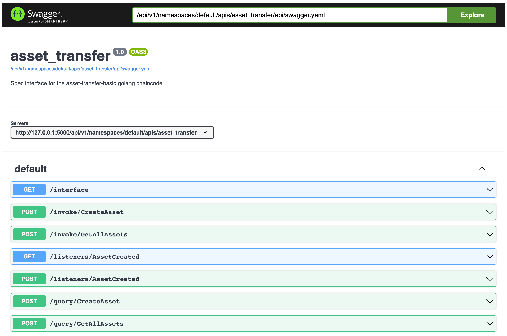

# Work with Hyperledger Fabric chaincodes
{: .no_toc }

This guide describes the steps to deploy a chaincode to a Hyperledger Fabric blockchain and use FireFly to interact with it in order to submit transactions, query for states and listening for events.

> **NOTE:** This guide assumes that you are running a local FireFly stack with at least 2 members and a Fabric blockchain created by the FireFly CLI. If you need help getting that set up, please see the [Getting Started guide to Start your environment](https://nguyer.github.io/firefly/gettingstarted/setup_env.html).

## Table of contents
{: .no_toc .text-delta }

1. TOC
{:toc}

---

## Example smart contract

For this tutorial, we will be using a well known, but slightly modified smart contract called `asset_transfer`. It's based on the `asset-transfer-basic` chaincode in the [fabric-samples](https://github.com/hyperledger/fabric-samples) project. Check out the code repository and use the source code provided below to replace part of the content of the file `fabric-samples/asset-transfer-basic/chaincode-go/chaincode/smartcontract.go`.

Find the following return statement in the function `CreateAsset`:

```golang
	return ctx.GetStub().PutState(id, assetJSON)
```

and replace it with the following, so that an event will be emitted when the transaction is committed to the channel ledger:

```golang
  err = ctx.GetStub().PutState(id, assetJSON)
  if err != nil {
    return err
  }
  return ctx.GetStub().SetEvent("AssetCreated", assetJSON)
```

## Create the chaincode package

Use the `peer` command to create the chaincode package for deployment. You can download the peer binary from the [releases page of the Fabric project](https://github.com/hyperledger/fabric/releases) or build it from source.

```console
  ~ johndoe$ cd fabric-samples/asset-transfer-basic/chaincode-go
  chaincode-go johndoe$ touch core.yaml
  chaincode-go johndoe$ peer lifecycle chaincode package -p . --label asset_transfer ./asset_transfer.zip
```

> The `peer` command requires an empty core.yaml file to be present in the working directory to perform the packaging. That's what `touch core.yaml` did above

The resulting `asset_transfer.zip` archive file will be used in the next step to deploy to the Fabric network used in FireFly.

## Contract deployment

**Deployment of smart contracts is not currently within the scope of responsibility for FireFly.** You can use your standard blockchain specific tools to deploy your contract to the blockchain you are using.

The FireFly CLI provides a convenient function to deploy a chaincode package to a local FireFly stack.

> **NOTE:** The contract deployment function of the FireFly CLI is a convenience function to speed up local development, and not intended for production applications

```console
~ johndoe$ ff help deploy fabric
Deploy a packaged chaincode to the Fabric network used by a FireFly stack

Usage:
  ff deploy fabric <stack_name> <chaincode_package> <channel> <chaincodeName> <version> [flags]
```

Notice the various parameters used by the command `ff deploy fabric`. We'll tell the FireFly to deploy using the following parameter values, if your stack setup is different, update the command accordingly:

- stack name: `dev`
- channel: `firefly` (this is the channel that is created by the FireFly CLI when bootstrapping the stack, replace if you use a different channel in your setup)
- chaincode name: `asset_transfer` (must match the value of the `--label` parameter when creating the chaincode package)
- version: `1.0`

```
$ ff deploy fabric dev asset_transfer.zip firefly asset_transfer 1.0
installing chaincode
querying installed chaincode
approving chaincode
committing chaincode
{
  "chaincode": "asset_transfer",
  "channel": "firefly"
}
```

## The FireFly Interface Format

In order to teach FireFly how to interact with the chaincode, a FireFly Interface (FFI) document is needed. While Ethereum (or other EVM based blockchains) requires an Application Binary Interface (ABI) to govern the interaction between the client and the smart contract, which is specific to each smart contract interface design, Fabric defines a generic [chaincode interface](https://hyperledger-fabric.readthedocs.io/en/release-2.0/chaincode4ade.html#chaincode-api) and leaves the encoding and decoding of the parameter values to the discretion of the chaincode developer.

As a result, the FFI document for a Fabric chaincode must be hand-crafted. The following FFI sample demonstrates the specification for the following common cases:

- structured JSON, used here for the list of chaincode function `CreateAsset` input parameters
- array of JSON, used here for the chaincode function `GetAllAssets` output
- structured JSON, used here for the list of chaincode event `AssetCreated` properties

```json
{
  "namespace": "default",
  "name": "asset_transfer",
  "description": "Spec interface for the asset-transfer-basic golang chaincode",
  "version": "1.0",
  "methods": [
    {
      "name": "GetAllAssets",
      "pathname": "",
      "description": "",
      "params": [],
      "returns": [
        {
          "name": "",
          "schema": {
            "type": "array",
            "details": {
              "type": "object",
              "properties": {
                "type": "string"
              }
            }
          }
        }
      ]
    },
    {
      "name": "CreateAsset",
      "pathname": "",
      "description": "",
      "params": [
        {
          "name": "id",
          "schema": {
            "type": "string"
          }
        },
        {
          "name": "color",
          "schema": {
            "type": "string"
          }
        },
        {
          "name": "size",
          "schema": {
            "type": "string"
          }
        },
        {
          "name": "owner",
          "schema": {
            "type": "string"
          }
        },
        {
          "name": "value",
          "schema": {
            "type": "string"
          }
        }
      ],
      "returns": []
    }
  ],
  "events": [
    {
      "name": "AssetCreated"
    }
  ]
}
```

### Input parameters

For the `params` section of the `CreateAsset` function, it is critical that the sequence of the properties (`id`, `color`, `size`, `owner`, `value`) matches the order of the input parameters in the chaincode's function signature:

```golang
func CreateAsset(ctx contractapi.TransactionContextInterface, id string, color string, size int, owner string, appraisedValue int) error
```

### Return values

FireFly can automatically decode JSON payloads in the return values. That's why the `returns` section of the `GetAllAssets` function only needs to specify the type as `array of objects`, without having to specify the detailed structure of the JSON payload.

On the other hand, if certain properties of the returned value are to be hidden, then you can provide a detailed structure of the JSON object with the desired properties. This is demonstrated in the JSON structure for the event payload, see below, where the property `AppraisedValue` is omitted from the output.

### Event payloads

For events, FireFly automatically decodes JSON payloads. If the event payload is not JSON, base64 encoded bytes will be returned instead. For the `events` section of the FFI, only the `name` property needs to be specified.

## Broadcast the contract interface

Now that we have a FireFly Interface representation of our chaincode, we want to broadcast that to the entire network. This broadcast will be pinned to the blockchain, so we can always refer to this specific name and version, and everyone in the network will know exactly which contract interface we are talking about.

We will use the FFI JSON constructed above and `POST` that to the `/contracts/interfaces` API endpoint.

### Request

`POST` `http://localhost:5000/api/v1/namespaces/default/contracts/interfaces`

```json
{
  "namespace": "default",
  "name": "asset_transfer",
  "description": "Spec interface for the asset-transfer-basic golang chaincode",
  "version": "1.0",
  "methods": [
    {
      "name": "GetAllAssets",
      "pathname": "",
      "description": "",
      "params": [],
      "returns": [
        {
          "name": "",
          "schema": {
            "type": "array",
            "details": {
              "type": "object",
              "properties": {
                "type": "string"
              }
            }
          }
        }
      ]
    },
    {
      "name": "CreateAsset",
      "pathname": "",
      "description": "",
      "params": [
        {
          "name": "id",
          "schema": {
            "type": "string"
          }
        },
        {
          "name": "color",
          "schema": {
            "type": "string"
          }
        },
        {
          "name": "size",
          "schema": {
            "type": "string"
          }
        },
        {
          "name": "owner",
          "schema": {
            "type": "string"
          }
        },
        {
          "name": "value",
          "schema": {
            "type": "string"
          }
        }
      ],
      "returns": []
    }
  ],
  "events": [
    {
      "name": "AssetCreated"
    }
  ]
}
```

### Response

```json
{
  "id": "f1e5522c-59a5-4787-bbfd-89975e5b0954",
  "message": "8a01fc83-5729-418b-9706-6fc17c8d2aac",
  "namespace": "default",
  "name": "asset_transfer",
  "description": "Spec interface for the asset-transfer-basic golang chaincode",
  "version": "1.1",
  "methods": [
    {
      "id": "b31e3623-35e8-4918-bf8c-1b0d6c01de25",
      "interface": "f1e5522c-59a5-4787-bbfd-89975e5b0954",
      "name": "GetAllAssets",
      "namespace": "default",
      "pathname": "GetAllAssets",
      "description": "",
      "params": [],
      "returns": [
        {
          "name": "",
          "schema": {
            "type": "array",
            "details": {
              "type": "object",
              "properties": {
                "type": "string"
              }
            }
          }
        }
      ]
    },
    {
      "id": "e5a170d1-0be1-4697-800b-f4bcfaf71cf6",
      "interface": "f1e5522c-59a5-4787-bbfd-89975e5b0954",
      "name": "CreateAsset",
      "namespace": "default",
      "pathname": "CreateAsset",
      "description": "",
      "params": [
        {
          "name": "id",
          "schema": {
            "type": "string"
          }
        },
        {
          "name": "color",
          "schema": {
            "type": "string"
          }
        },
        {
          "name": "size",
          "schema": {
            "type": "string"
          }
        },
        {
          "name": "owner",
          "schema": {
            "type": "string"
          }
        },
        {
          "name": "value",
          "schema": {
            "type": "string"
          }
        }
      ],
      "returns": []
    }
  ],
  "events": [
    {
      "id": "27564533-30bd-4536-884e-02e5d79ec238",
      "interface": "f1e5522c-59a5-4787-bbfd-89975e5b0954",
      "namespace": "default",
      "pathname": "AssetCreated",
      "signature": "",
      "name": "AssetCreated",
      "description": "",
      "params": null
    }
  ]
}
```

> **NOTE**: We can broadcast this contract interface conveniently with the help of FireFly Sandbox running at `http://127.0.0.1:5108`
* Go to the `Contracts Section`
* Click on `Define a Contract Interface`
* Select `FFI - FireFly Interface` in the `Interface Fromat` dropdown
* Copy the `FFI JSON` crafted by you into the `Schema` Field
* Click on `Run`

## Create an HTTP API for the contract

Now comes the fun part where we see some of the powerful, developer-friendly features of FireFly. The next thing we're going to do is tell FireFly to build an HTTP API for this chaincode, complete with an OpenAPI Specification and Swagger UI. As part of this, we'll also tell FireFly where the chaincode is on the blockchain.

Like the interface broadcast above, this will also generate a broadcast which will be pinned to the blockchain so all the members of the network will be aware of and able to interact with this API.

We need to copy the `id` field we got in the response from the previous step to the `interface.id` field in the request body below. We will also pick a name that will be part of the URL for our HTTP API, so be sure to pick a name that is URL friendly. In this case we'll call it `asset_transfer`. Lastly, in the `location` field, we're telling FireFly where an instance of the chaincode is deployed on-chain, which is a chaincode named `asset_transfer` in the channel `firefly`.

> **NOTE**: The `location` field is optional here, but if it is omitted, it will be required in every request to invoke or query the chaincode. This can be useful if you have multiple instances of the same chaincode deployed to different channels.

### Request

`POST` `http://localhost:5000/api/v1/namespaces/default/apis`

```json
{
  "name": "asset_transfer",
  "interface": {
    "id": "f1e5522c-59a5-4787-bbfd-89975e5b0954"
  },
  "location": {
    "channel": "firefly",
    "chaincode": "asset_transfer"
  }
}
```

### Response

```json
{
  "id": "a9a9ab4e-2544-45d5-8824-3c05074fbf75",
  "namespace": "default",
  "interface": {
    "id": "f1e5522c-59a5-4787-bbfd-89975e5b0954"
  },
  "location": {
    "channel": "firefly",
    "chaincode": "asset_transfer"
  },
  "name": "asset_transfer",
  "message": "5f1556a1-5cb1-4bc6-8611-d8f88ccf9c30",
  "urls": {
    "openapi": "http://127.0.0.1:5000/api/v1/namespaces/default/apis/asset_transfer/api/swagger.json",
    "ui": "http://127.0.0.1:5000/api/v1/namespaces/default/apis/asset_transfer/api"
  }
}
```
> **NOTE**: We can create this Http API conveniently with the help of FireFly Sandbox running at `http://127.0.0.1:5108`
* Go to the `Contracts Section`
* Click on `Register a Contract API`
* Select the name of your broadcasted FFI in the `Contract Interface` dropdown
* In the `Name` Field, give a name that will be part of the URL for your Http API
* In the `Chaincode` Field, give your chaincode name for which you wrote the FFI
* In the `Channel` Field, give the channel name where your chaincode is deployed
* Click on `Run`

## View OpenAPI spec for the contract

You'll notice in the response body that there are a couple of URLs near the bottom. If you navigate to the one labeled `ui` in your browser, you should see the Swagger UI for your chaincode.



### /invoke/\* endpoints

The `/invoke` endpoints in the generated API are for submitting transactions. These endpoints will be mapped to the `POST /transactions` endpoint of the [FabConnect API](https://github.com/hyperledger/firefly-fabconnect).

### /query/\* endpoints

The `/query` endpoints in the generated API, on the other hand, are for sending query requests. These endpoints will be mapped to the `POST /query` endpoint of the Fabconnect API, which under the cover only sends chaincode endorsement requests to the target peer node without sending a trasaction payload to the orderer node.

## Invoke the chaincode

Now that we've got everything set up, it's time to use our chaincode! We're going to make a `POST` request to the `invoke/CreateAsset` endpoint to create a new asset.

### Request

`POST` `http://localhost:5000/api/v1/namespaces/default/apis/asset_transfer/invoke/CreateAsset`

```json
{
  "input": {
    "color": "blue",
    "id": "asset-01",
    "owner": "Harry",
    "size": "30",
    "value": "23400"
  }
}
```

### Response

```json
{
  "id": "b8e905cc-bc23-434a-af7d-13c6d85ae545",
  "namespace": "default",
  "tx": "79d2668e-4626-4634-9448-1b40fa0d9dfd",
  "type": "blockchain_invoke",
  "status": "Pending",
  "plugin": "fabric",
  "input": {
    "input": {
      "color": "blue",
      "id": "asset-02",
      "owner": "Harry",
      "size": "30",
      "value": "23400"
    },
    "interface": "f1e5522c-59a5-4787-bbfd-89975e5b0954",
    "key": "Org1MSP::x509::CN=org_0,OU=client::CN=fabric_ca.org1.example.com,OU=Hyperledger FireFly,O=org1.example.com,L=Raleigh,ST=North Carolina,C=US",
    "location": {
      "chaincode": "asset_transfer",
      "channel": "firefly"
    },
    "method": {
      "description": "",
      "id": "e5a170d1-0be1-4697-800b-f4bcfaf71cf6",
      "interface": "f1e5522c-59a5-4787-bbfd-89975e5b0954",
      "name": "CreateAsset",
      "namespace": "default",
      "params": [
        {
          "name": "id",
          "schema": {
            "type": "string"
          }
        },
        {
          "name": "color",
          "schema": {
            "type": "string"
          }
        },
        {
          "name": "size",
          "schema": {
            "type": "string"
          }
        },
        {
          "name": "owner",
          "schema": {
            "type": "string"
          }
        },
        {
          "name": "value",
          "schema": {
            "type": "string"
          }
        }
      ],
      "pathname": "CreateAsset",
      "returns": []
    },
    "methodPath": "CreateAsset",
    "type": "invoke"
  },
  "created": "2022-05-02T17:08:40.811630044Z",
  "updated": "2022-05-02T17:08:40.811630044Z"
}
```

You'll notice that we got an ID back with status `Pending`, and that's expected due to the asynchronous programming model of working with custom onchain logic in FireFly. To see what the latest state is now, we can query the chaincode. In a little bit, we'll also subscribe to the events emitted by this chaincode so we can know when the state is updated in realtime.

## Query the current state

To make a read-only request to the blockchain to check the current list of assets, we can make a `POST` to the `query/GetAllAssets` endpoint.

### Request

`POST` `http://localhost:5000/api/v1/namespaces/default/apis/asset_transfer/query/GetAllAssets`

```json
{}
```

### Response

```json
[
  {
    "AppraisedValue": 23400,
    "Color": "blue",
    "ID": "asset-01",
    "Owner": "Harry",
    "Size": 30
  }
]
```

> **NOTE:** Some chaincodes may have queries that require input parameters. That's why the query endpoint is a `POST`, rather than a `GET` so that parameters can be passed as JSON in the request body. This particular function does not have any parameters, so we just pass an empty JSON object.

## Create a blockchain event listener

Now that we've seen how to submit transactions and preform read-only queries to the blockchain, let's look at how to receive blockchain events so we know when things are happening in realtime.

If you look at the source code for the smart contract we're working with above, you'll notice that it emits an event when a new asset is created. In order to receive these events, we first need to instruct FireFly to listen for this specific type of blockchain event. To do this, we create an **Event Listener**.

The `/contracts/listeners` endpoint is RESTful so there are `POST`, `GET`, and `DELETE` methods available on it. To create a new listener, we will make a `POST` request. We are going to tell FireFly to listen to events with name `"AssetCreated"` from the FireFly Interface we defined earlier, referenced by its ID. We will also tell FireFly which channel and chaincode we expect to emit these events.

### Request

`POST` `http://localhost:5000/api/v1/namespaces/default/contracts/listeners`

```json
{
  "interface": {
    "id": "f1e5522c-59a5-4787-bbfd-89975e5b0954"
  },
  "location": {
    "channel": "firefly",
    "chaincode": "asset_transfer"
  },
  "event": {
    "name": "AssetCreated"
  },
  "options": {
    "firstEvent": "oldest"
  },
  "topic": "assets"
}
```

### Response

```json
{
  "id": "6e7f5dd8-5a57-4163-a1d2-5654e784dc31",
  "namespace": "default",
  "name": "sb-2cac2bfa-38af-4408-4ff3-973421410e5d",
  "backendId": "sb-2cac2bfa-38af-4408-4ff3-973421410e5d",
  "location": {
    "channel": "firefly",
    "chaincode": "asset_transfer"
  },
  "created": "2022-05-02T17:19:13.144561086Z",
  "event": {
    "name": "AssetCreated",
    "description": "",
    "params": null
  },
  "signature": "AssetCreated",
  "topic": "assets",
  "options": {
    "firstEvent": "oldest"
  }
}
```

## Subscribe to events from our contract

Now that we've told FireFly that it should listen for specific events on the blockchain, we can set up a **Subscription** for FireFly to send events to our client app. To set up our subscription, we will make a `POST` to the `/subscriptions` endpoint.

We will set a friendly name `asset_transfer` to identify the Subscription when we are connecting to it in the next step.

We're also going to set up a filter to only send events blockchain events from our listener that we created in the previous step. To do that, we'll **copy the listener ID** from the step above (`6e7f5dd8-5a57-4163-a1d2-5654e784dc31`) and set that as the value of the `listener` field in the example below:

### Request

`POST` `http://localhost:5000/api/v1/namespaces/default/subscriptions`

```json
{
  "namespace": "default",
  "name": "asset_transfer",
  "transport": "websockets",
  "filter": {
    "events": "blockchain_event_received",
    "blockchainevent": {
      "listener": "6e7f5dd8-5a57-4163-a1d2-5654e784dc31"
    }
  },
  "options": {
    "firstEvent": "oldest"
  }
}
```

### Response

```json
{
  "id": "06d18b49-e763-4f5c-9e97-c25024fe57c8",
  "namespace": "default",
  "name": "asset_transfer",
  "transport": "websockets",
  "filter": {
    "events": "blockchain_event_received",
    "message": {},
    "transaction": {},
    "blockchainevent": {
      "listener": "6e7f5dd8-5a57-4163-a1d2-5654e784dc31"
    }
  },
  "options": {
    "firstEvent": "-1",
    "withData": false
  },
  "created": "2022-05-02T17:22:06.480181291Z",
  "updated": null
}
```

## Receive custom smart contract events

The last step is to connect a WebSocket client to FireFly to receive the event. You can use any WebSocket client you like, such as [Postman](https://www.postman.com/) or a command line app like [`websocat`](https://github.com/vi/websocat).

Connect your WebSocket client to `ws://localhost:5000/ws`.

After connecting the WebSocket client, send a message to tell FireFly to:

- Start sending events
- For the Subscription named `asset_transfer`
- On the `default` namespace
- Automatically "ack" each event which will let FireFly immediately send the next event when available

```json
{
  "type": "start",
  "name": "asset_transfer",
  "namespace": "default",
  "autoack": true
}
```

### WebSocket event

After creating the subscription, you should see an event arrive on the connected WebSocket client that looks something like this:

```json
{
  "id": "d9fb86b2-b25b-43b8-80d3-936c5daa5a66",
  "sequence": 29,
  "type": "blockchain_event_received",
  "namespace": "default",
  "reference": "e0d670b4-a1b6-4efd-a985-06dfaaa58fe3",
  "topic": "assets",
  "created": "2022-05-02T17:26:57.57612001Z",
  "blockchainEvent": {
    "id": "e0d670b4-a1b6-4efd-a985-06dfaaa58fe3",
    "source": "fabric",
    "namespace": "default",
    "name": "AssetCreated",
    "listener": "6e7f5dd8-5a57-4163-a1d2-5654e784dc31",
    "protocolId": "000000000015/000000/000000",
    "output": { "AppraisedValue": 12300, "Color": "red", "ID": "asset-01", "Owner": "Jerry", "Size": 10 },
    "info": {
      "blockNumber": 15,
      "chaincodeId": "asset_transfer",
      "eventIndex": 0,
      "eventName": "AssetCreated",
      "subId": "sb-2cac2bfa-38af-4408-4ff3-973421410e5d",
      "timestamp": 1651512414920972300,
      "transactionId": "172637bf59a3520ca6dd02f716e1043ba080e10e1cd2f98b4e6b85abcc6a6d69",
      "transactionIndex": 0
    },
    "timestamp": "2022-05-02T17:26:54.9209723Z",
    "tx": { "type": "", "blockchainId": "172637bf59a3520ca6dd02f716e1043ba080e10e1cd2f98b4e6b85abcc6a6d69" }
  },
  "subscription": { "id": "06d18b49-e763-4f5c-9e97-c25024fe57c8", "namespace": "default", "name": "asset_transfer" }
}
```

You can see in the event received over the WebSocket connection, the blockchain event that was emitted from our first transaction, which happened in the past. We received this event, because when we set up both the Listener, and the Subscription, we specified the `"firstEvent"` as `"oldest"`. This tells FireFly to look for this event from the beginning of the blockchain, and that your app is interested in FireFly events since the beginning of FireFly's event history.

In the event, we can also see the `blockchainEvent` itself, which has an `output` object. This contains the event payload that was set by the chaincode.
