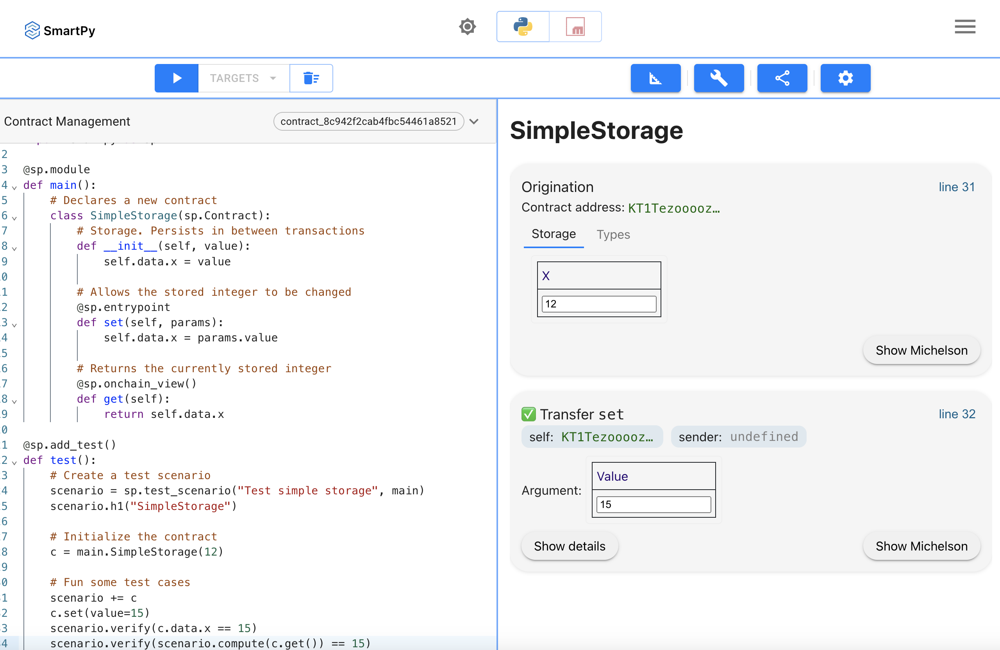
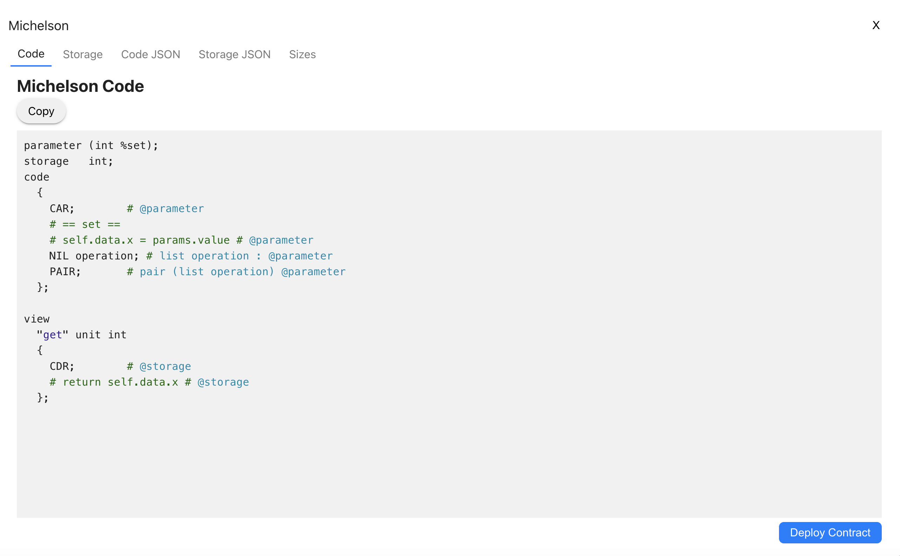

# Work with Tezos smart contracts

{: .no_toc }
This guide describes the steps to deploy a smart contract to a Tezos blockchain and use FireFly to interact with it in order to submit transactions, query for states and listening for events.

## Table of contents
{: .no_toc .text-delta }

1. TOC
{:toc}

---

## Smart Contract Languages

Smart contracts on Tezos can be programmed using familiar, developer-friendly languages. All features available on Tezos can be written in any of the high-level languages used to write smart contracts, such as Archetype, LIGO, and SmartPy. These languages all compile down to [Michelton](https://tezos.gitlab.io/active/michelson.html) and you can switch between languages based on your preferences and projects.

> **NOTE:** For this tutorial we are going to use [SmartPy](https://smartpy.io/) for building Tezos smart contracts utilizing the broadly adopted Python language.

## Example smart contract

First let's look at a simple contract smart contract called `SimpleStorage`, which we will be using on a Tezos blockchain. Here we have one state variable called 'storedValue' and initialized with the value 12. During initialization the type of the variable was defined as 'int'. You can see more at [SmartPy types](https://smartpy.io/manual/syntax/integers-and-mutez). And then we added a simple test, which set the storage value to 15 and checks that the value was changed as expected.

> **NOTE:** Smart contract's tests (marked with `@sp.add_test` annotation) are used to verify the validity of contract entrypoints and do not affect the state of the contract during deployment.

Here is the source for this contract:

```smarty
import smartpy as sp

@sp.module
def main():
    # Declares a new contract
    class SimpleStorage(sp.Contract):
        # Storage. Persists in between transactions
        def __init__(self, value):
            self.data.x = value

        # Allows the stored integer to be changed
        @sp.entrypoint
        def set(self, params):
            self.data.x = params.value

        # Returns the currently stored integer
        @sp.onchain_view()
        def get(self):
            return self.data.x

@sp.add_test(name="SimpleStorage")
def test():
    # Initialize the contract
    c = main.SimpleStorage(12)

    # Create a test scenario and run some test cases
    scenario = sp.test_scenario(main)
    scenario.h1("SimpleStorage")
    scenario += c
    c.set(value=15)
    scenario.verify(c.data.x == 15)
    scenario.verify(scenario.compute(c.get()) == 15)
```

## Contract deployment

To deploy the contract, we will use [SmartPy IDE](https://smartpy.io/ide).
1. Open an IDE;
2. Paste the contract code;
3. Click "Run code" button;
4. Then you will see "Deploy Michelson Contract" button, click on that;
5. Choose the Ghostnet network;
6. Select an account, which you're going to use to deploy the contract;
7. Click "Estimate Cost From RPC" button;
8. Click "Deploy Contract" button;




Here we can see that our new contract address is `KT1ED4gj2xZnp8318yxa5NpvyvW15pqe4yFg`. This is the address that we will reference in the rest of this guide.

## The FireFly Interface Format

As we know from the previous section - smart contracts on the Tezos blockchain are using the domain-specific, stack-based programming language called [Michelson](https://tezos.gitlab.io/active/michelson.html). It is a key component of the Tezos platform and plays a fundamental role in defining the behavior of smart contracts and facilitating their execution.
This language is very efficient but also a bit tricky and challenging for learning, so in order to teach FireFly how to interact with the smart contract, we will be using [FireFly Interface (FFI)](../../reference/firefly_interface_format.md) to define the contract inteface which later will be encoded to Michelson.

### Schema details

The `details` field is used to encapsulate blockchain specific type information about a specific field. (More details at [schema details](../../reference/firefly_interface_format.md#schema-details))

#### Supported Tezos types

- nat
- integer
- string
- address
- bytes
- boolean
- variant
- list
- struct
- map

#### Internal type vs Internal schema

<i>internalType</i> is a field which is used to describe tezos primitive types

``` json
{
    "details": {
        "type": "address",
        "internalType": "address"
    }
}
```

<i>internalSchema</i> in turn is used to describe more complex tezos types as <b>list</b>, <b>struct</b> or <b>variant</b>

<i>Struct example:</i>

``` json
{
    "details": {
        "type": "schema",
        "internalSchema": {
            "type": "struct",
            "args": [
                {
                    "name": "metadata",
                    "type": "bytes"
                },
                {
                    "name": "token_id",
                    "type": "nat"
                }
            ]
        }
    }
}
```

<i>List example:</i>

``` json
{
    "details": {
        "type": "schema",
        "internalSchema": {
            "type": "struct",
            "args": [
                {
                    "name": "metadata",
                    "type": "bytes"
                },
                {
                    "name": "token_id",
                    "type": "nat"
                }
            ]
        }
    }
}
```

<i>Variant example:</i>

``` json
{
    "details": {
        "type": "schema",
        "internalSchema": {
            "type": "variant",
            "variants": [
                "add_operator",
                "remove_operator"
            ],
            "args": [
                {
                    "type": "struct",
                    "args": [
                        {
                            "name": "owner",
                            "type": "address"
                        },
                        {
                            "name": "operator",
                            "type": "address"
                        },
                        {
                            "name": "token_id",
                            "type": "nat"
                        }
                    ]
                }
            ]
        }
    }
}
```

<i>Map example:</i>

``` json
{
    "details": {
        "type": "schema",
        "internalSchema": {
            "type": "map",
            "args": [
                {
                    "name": "key",
                    "type": "integer"
                },
                {
                    "name": "value",
                    "type": "string"
                }
            ]
        }
    }
}
```

#### Options

<i>Option</i> type is used to indicate a value as optional (see more at [smartpy options](https://smartpy.io/manual/syntax/options-and-variants#options))

``` json
{
    "details": {
        "type": "string",
        "internalType": "string",
        "kind": "option"
    }
}
```

### FA2 example

The following FFI sample demonstrates the specification for the widely used FA2 (analogue of ERC721 for EVM) smart contract:

```json
{
    "namespace": "default",
    "name": "fa2",
    "version": "v1.0.0",
    "description": "",
    "methods": [
        {
            "name": "burn",
            "pathname": "",
            "description": "",
            "params": [
                {
                    "name": "token_ids",
                    "schema": {
                        "type": "array",
                        "details": {
                            "type": "nat",
                            "internalType": "nat"
                        }
                    }
                }
            ],
            "returns": []
        },
        {
            "name": "destroy",
            "pathname": "",
            "description": "",
            "params": [],
            "returns": []
        },
        {
            "name": "mint",
            "pathname": "",
            "description": "",
            "params": [
                {
                    "name": "owner",
                    "schema": {
                        "type": "string",
                        "details": {
                            "type": "address",
                            "internalType": "address"
                        }
                    }
                },
                {
                    "name": "requests",
                    "schema": {
                        "type": "array",
                        "details": {
                            "type": "schema",
                            "internalSchema": {
                                "type": "struct",
                                "args": [
                                    {
                                        "name": "metadata",
                                        "type": "bytes"
                                    },
                                    {
                                        "name": "token_id",
                                        "type": "nat"
                                    }
                                ]
                            }
                        }
                    }
                }
            ],
            "returns": []
        },
        {
            "name": "pause",
            "pathname": "",
            "description": "",
            "params": [
                {
                    "name": "pause",
                    "schema": {
                        "type": "boolean",
                        "details": {
                            "type": "boolean",
                            "internalType": "boolean"
                        }
                    }
                }
            ],
            "returns": []
        },
        {
            "name": "select",
            "pathname": "",
            "description": "",
            "params": [
                {
                    "name": "batch",
                    "schema": {
                        "type": "array",
                        "details": {
                            "type": "schema",
                            "internalSchema": {
                                "type": "struct",
                                "args": [
                                    {
                                        "name": "token_id",
                                        "type": "nat"
                                    },
                                    {
                                        "name": "recipient",
                                        "type": "address"
                                    },
                                    {
                                        "name": "token_id_start",
                                        "type": "nat"
                                    },
                                    {
                                        "name": "token_id_end",
                                        "type": "nat"
                                    }
                                ]
                            }
                        }
                    }
                }
            ],
            "returns": []
        },
        {
            "name": "transfer",
            "pathname": "",
            "description": "",
            "params": [
                {
                    "name": "batch",
                    "schema": {
                        "type": "array",
                        "details": {
                            "type": "schema",
                            "internalSchema": {
                                "type": "struct",
                                "args": [
                                    {
                                        "name": "from_",
                                        "type": "address"
                                    },
                                    {
                                        "name": "txs",
                                        "type": "list",
                                        "args": [
                                            {
                                                "type": "struct",
                                                "args": [
                                                    {
                                                        "name": "to_",
                                                        "type": "address"
                                                    },
                                                    {
                                                        "name": "token_id",
                                                        "type": "nat"
                                                    },
                                                    {
                                                        "name": "amount",
                                                        "type": "nat"
                                                    }
                                                ]
                                            }
                                        ]
                                    }
                                ]
                            }
                        }
                    }
                }
            ],
            "returns": []
        },
        {
            "name": "update_admin",
            "pathname": "",
            "description": "",
            "params": [
                {
                    "name": "admin",
                    "schema": {
                        "type": "string",
                        "details": {
                            "type": "address",
                            "internalType": "address"
                        }
                    }
                }
            ],
            "returns": []
        },
        {
            "name": "update_operators",
            "pathname": "",
            "description": "",
            "params": [
                {
                    "name": "requests",
                    "schema": {
                        "type": "array",
                        "details": {
                            "type": "schema",
                            "internalSchema": {
                                "type": "variant",
                                "variants": [
                                    "add_operator",
                                    "remove_operator"
                                ],
                                "args": [
                                    {
                                        "type": "struct",
                                        "args": [
                                            {
                                                "name": "owner",
                                                "type": "address"
                                            },
                                            {
                                                "name": "operator",
                                                "type": "address"
                                            },
                                            {
                                                "name": "token_id",
                                                "type": "nat"
                                            }
                                        ]
                                    }
                                ]
                            }
                        }
                    }
                }
            ],
            "returns": []
        }
    ],
    "events": []
}
```


## Broadcast the contract interface

Now that we have a FireFly Interface representation of our smart contract, we want to broadcast that to the entire network. This broadcast will be pinned to the blockchain, so we can always refer to this specific name and version, and everyone in the network will know exactly which contract interface we are talking about.

We will use the FFI JSON constructed above and `POST` that to the `/contracts/interfaces` API endpoint.

### Request

`POST` `http://localhost:5000/api/v1/namespaces/default/contracts/interfaces`

```json
{
    "namespace": "default",
    "name": "simplestorage",
    "version": "v1.0.0",
    "description": "",
    "methods": [
        {
            "name": "set",
            "pathname": "",
            "description": "",
            "params": [
                {
                    "name": "newValue",
                    "schema": {
                        "type": "integer",
                        "details": {
                            "type": "integer",
                            "internalType": "integer"
                        }
                    }
                }
            ],
            "returns": []
        },
        {
            "name": "get",
            "pathname": "",
            "description": "",
            "params": [],
            "returns": []
        }
    ],
    "events": []
}
```

### Response

```json
{
    "id": "f9e34787-e634-46cd-af47-b52c537404ff",
    "namespace": "default",
    "name": "simplestorage",
    "description": "",
    "version": "v1.0.0",
    "methods": [
        {
            "id": "78f13a7f-7b85-47c3-bf51-346a9858c027",
            "interface": "f9e34787-e634-46cd-af47-b52c537404ff",
            "name": "set",
            "namespace": "default",
            "pathname": "set",
            "description": "",
            "params": [
                {
                    "name": "newValue",
                    "schema": {
                        "type": "integer",
                        "details": {
                            "type": "integer",
                            "internalType": "integer"
                        }
                    }
                }
            ],
            "returns": []
        },
        {
            "id": "ee864e25-c3f7-42d3-aefd-a82f753e9002",
            "interface": "f9e34787-e634-46cd-af47-b52c537404ff",
            "name": "get",
            "namespace": "tezos",
            "pathname": "get",
            "description": "",
            "params": [],
            "returns": []
        }
    ]
}
```

> **NOTE**: We can broadcast this contract interface conveniently with the help of FireFly Sandbox running at `http://127.0.0.1:5108`
* Go to the `Contracts Section`
* Click on `Define a Contract Interface`
* Select `FFI - FireFly Interface` in the `Interface Fromat` dropdown
* Copy the `FFI JSON` crafted by you into the `Schema` Field
* Click on `Run`

## Create an HTTP API for the contract

Now comes the fun part where we see some of the powerful, developer-friendly features of FireFly. The next thing we're going to do is tell FireFly to build an HTTP API for this smart contract, complete with an OpenAPI Specification and Swagger UI. As part of this, we'll also tell FireFly where the contract is on the blockchain.

Like the interface broadcast above, this will also generate a broadcast which will be pinned to the blockchain so all the members of the network will be aware of and able to interact with this API.

We need to copy the `id` field we got in the response from the previous step to the `interface.id` field in the request body below. We will also pick a name that will be part of the URL for our HTTP API, so be sure to pick a name that is URL friendly. In this case we'll call it `simple-storage`. Lastly, in the `location.address` field, we're telling FireFly where an instance of the contract is deployed on-chain.

> **NOTE**: The `location` field is optional here, but if it is omitted, it will be required in every request to invoke or query the contract. This can be useful if you have multiple instances of the same contract deployed to different addresses.

### Request

`POST` `http://localhost:5000/api/v1/namespaces/default/apis`

```json
{
  "name": "simple-storage",
  "interface": {
    "id": "f9e34787-e634-46cd-af47-b52c537404ff"
  },
  "location": {
    "address": "KT1ED4gj2xZnp8318yxa5NpvyvW15pqe4yFg"
  }
}
```

### Response

```json
{
  "id": "af09de97-741d-4f61-8d30-4db5e7460f76",
  "namespace": "default",
  "interface": {
    "id": "f9e34787-e634-46cd-af47-b52c537404ff"
  },
  "location": {
    "address": "KT1ED4gj2xZnp8318yxa5NpvyvW15pqe4yFg"
  },
  "name": "simple-storage",
  "urls": {
    "openapi": "http://127.0.0.1:5000/api/v1/namespaces/default/apis/simple-storage/api/swagger.json",
    "ui": "http://127.0.0.1:5000/api/v1/namespaces/default/apis/simple-storage/api"
  }
}
```

## View OpenAPI spec for the contract

You'll notice in the response body that there are a couple of URLs near the bottom. If you navigate to the one labeled `ui` in your browser, you should see the Swagger UI for your smart contract.


## Invoke the smart contract

Now that we've got everything set up, it's time to use our smart contract! We're going to make a `POST` request to the `invoke/set` endpoint to set the integer value on-chain. Let's set it to the value of `3` right now.

### Request

`POST` `http://localhost:5000/api/v1/namespaces/default/apis/simple-storage/invoke/set`

```json
{
  "input": {
    "newValue": 3
  }
}
```

### Response

```json
{
  "id": "87c7ee1b-33d1-46e2-b3f5-8566c14367cf",
  "type": "blockchain_invoke",
  "status": "Pending",
  "..."
}
```

You'll notice that we got an ID back with status `Pending`, and that's expected due to the asynchronous programming model of working with smart contracts in FireFly. To see what the value is now, we can query the smart contract.

## Query the current value

To make a read-only request to the blockchain to check the current value of the stored integer, we can make a `POST` to the `query/get` endpoint.

### Request

`POST` `http://localhost:5000/api/v1/namespaces/default/apis/simple-storage/query/get`

```json
{}
```

### Response

```json
{
  "3"
}
```

> **NOTE:** Some contracts may have queries that require input parameters. That's why the query endpoint is a `POST`, rather than a `GET` so that parameters can be passed as JSON in the request body. This particular function does not have any parameters, so we just pass an empty JSON object.
