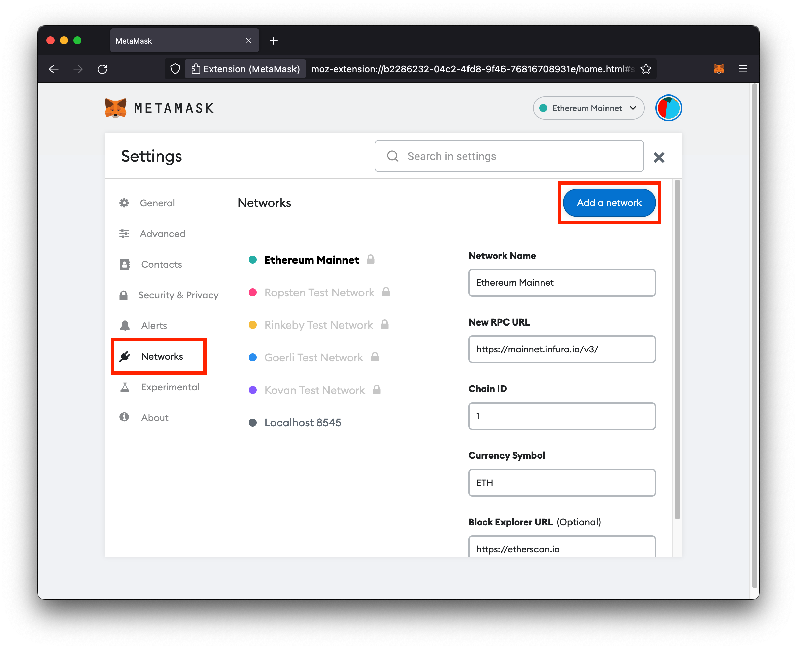

# Use ERC-721 tokens
{: .no_toc }

## Table of contents
{: .no_toc .text-delta }

1. TOC
{:toc}

---

## Previous steps: Start your environment
If you haven't started a FireFly stack already, please go to the Getting Started guide on how to [Start your environment](../../gettingstarted/setup_env.md). This will set up a token connector that works with both ERC-20 and ERC-721 by default.

[← ② Start your environment](../../gettingstarted/setup_env.md){: .btn .btn-purple .mb-5}

## Use the built in sample token factory

If you are using the default ERC-20 / ERC-721 token connector, when the FireFly CLI set up your FireFly stack, it also deployed a token factory contract. When you create a token pool through FireFly's token APIs, the token factory contract will automatically deploy an ERC-20 or ERC-721 contract, based on the pool `type` in the API request.

<div style="color: #ffffff; background: #ff7700; padding: 1em; border-radius: 5px;">⚠️ <span style="font-weight: bold;">WARNING</span>: The default token contract that was deployed by the FireFly CLI is only provided for the purpose of learning about FireFly. It is <span style="font-weight: bold;">not</span> a production grade contract. If you intend to deploy a production application using tokens FireFly you should research token contract best practices. For details, <a style="color: #ffffff;" href="https://github.com/hyperledger/firefly-tokens-erc20-erc721/blob/main/samples/solidity/contracts/TokenFactory.sol">please see the source code</a> for the contract that was deployed.</div>

## Use the Sandbox (optional)
At this point you could open the Sandbox at [http://127.0.0.1:5109/home?action=tokens.pools](http://127.0.0.1:5109/home?action=tokens.pools) and perform the functions outlined in the rest of this guide. Or you can keep reading to learn how to build HTTP requests to work with tokens in FireFly.
 

## Create a pool
After you stack is up and running, the first thing you need to do is create a Token Pool. Every application will need at least one Token Pool. At a minimum, you must always
specify a `name` and `type` for the pool.

If you're using the default ERC-20 / ERC-721 token connector and its sample token factory, it will automatically deploy a new token contract, based on the `type` in the request to create the token pool.

#### Request
`POST` `http://127.0.0.1:5000/api/v1/namespaces/default/tokens/pools`

```json
{
    "type": "nonfungible",
    "name": "nfts"
}
```

#### Response
```json
{
    "id": "a92a0a25-b886-4b43-931f-4add2840258a",
    "type": "nonfungible",
    "namespace": "default",
    "name": "nfts",
    "key": "0x14ddd36a0c2f747130915bf5214061b1e4bec74c",
    "connector": "erc20_erc721",
    "tx": {
        "type": "token_pool",
        "id": "00678116-89d2-4295-990c-bd5ffa6e2434"
    }
}
```

Other parameters:
- You must specify a `connector` if you have configured multiple token connectors
- You may pass through a `config` object of additional parameters, if supported by your token connector
- You may specify a `key` understood by the connector (i.e. an Ethereum address) if you'd like to use a non-default signing identity

### Get the address of the deployed contract

To lookup the address of the new contract, you can lookup the Token Pool by its ID on the API. Creating the token pool will also emit an event which will contain the address. To query the token pool you can make a `GET` request to the pool's ID:

#### Request
`GET` `http://127.0.0.1:5000/api/v1/namespaces/default/tokens/pools/5811e8d5-52d0-44b1-8b75-73f5ff88f598`

#### Response
```json
{
    "id": "a92a0a25-b886-4b43-931f-4add2840258a",
    "type": "nonfungible",
    "namespace": "default",
    "name": "nfts",
    "standard": "ERC721",
    "locator": "address=0xc4d02efcfab06f18ec0a68e00b98ffecf6bf7e3c&schema=ERC721WithData&type=nonfungible",
    "connector": "erc20_erc721",
    "message": "53d95dda-e8ca-4546-9226-a0fdc6ec03ec",
    "state": "confirmed",
    "created": "2022-04-29T12:03:51.971349509Z",
    "info": {
        "address": "0xc4d02efcfab06f18ec0a68e00b98ffecf6bf7e3c",
        "name": "nfts",
        "schema": "ERC721WithData"
    },
    "tx": {
        "type": "token_pool",
        "id": "00678116-89d2-4295-990c-bd5ffa6e2434"
    }
}
```

### Create a pool for an existing contract
If you wish to use a contract that is already on the chain, you can pass the address in a `config` object with an `address` when you make the request to create the Token Pool.

`POST` `http://127.0.0.1:5000/api/v1/namespaces/default/tokens/pools`

```json
{
  "name": "testpool",
  "type": "fungible",
  "config": {
    "address": "0xb1C845D32966c79E23f733742Ed7fCe4B41901FC"
  }
}
```

## Mint a token

Once you have a token pool, you can mint tokens within it. With a token contract deployed by the default token factory, only the creator of a pool is allowed to mint, but a different contract may define its own permission model. With the default ERC-20 / ERC-721 token connector, the `tokenIndex` field must be set when minting an NFT. This is the unique index within the pool for the specific token that you are minting.

> **NOTE:** When minting NFTs the `amount` must be `1`. If you wish to mint more NFTs, simply call the endpoint multiple times.

#### Request
`POST` `http://127.0.0.1:5000/api/v1/namespaces/default/tokens/mint`
```json
{
  "amount": "1",
  "tokenIndex": "1"
}
```

#### Response
```json
{
    "type": "mint",
    "localId": "2de2e05e-9474-4a08-a64f-2cceb076bdaa",
    "pool": "a92a0a25-b886-4b43-931f-4add2840258a",
    "connector": "erc20_erc721",
    "key": "0x14ddd36a0c2f747130915bf5214061b1e4bec74c",
    "from": "0x14ddd36a0c2f747130915bf5214061b1e4bec74c",
    "to": "0x14ddd36a0c2f747130915bf5214061b1e4bec74c",
    "amount": "1",
    "tx": {
        "type": "token_transfer",
        "id": "0fad4581-7cb2-42c7-8f78-62d32205c2c2"
    }
}
```

Other parameters:
- You must specify a `pool` name if you've created more than one pool
- You may specify a `key` understood by the connector (i.e. an Ethereum address) if you'd like to use a non-default signing identity
- You may specify `to` if you'd like to send the minted tokens to a specific identity (default is the same as `key`)

## Transfer a token

You may transfer tokens within a pool by specifying an amount and a destination understood by the connector (i.e. an Ethereum address). With a token contract deployed by the default token factory, only the owner of the tokens or another approved account may transfer their tokens, but a different contract may define its own permission model.

When transferring an NFT, you must also specify the `tokenIndex` that you wish to transfer. The `tokenIndex` is simply the ID of the specific NFT within the pool that you wish to transfer.

> **NOTE:** When transferring NFTs the `amount` must be `1`. If you wish to transfer more NFTs, simply call the endpoint multiple times, specifying the token index of each token to transfer.

#### Request
`POST` `http://127.0.0.1:5000/api/v1/namespaces/default/tokens/transfers`
```json
{
  "amount": "1",
  "tokenIndex": "1",
  "to": "0xa4222a4ae19448d43a338e6586edd5fb2ac398e1"
}
```

#### Response
```json
{
    "type": "transfer",
    "localId": "f5fd0d13-db13-4d70-9a99-6bcd747f1e42",
    "pool": "a92a0a25-b886-4b43-931f-4add2840258a",
    "tokenIndex": "1",
    "connector": "erc20_erc721",
    "key": "0x14ddd36a0c2f747130915bf5214061b1e4bec74c",
    "from": "0x14ddd36a0c2f747130915bf5214061b1e4bec74c",
    "to": "0xa4222a4ae19448d43a338e6586edd5fb2ac398e1",
    "amount": "1",
    "tx": {
        "type": "token_transfer",
        "id": "63c1a89b-240c-41eb-84bb-323d56f4ba5a"
    }
}
```

Other parameters:
- You must specify a `pool` name if you've created more than one pool
- You may specify a `key` understood by the connector (i.e. an Ethereum address) if you'd like to use a non-default signing identity
- You may specify `from` if you'd like to send tokens from a specific identity (default is the same as `key`)

## Sending data with a transfer

All transfers (as well as mint/burn operations) support an optional `message` parameter that contains a broadcast or private
message to be sent along with the transfer. This message follows the same convention as other FireFly messages, and may be comprised
of text or blob data, and can provide context, metadata, or other supporting information about the transfer. The message will be
batched, hashed, and pinned to the primary blockchain.

The message ID and hash will also be sent to the token connector as part of the transfer operation, to be written to the token blockchain
when the transaction is submitted. All recipients of the message will then be able to correlate the message with the token transfer.

`POST` `http://127.0.0.1:5000/api/v1/namespaces/default/tokens/transfers`

### Broadcast message
```json
{
  "amount": 1,
  "tokenIndex": "1",
  "to": "0x07eab7731db665caf02bc92c286f51dea81f923f",
  "message": {
    "data": [{
      "value": "payment for goods"
    }]
  }
}
```

### Private message
```json
{
  "amount": 1,
  "tokenIndex": "1",
  "to": "0x07eab7731db665caf02bc92c286f51dea81f923f",
  "message": {
    "header": {
      "type": "transfer_private",
    },
    "group": {
      "members": [{
          "identity": "org_1"
      }]
    },
    "data": [{
      "value": "payment for goods"
    }]
  }
}
```

Note that all parties in the network will be able to see the transfer (including the message ID and hash), but only
the recipients of the message will be able to view the actual message data.

## Burn tokens
You may burn a token by specifying the token's `tokenIndex`. With a token contract deployed by the default token factory, only the owner of a token may
burn it, but a different contract may define its own permission model.

`POST` `http://127.0.0.1:5000/api/v1/namespaces/default/tokens/burn`

```json
{
  "amount": 1,
  "tokenIndex": "1"
}
```

Other parameters:
- You must specify a `pool` name if you've created more than one pool
- You may specify a `key` understood by the connector (i.e. an Ethereum address) if you'd like to use a non-default signing identity
- You may specify `from` if you'd like to burn tokens from a specific identity (default is the same as `key`)

## Token approvals
You can also approve other wallets to transfer tokens on your behalf with the `/approvals` API. The important fields in a token approval API request are as follows:

- `approved`: Sets whether another account is allowed to transfer tokens out of this wallet or not. If not specified, will default to `true`. Setting to `false` can revoke an existing approval.
- `operator`: The other account that is allowed to transfer tokens out of the wallet specified in the `key` field
- `config.tokenIndex`: The specific token index within the pool that the operator is allowed to transfer. If `0` or not set, the approval is valid for all tokens.
- `key`: The wallet address for the approval. If not set, it defaults to the address of the FireFly node submitting the transaction

Here is an example request that would let the signing account `0x634ee8c7d0894d086c7af1fc8514736aed251528` transfer `tokenIndex` `2` from my wallet.

#### Request
`POST` `http://127.0.0.1:5000/api/v1/namespaces/default/tokens/approvals`
```json
{
  "operator": "0x634ee8c7d0894d086c7af1fc8514736aed251528",
  "config": {
      "tokenIndex": "2"
  }
}
```

#### Response
```json
{
    "localId": "46fef50a-cf93-4f92-acf8-fae161b37362",
    "pool": "e1477ed5-7282-48e5-ad9d-1612296bb29d",
    "connector": "erc20_erc721",
    "key": "0x14ddd36a0c2f747130915bf5214061b1e4bec74c",
    "operator": "0x634ee8c7d0894d086c7af1fc8514736aed251528",
    "approved": true,
    "tx": {
        "type": "token_approval",
        "id": "00faa011-f42c-403d-a047-2df7318967cd"
    },
    "config": {
       "tokenIndex": "2"
    }
}
```

## Use Metamask
Now that you have an ERC-721 contract up and running, you may be wondering how to use Metamask (or some other wallet) with this contract. This section will walk you through how to connect Metamask to the blockchain and token contract that FireFly is using.

### Configure a new network
The first thing we need to do is tell Metamask how to connect to our local blockchain node. To do that:

- Click your account icon
- In the drop down menu, click **Settings**


- On the left hand side of the page, click **Networks**
- Click the **Add a network** button


- Fill in the network details:
  - Network Name: `FireFly` (could be any name)
  - New RPC URL: `http://127.0.0.1:5100`
  - Chain ID: `2021`
  - Currency Symbol: ETH
- Click **Save**


### Import tokens
Metamask won't know about our custom ERC-721 contract until we give it the Ethereum address for the contract, so that's what we'll do next.

- Click on **Import tokens**


- Enter the Ethereum address of the contract
- Enter a Token Symbol (can be anything you want)
- Click **Add Custom Token**

> **NOTE:** You can find the address of your contract from the response to the request to create the token pool above. You can also do a `GET` to `http://127.0.0.1:5000/api/v1/namespaces/default/tokens/pools` to lookup your configured token pools.


### Transfer tokens
Now you can copy your account address from your Metamask wallet, and perform a transfer from FireFly's API (as described above) to your Metamask address.


After a couple seconds, you should see your token show up in your Metamask wallet.


> **NOTE:** While the NFT token balance can be viewed in Metamask, it does not appear that Metamask supports sending these tokens to another address at this time.