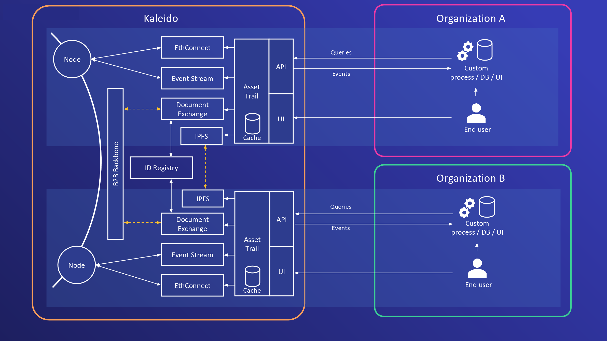

# Kaleido Asset Trail



## Setup

Kaleido asset trail can be run as a Kaleido member service or as a standalone application.
For the latter, deploy an ERC20 token and use its address in the constructor of the [asset Trail smart contract](solidity_new/contracts/AssetTrail.sol),

For each participating member, deploy the following runtimes:
* IPFS
* App2App Messaging (with 2 destinations representing KAT and the client)
* Document Exchange (with 1 destination)

You must also define an Event Stream with subscriptions to all relevant
events for your use case (subscribe to all events if unsure).

Asset trail has built-in storage and can optionally be configured to use MongoDB.

Create a new folder for your config.
Populate `config.json` with the URLs for the deployed contract API, the event stream, the IPFS/App2App/Document
Exchange runtimes, a valid set of credentials, and the locally running MongoDB.

```json
{
  "port": 5000,
  "assetTrailInstanceID": "asset-trail-org-a",
  "protocol": "ethereum",
  "apiGateway": {
    "apiEndpoint": "https://xx12345678-yy12345678-connect.aws-0.kaleido.io/instances/0xc4ed58b23059e5b2f867b6040b46dcea04396c8b"
  },
  "eventStreams": {
    "wsEndpoint": "wss://xx12345678-yy12345678-connect.aws-0.kaleido.io/ws",
    "topic": "A"
  },
  "ipfs": {
    "apiEndpoint": "https://xx12345678-yy12345678-ipfs.aws-0.kaleido.io"
  },
  "app2app": {
    "socketIOEndpoint": "wss://xx12345678-yy12345678-app2app.aws-0.kaleido.io/api/v1",
    "destinations": {
      "kat": "kld://app2app/z/dev2/m/zzdza6cuf9/e/zzdk0au9rl/s/zzspcgumw6/d/kat",
      "client": "kld://app2app/z/dev2/m/zzdza6cuf9/e/zzdk0au9rl/s/zzspcgumw6/d/client"
    }
  },
  "docExchange": {
    "apiEndpoint": "https://xx12345678-yy12345678-documentstore.aws-0.kaleido.io/api/v1",
    "socketIOEndpoint": "wss://xx12345678-yy12345678-documentstore.aws-0.kaleido.io/api/v1",
    "destination": "kld://documentstore/z/dev2/m/zzdza6cuf9/e/zzdk0au9rl/s/zzu2yrgdqw/d/a"
  },
  "appCredentials": {
    "user": "xx12345678",
    "password": "yyyyyyyyyyy"
  },
  "mongodb": {
    "connectionUrl": "mongodb://localhost:27017",
    "databaseName": "assettrail0"
  }
}
```

You can create separate config folders for each org you wish to simulate.

Run the server with the following (substitute the path to your own data directory as needed):
```
cd core
DATA_DIRECTORY=data/single-region/OrgA nodemon
```

If using Visual Studio Code, there is also a provided [.vscode/launch.json](launch.json) file which can be
edited to add launch configurations to the UI.
